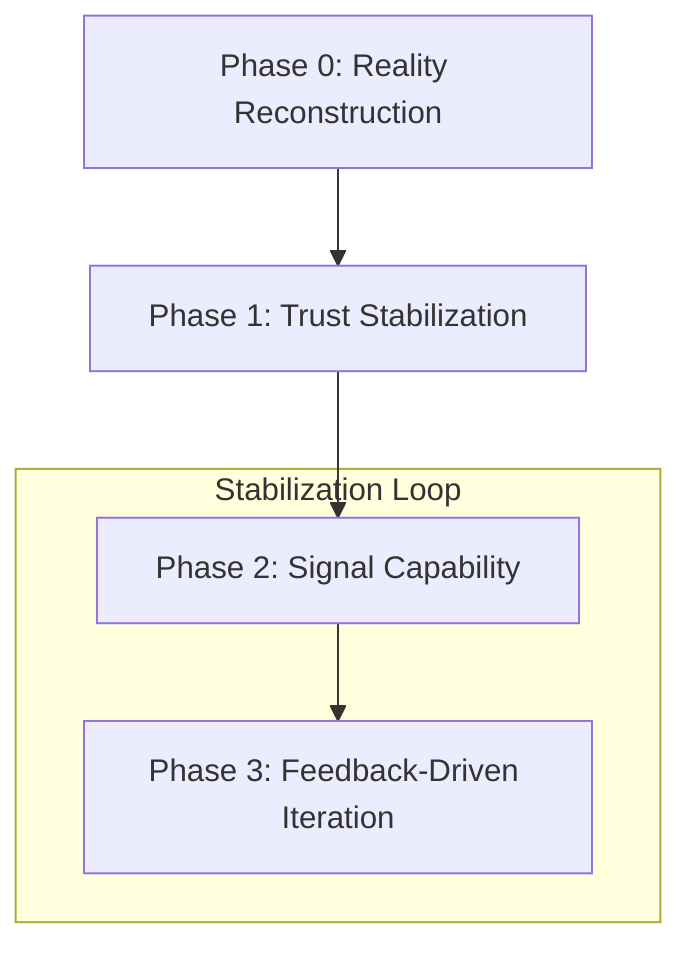

# Risk Control Playbook

This playbook provides a systematic approach to regaining control of failing projects and evaluating the **Result Ownership** of team members. In high-stakes environments, we prioritize **Reality Reconstruction** over optimistic reporting.

---

## 🏗 Project Takeover Strategy

The primary goal of a project takeover is to stabilize trust and deliver early proof of capability before attempting a full recovery.

### Phase 0: Reality Reconstruction
**Goal**: Eliminate assumptions and establish a verifiable baseline.

-   **Identify Actual Deliverables**: What can be delivered *right now*, regardless of previous promises?
-   **Understand True Client Needs**: What does the client *actually* care about beyond the written specs?
-   **Analyze Rejection Root Cause**: Focus on the mismatch between output and expectations, not on assigning blame.

:::tip Core Principle
You cannot fix a project until you reconstruct reality as it truly is. Optimism is a risk factor in this phase.
:::

---

### Phase 1: Trust Stabilization (Within 48 Hours)
**Goal**: Buy time by reducing uncertainty and increasing transparency.

-   **Proactive Contact**: Reach out to the client before they reach out to you.
-   **Radical Honesty**: Admit uncertainty about existing problems and unknown variables.
-   **Micro-Expectations**: State clearly what will be delivered in the next **7–14 days**.

:::info Key Message Template
"We have identified [X] as the primary bottleneck. We will deliver a verifiable interim result by [Date] to confirm direction before expanding the system further."
:::

---

### Phase 2: Signal Capability (MVP with Intent)
**Goal**: Demonstrate control and competence through "Signal Deliverables."

-   **Visualize Control**: Produce clear process flow diagrams to help the client understand the path forward.
-   **Focus on Signal**: Identify 1–2 sub-deliverables that best demonstrate your team's unique capability.
-   **Speed over Completeness**: A working 10% is better than a "nearly finished" 90%.

:::important
Do not optimize for completeness; optimize for **Confidence Restoration**.
:::

---

## 📊 Result Ownership Framework

This framework distinguishes between execution capability and result responsibility to ensure high-risk work is assigned to the right talent.

### Ownership Matrix

| Level | Role | Characteristics | Suitable For |
| :--- | :--- | :--- | :--- |
| **Level 1** | **Executor** | Requests clear specs; performs tasks accurately; explains failure reasons. | Stable execution; clearly scoped tasks. |
| **Level 2** | **Analyst** | Diagnoses problems; provides detailed analysis; avoids final decisions. | Support roles; advisory capacity. |
| **Level 3** | **Result Owner** | Defines assumptions; articulates trade-offs; **takes accountability for outcomes.** | Architecture; client-facing; high-ambiguity. |

### 🔍 Evaluation Tests

Use these "Stress Tests" to identify **Level 3 Result Owners**:

1.  **Ambiguity Test**: *"If the requirements are unclear, how would you proceed?"*
    -   ✅ **Result Owner**: Proposes assumptions and validation steps.
    -   ❌ **Executor**: Waits for further specifications.
2.  **Failure Responsibility Test**: *"If this fails, where do you think the biggest risk lies?"*
    -   ✅ **Result Owner**: Identifies systemic risks and proposes mitigation.
    -   ❌ **Analyst**: Explains why failure would be external to their work.

:::danger Management Rule
Do not ask "Is this person capable?". Ask instead: **"Am I willing to let this person own the consequences of failure?"**
:::

