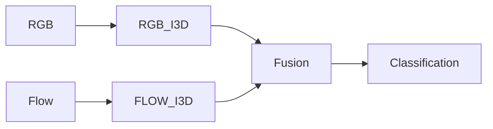
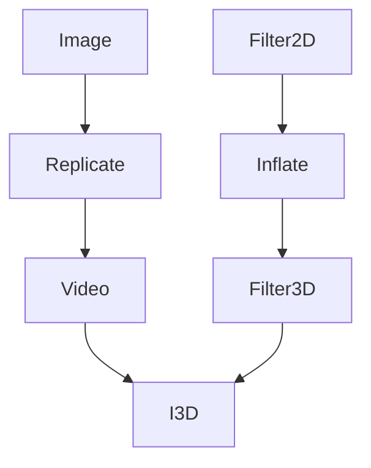

# I3D论文笔记

:::info[文档目标]

本文档总结 I3D（Inflated 3D ConvNet）论文的核心思想、相关工作背景、网络架构设计以及 Inflate 方法，重点理解 2D CNN 如何扩展为 3D CNN。

:::

## 背景

### 贡献一：提出 I3D 模型

I3D 的核心目标是：

- 将成熟的 2D CNN 扩展为 3D CNN；
- 继承 ImageNet 预训练权重；
- 同时建模空间信息与时间信息；
- 降低从零训练 3D 网络的难度。

### 贡献二：提出 Kinetics Dataset

:::tip[为什么重要]

视频理解领域长期缺少大规模且类别均衡的数据集。Kinetics 的出现使得视频模型能够像图像领域的 ImageNet 一样进行预训练。

:::

## 前置知识

### EfficientNet

:::note[核心思想]

网络性能受到以下三个维度共同影响：

- Depth（深度）
- Width（宽度）
- Resolution（分辨率）

EfficientNet 提出 Compound Scaling，同时缩放三个维度，而不是只调整其中一个。

:::

### Optical Flow（光流）

#### 作用

光流用于描述连续两帧之间像素的运动趋势。

#### 优点

- 显式建模运动信息
- 对动作识别十分有效

#### 缺点

:::caution[光流局限性]

光流依赖亮度恒定假设。

当光照发生变化时，即使物体没有运动，也可能产生错误光流，从而影响识别效果。

:::

## I3D之前的视频理解方法

### CNN + LSTM

特点：

- CNN 提取空间特征
- LSTM 建模时间关系
- 最终进行分类

缺点：

- 空间与时间建模分离
- 时空信息无法充分融合

### C3D

特点：

- 将视频视为三维体数据（Volume）
- 使用 3D Convolution 建模时间与空间

缺点：

:::caution[训练困难]

无法直接继承 ImageNet 的预训练权重。

通常需要从头训练，容易出现：

- 参数量增加
- 训练困难
- 过拟合

:::

### Two-Stream

特点：

- RGB 分支学习空间信息
- Optical Flow 分支学习运动信息
- 最后进行结果融合

优点：

- 可直接利用 ImageNet 预训练模型
- 时间建模能力强于 CNN+LSTM

缺点：

- 需要额外计算 Optical Flow
- 计算开销较大

## I3D 核心架构

### 各类方法对比

| 方法 | 时间建模方式 | 优点 | 缺点 |
|--------|--------|--------|--------|
| CNN + LSTM | LSTM | 简单 | 时空分离 |
| C3D | 3D卷积 | 统一建模 | 无法利用预训练 |
| Two-Stream | 光流 | 效果好 | 光流计算昂贵 |
| I3D | Inflated 3D Conv | 继承预训练权重 | 计算量增加 |

### I3D整体流程

### I3D思想

:::info[I3D核心思想]

RGB 和 Optical Flow 分别进入独立的 3D CNN。

每个分支内部同时完成空间特征与时间特征建模。

最后再进行融合与分类。

:::

## 方法

### Inflate

Inflate 的目标是：

将 2D CNN 转换为 3D CNN。

具体规则：

- 2D Conv → 3D Conv
- 2D Pooling → 3D Pooling
- NxN Filter → NxNxN Filter

### Bootstrapping 3D Filters from 2D

#### 核心问题

如何利用已经训练好的 2D 网络初始化 3D 网络？

#### 解决方案

作者采用如下策略：

1. 将同一张图片复制为连续视频帧；
2. 构造每帧都相同的视频；
3. 将 2D Filter 复制 N 次扩展到时间维度；
4. 使用扩展后的权重初始化 3D 卷积。

:::tip[关键理解]

如果输入视频的每一帧完全相同，那么理论上：

- 原始 2D CNN 输出
- Inflate 后的 3D CNN 输出

应保持一致。

因此能够安全继承 ImageNet 预训练权重。

:::

## 总结

I3D 的最大贡献并不是提出新的卷积结构，而是提出了一种能够继承 ImageNet 预训练权重的 3D CNN 构建方法。

其核心思想是：

- Inflate 2D Conv 到 3D Conv；
- 使用 Kinetics 进行大规模视频预训练；
- RGB 与 Optical Flow 双分支独立完成时空建模；
- 最终融合获得更强的视频动作识别能力。
