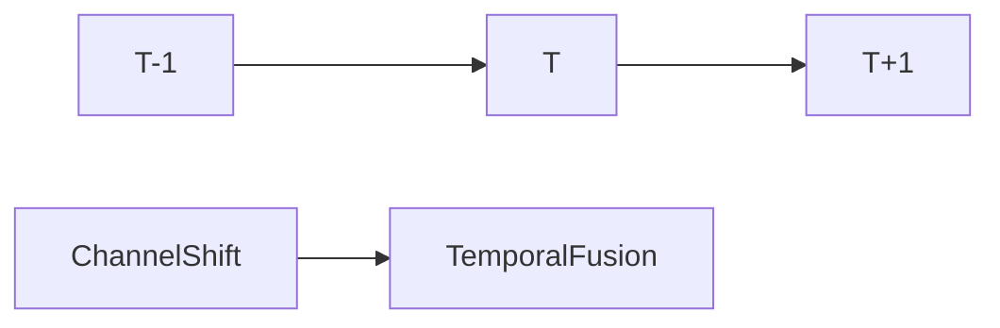
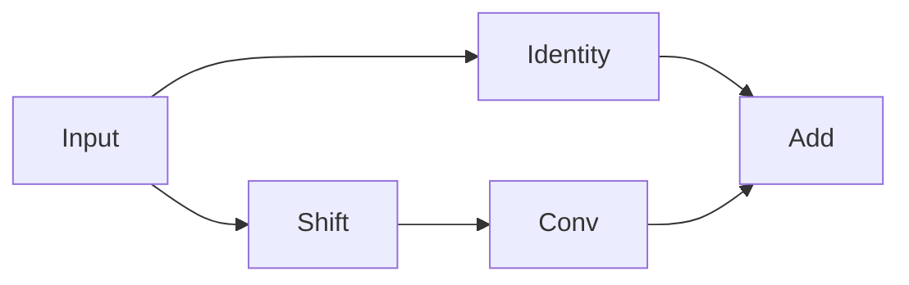

# TSM论文笔记

:::info[一句话理解]

TSM（Temporal Shift Module）的核心思想是：在不增加参数和 FLOPs 的情况下，通过通道沿时间维度移动（Shift），让普通 2D CNN 获得时序建模能力。

:::

## 背景

### 为什么需要 TSM

传统视频理解主要有两种方案：

| 方法 | 优点 | 缺点 |
|--------|--------|--------|
| 2D CNN | 快速、高效 | 无法建模时间 |
| 3D CNN | 同时建模时空信息 | 计算量巨大 |


:::caution[核心问题]

能否保留 2D CNN 的计算效率，同时获得类似 3D CNN 的时间建模能力？

:::

## TSM核心思想

### Temporal Shift

TSM提出了一种极轻量级的时序融合方式。


其核心操作是：

- 部分通道向前移动
- 部分通道向后移动
- 剩余通道保持不变



### Shift的作用

:::note[关键理解]

Shift 本身不学习任何参数。

它只是改变特征存储位置，让当前帧能够看到相邻时间帧的信息。

:::

## Offline TSM 与 Online TSM

### Offline TSM

适用于已经完整录制好的视频。

特点：

- 双向 Shift
- 可以访问未来帧
- 时间建模能力更强

```text
1/8 向前
1/8 向后
3/4 保持不变
```

### Online TSM

适用于实时视频流。

特点：

- 单向 Shift
- 只能访问过去帧
- 延迟极低


:::tip[在线推理优势]

- 几乎不增加计算量
- 显存开销极低
- 适用于自动驾驶、监控等实时场景

:::

## Residual TSM 与 In-Place TSM

### In-Place TSM

直接进行 Shift。

缺点：

部分当前帧特征被移走，导致空间信息损失。

### Residual TSM


Residual TSM 将 Shift 放入残差分支。



:::info[为什么效果更好]

残差连接保留了原始空间特征。

即使部分通道发生移动，模型仍然能够访问完整的当前帧信息。

:::

## 实验结论

### Shift比例

论文发现：

| Shift比例 | 结果 |
|-----------|------|
| 0 | 无时间建模 |
| 1/8 | 提升有限 |
| 1/4 | 最佳 |
| 1/2以上 | 精度下降 |

### 结论

:::tip[论文最终结论]

TSM 使用极低成本获得接近 3D CNN 的时序建模能力。

其最大的价值在于：

- 零参数增加
- 零 FLOPs 增加
- 适用于实时部署

:::

## 面试速记

TSM = Shift + 2D CNN

核心思想：

通过移动部分通道，让当前帧融合前后帧信息，再利用普通 2D 卷积完成特征融合。
