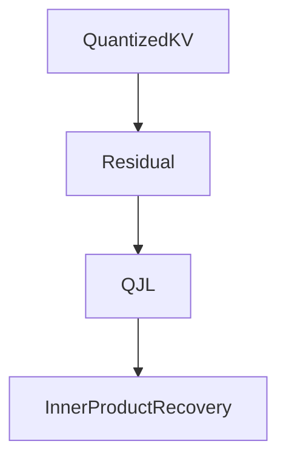

# TurboQuant论文笔记

:::info[一句话理解]

TurboQuant 是一种面向 Transformer KV Cache 的超低比特量化方法，通过 PolarQuant + QJL 将 KV Cache 压缩到约 3 bit，同时保持接近无损的推理精度。

:::

## 为什么需要 TurboQuant

### KV Cache 问题

Transformer 推理时需要缓存历史 Token 的 Key 与 Value。


随着上下文增长：

- KV Cache 急剧膨胀
- 显存消耗远超模型权重
- 成为长上下文推理瓶颈

:::caution[典型问题]

百万 Token 场景下，KV Cache 甚至可能达到 TB 级显存需求。

:::

## TurboQuant总体框架


TurboQuant包含两个核心步骤：

| 阶段 | 作用 |
|--------|--------|
| PolarQuant | 负责主要压缩 |
| QJL | 负责误差修正 |

## PolarQuant

### 随机旋转

:::note[核心思想]

随机正交旋转不会改变向量长度和内积关系。

但能够让能量分布更加均匀。

:::


作用：

- 消除异常大值
- 降低量化误差
- 更接近高斯分布

### 高斯化

随机旋转后：

- 各维度方差更均匀
- 更适合建立统一量化码本
- 支持极低比特量化

## 极坐标量化

### 为什么使用极坐标

传统表示：

```text
(x,y)
```

极坐标表示：

```text
(r,θ)
```

其中：

- r 表示长度
- θ 表示方向

### 核心思想

:::tip[信息不均匀]

向量的大部分信息集中在长度 r。

方向 θ 更多承担微调作用。

因此：

- 高精度保留 r
- 强压缩 θ

:::


## QJL误差修正

### 为什么需要QJL

即使 PolarQuant 已经大幅压缩数据：

仍然会产生 Attention 内积误差。

因此 TurboQuant 引入 QJL。

### QJL作用



QJL不会恢复原始向量。

它的目标是：

- 近似恢复 Attention 内积
- 修正量化误差
- 保持模型精度

## 实验结果


:::info[实验结论]

在约 3.5 bit KV Cache 条件下：

TurboQuant 性能接近 Full Cache。

说明：

- PolarQuant 完成主要压缩
- QJL 完成关键误差修正

二者缺一不可。

:::

## 面试速记

TurboQuant = PolarQuant + QJL

其中：

1. 随机旋转 → 高斯化；
2. 极坐标量化 → 压缩 KV Cache；
3. QJL → 修正 Attention 内积误差；
4. 最终实现约 3 bit KV Cache 与接近无损精度。
