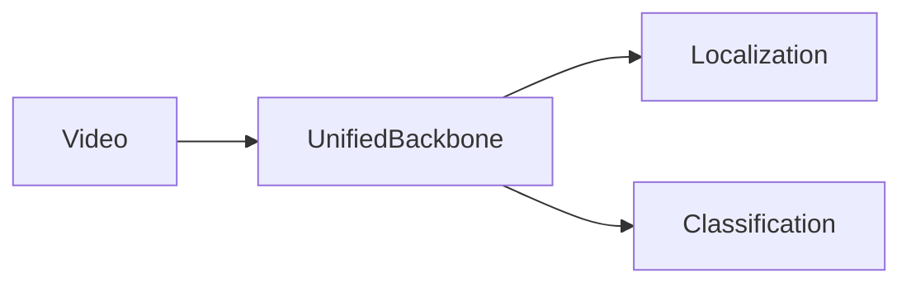
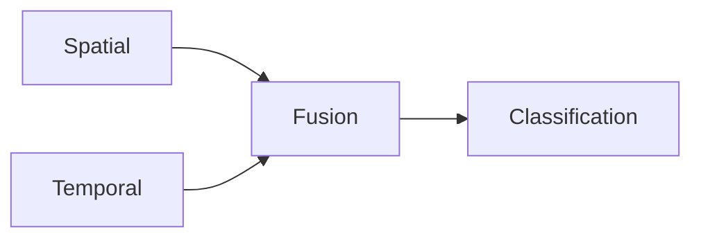
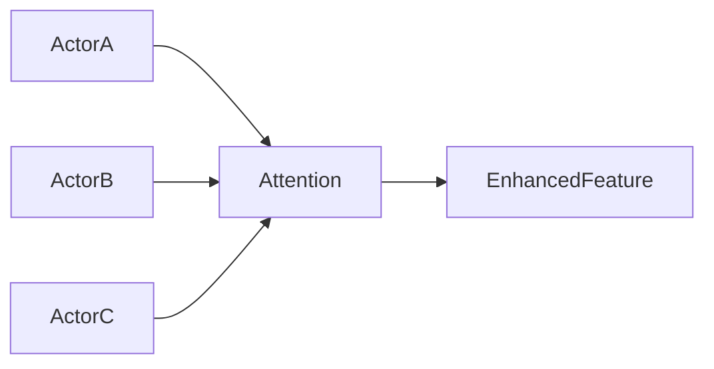

# WOO论文笔记

:::info[一句话理解]

WOO（Watch Once Only）希望用一个统一 Backbone 一次前向传播同时完成：

- Actor Localization（人在哪里）
- Action Classification（人在做什么）

真正实现端到端的视频动作检测。

:::

## 问题背景

### 什么是视频动作检测

视频动作检测本质上需要同时回答两个问题：

```text
Where？
人在哪里
```

```text
What？
人在做什么
```

即：

```text
Action Detection
= Localization + Classification
```

### 传统方法的问题


传统方法通常采用：

| 方法 | 特点 |
|--------|--------|
| Two-Stage | 检测与分类分开 |
| Two Backbone | 空间与时间独立建模 |
| YOWO | One Stage + Two Backbone |

:::caution[WOO的质疑]

同一个关键帧被多个 Backbone 重复处理。

导致：

- 计算冗余
- 参数量大
- 推理效率低

:::

## 核心思想

### WOO创新点



WOO希望：

- 一个 Backbone
- 一次前向传播
- 同时完成检测与分类

## 整体架构

WOO包含三个核心模块：

| 模块 | 作用 |
|--------|--------|
| Unified Backbone | 特征提取 |
| Spatio-Temporal Embedding | 增强分类能力 |
| Fusion Module | 空间时间融合 |

## Unified Backbone

### 为什么统一 Backbone

传统方案：

```text
2D Backbone → 检测

3D Backbone → 分类
```

WOO：

```text
Video Backbone

├── Key Frame → Detection
└── Video Feature → Classification
```


### Key Frame机制

:::tip[核心思想]

动作定位只需要关键帧。

动作分类需要完整视频。

因此：

Key Frame 提前分离用于检测。

完整视频特征继续用于分类。

:::

## 时空动作嵌入

### 为什么需要Embedding

作者发现：

统一 Backbone 后：

- 定位性能较好
- 分类性能提升有限

因此推测：

```text
共享 Backbone
↓
更偏向定位任务
↓
分类能力不足
```

于是提出：

- Spatial Embedding
- Temporal Embedding

增强分类特征表达能力。

## 时空融合模块

### Fusion思想

空间信息：

```text
Shape
Pose
Location
```

时间信息：

```text
Motion
Action Duration
Temporal Scale
```

通过 Fusion Module 融合。



## Actor Localization Head

### 功能

负责寻找人。

输入：

```text
Key Frame + FPN
```

输出：

```text
Bounding Box
Confidence Score
```

### Sparse R-CNN思想

:::note[Set Prediction]

训练阶段完成最佳匹配。

推理阶段无需 NMS。

:::

## Action Classification Head


整体流程：

```text
RoI Align
↓
Spatial Feature
↓
Temporal Feature
↓
Interaction Module
↓
Classification
```

### Spatial Branch

沿时间维 Pooling。

保留：

```text
空间结构
```

### Temporal Branch

沿空间维 Pooling。

保留：

```text
时间变化
```

## Interaction Module

### 为什么需要交互

:::info[关键观察]

视频中的动作往往与其他人相关。

只看当前 Actor 不够。

:::

因此作者设计 Attention。



## Embedding Attention

### 为什么不用 Feature Attention

原文指出：

Embedding 远小于 Feature。

因此：

```text
Embedding Attention
↓↓↓
Feature Attention
```

计算量大幅降低。

### Attention流程

```text
Embedding
↓
Q K V
↓
QK^T
↓
Softmax
↓
Attention Weight
↓
Enhanced Embedding
```

### Scale作用

公式：

QK^T / √d

作用：

防止维度过大导致 Softmax 梯度不稳定。

## 与YOWO对比

| 项目 | YOWO | WOO |
|--------|--------|--------|
| Backbone | 2个 | 1个 |
| Attention | CFAM | Self-Attention |
| 检测分类 | 分支独立 | 统一 Backbone |
| 推理效率 | 较高 | 更高 |
| FLOPs | 更大 | 更小 |

## 面试速记

WOO = Unified Backbone + Embedding Interaction

核心思想：

- 一个 Backbone 同时完成检测与分类；
- Key Frame 负责定位；
- Video Feature 负责动作分类；
- Spatial/Temporal Embedding 建模 Actor 关系；
- Self-Attention 代替高成本 Feature Attention。
