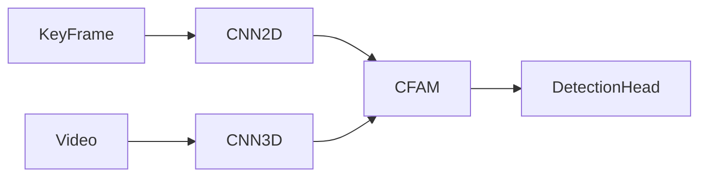
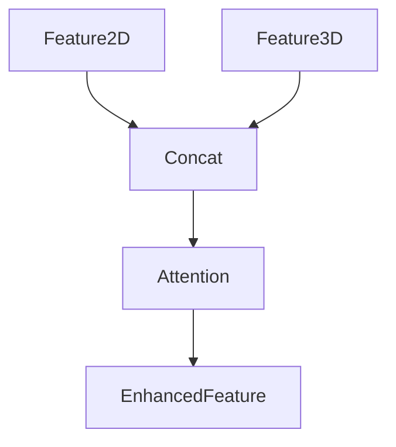

# YOWO论文笔记

:::info[一句话理解]

YOWO（You Only Watch Once）借鉴 YOLO 的 One-Stage 思想，利用 2D CNN + 3D CNN + CFAM Attention 同时完成动作定位与动作分类。

:::

## 问题背景

### 什么是STAD

STAD：

```text
Spatio-Temporal Action Detection
```

即：

```text
Action Detection
= Localization + Classification
```

需要同时回答：

```text
谁在做动作？
在哪里做动作？
```

### Two-Stage问题

传统方法：

```text
Proposal
↓
Classification
↓
Regression
```

存在问题：

- 流程复杂
- 参数量大
- 推理速度慢

## 核心思想

### YOWO目标

实现：

```text
One Stage
Real-Time
Action Detection
```

### 核心挑战

:::caution[动作 ≠ 单帧]

动作来源于连续时间变化。

仅依赖单帧难以判断行为。

:::

因此需要：

```text
Appearance + Motion
```

## 整体架构




## 空间建模

### 2D CNN

采用：

```text
Darknet-19
```

输入：

```text
Key Frame
```

输出：

```text
Appearance Feature
```

### Key Frame机制

:::tip[关键设计]

每个视频窗口只预测最后一帧。

因此无需额外复杂的数据加载机制。

:::

## 时间建模

### 3D CNN

采用：

```text
3D ResNext-101
```

输入：

```text
连续视频片段
```

输出：

```text
Spatio-Temporal Feature
```

### 为什么需要3D CNN

普通 CNN：

```text
H × W
```

3D CNN：

```text
T × H × W
```

同时学习空间与时间信息。

## CFAM模块

### 为什么需要CFAM

2D CNN 学到：

```text
Appearance
```

3D CNN 学到：

```text
Motion
```

二者不能简单相加。

因此设计：

```text
CFAM
= Channel Feature Attention Module
```

## CFAM整体流程



## Channel Attention

### Step1 Flatten

原始：

```text
C × H × W
```

变成：

```text
C × N
```

其中：

```text
N = H × W
```

### Step2 Channel Relation

计算：

G = FF^T

得到：

```text
C × C
```

关系矩阵。

表示：

```text
哪个 Channel 更重要
```

### Step3 Softmax

Softmax作用：

- 转换为概率
- 分配注意力权重

### Step4 Residual

最终输出：

```text
F = F + αF''
```

其中 α 为可学习参数。

## Bounding Box Regression

采用 YOLO 风格检测头。

最终输出：

```text
(5 × (NumCls + 5))
× H'
× W'
```

其中：

- 5个Anchor
- 4个坐标
- 1个Confidence
- NumCls个动作类别

## 热力图解释

### 3D CNN关注什么

关注：

```text
运动区域
```

而不是所有人。

### 2D CNN关注什么

关注：

```text
人的空间位置
```

而不是运动。

:::info[论文结论]

2D CNN 学习 Appearance。

3D CNN 学习 Motion。

CFAM 完成二者融合。

:::

## 与WOO对比

| 项目 | YOWO | WOO |
|--------|--------|--------|
| Backbone | 双 Backbone | 单 Backbone |
| Attention | CFAM | Self-Attention |
| 检测方式 | YOLO Head | Sparse RCNN Head |
| 目标 | 实时检测 | 统一架构 |
| 核心思想 | Appearance + Motion | End-to-End Action Detection |

## 面试速记

YOWO = 2D CNN + 3D CNN + CFAM

其中：

- 2D CNN负责定位；
- 3D CNN负责时间建模；
- CFAM负责特征融合；
- 最终实现实时时空动作检测。
