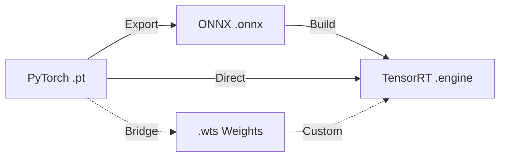

# Deep Learning Model Files

In the deep learning lifecycle, different model formats serve different purposes, ranging from training to deployment.

## Format Relationships

The diagram below illustrates the standard conversion chain for modern deep learning models.

## Supported Formats

| Format | Role | Primary Use |
| :--- | :--- | :--- |
| **[.pt / .pth](./pytorch-pt-guide.mdx)** | Training | Native PyTorch storage for weights and architectures. |
| **[.onnx](./onnx-overview.mdx)** | Conversion | Universal bridge between frameworks (Open Neural Network Exchange). |
| **[.engine / .plan](./tensorrt-engine.mdx)** | Deployment | High-performance optimized inference on NVIDIA GPUs. |
| **[.wts](./wts-bridge.mdx)** | Bridge | Plain text weight storage for custom TensorRT builders. |

:::tip[Recommendation]
The standard path for 90% of production models is: **`.pt` → `.onnx` → `.engine`**.
:::

## Key Concepts

- **Framework Independence**: ONNX allows you to move models between different tools without framework lock-in.
- **Hardware Optimization**: TensorRT engines are bound to specific GPU architectures and driver versions to achieve peak performance.
- **Conversion is One-Way**: While you can go from `.pt` to `.engine`, you generally cannot reverse the process.
