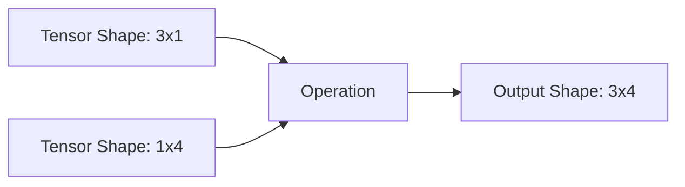

# Tensor Operations

Tensors are the core data structures in PyTorch, functioning similarly to NumPy arrays but with hardware acceleration support.

## Creation

Create tensors using factory functions. Always specify the `dtype` and `device` for optimal performance.

```python
import torch

# From lists or NumPy arrays
tensor_a = torch.tensor([[1.0, 2.0], [3.0, 4.0]], dtype=torch.float32)

# Zeros, ones, and random values
zeros = torch.zeros((3, 3), device='cuda')
ones = torch.ones((2, 2))
random_tensor = torch.randn((10, 10))
```

## Indexing

Access specific elements or slices of a tensor using standard Python indexing syntax.

```python
x = torch.arange(9).reshape(3, 3)

# Extract the second row
row = x[1, :]

# Extract a block
block = x[:2, :2]
```

## Broadcasting

PyTorch automatically expands smaller tensors to match the shape of larger tensors during arithmetic operations.



```python
a = torch.ones(3, 1)
b = torch.ones(1, 4)
# b is broadcast to 3x4, a is broadcast to 3x4
c = a + b 
```

:::tip[Shape Compatibility]
Two dimensions are compatible for broadcasting if they are equal or if one of them is 1.
:::

## Reshape, View, and Permute

Manipulate tensor dimensions without changing the underlying data.

- `view()`: Returns a new tensor sharing the same data. Requires the tensor to be contiguous in memory.
- `reshape()`: Returns a new tensor. Uses `view()` if possible, otherwise copies the data.
- `permute()`: Swaps dimensions.

```python
x = torch.randn(2, 3, 4)

# Flatten
flat_x = x.view(-1) # Shape: 24

# Swap dimensions (e.g., from NCHW to NHWC)
permuted_x = x.permute(0, 2, 3, 1)
```

:::caution[Memory Layout]
Operations like `permute()` or `transpose()` make the tensor non-contiguous in memory. Call `.contiguous()` before using `.view()` on such tensors.
:::

```python
y = x.transpose(0, 1)
# y.view(-1)  # This will raise an error!
z = y.contiguous().view(-1) # Correct
```