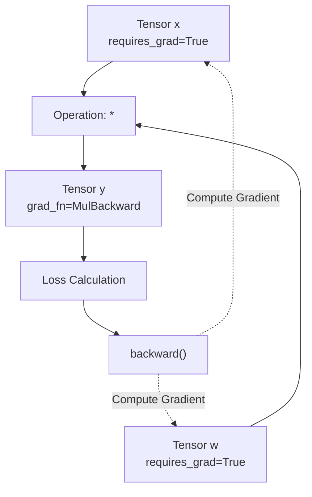

# Autograd Mechanics

PyTorch's `autograd` engine automatically computes gradients for neural network training. It builds a directed acyclic computation graph dynamically as operations are executed.

## Computation Graph

When performing operations on tensors with `requires_grad=True`, PyTorch tracks the operations and creates a computation graph.



## `requires_grad` and `grad_fn`

Enable gradient tracking by setting `requires_grad=True`.

```python
import torch

x = torch.tensor([1.0, 2.0], requires_grad=True)
w = torch.tensor([3.0, 4.0], requires_grad=True)

y = x * w
print(y.grad_fn) # <MulBackward0 object>
```

The `grad_fn` attribute references the mathematical function that created the tensor, allowing `autograd` to trace back the steps for differentiation.

## Backpropagation

Compute gradients by calling `.backward()` on the output tensor (usually the loss).

```python
loss = y.sum()
loss.backward()

# Gradients are stored in the .grad attribute
print(x.grad) # [3.0, 4.0]
print(w.grad) # [1.0, 2.0]
```

## Disabling Gradient Tracking

Prevent PyTorch from tracking history when evaluating the model or performing inference to save memory and compute resources.

### `torch.no_grad()`

Use this context manager to wrap blocks of code where gradients are not needed.

```python
with torch.no_grad():
    y_pred = x * w
    # y_pred.requires_grad is False
```

### `.detach()`

Create a new tensor that shares the same data but is detached from the computation graph.

```python
y_detached = y.detach()
# y_detached.requires_grad is False
```

## Gradient Accumulation and Zeroing

PyTorch accumulates gradients in the `.grad` attribute by default. You must manually zero out the gradients before the next backward pass to prevent them from summing up across multiple batches.

```python
# Assuming an optimizer exists
optimizer.zero_grad() # Zero gradients
loss.backward()       # Compute new gradients
optimizer.step()      # Update weights
```

:::info[Gradient Accumulation]
Gradient accumulation is a useful feature when simulating larger batch sizes. You can call `.backward()` multiple times before calling `optimizer.step()` and `optimizer.zero_grad()`.
:::
