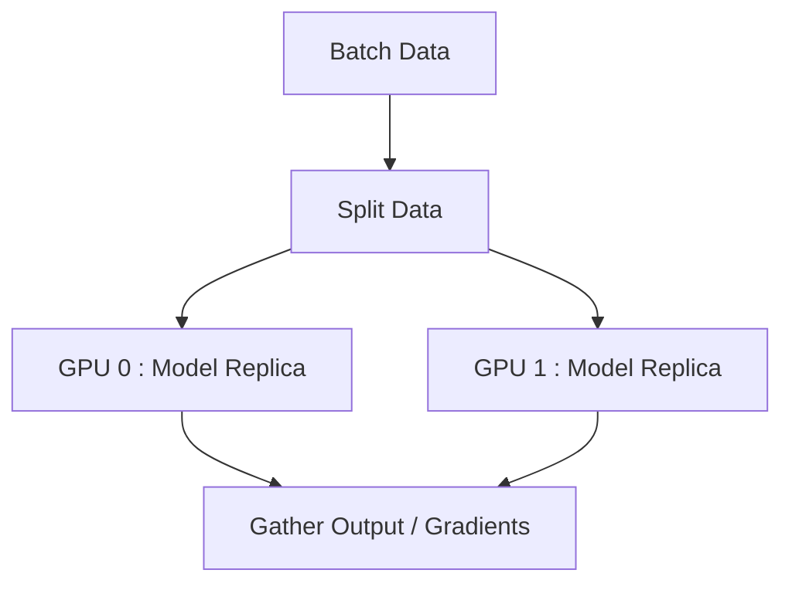

# Device Management

PyTorch allows explicit control over where tensors and models are allocated. Leveraging hardware accelerators like GPUs is crucial for deep learning performance.

## CPU and CUDA Switching

Check for GPU availability and dynamically assign the device. Always use a dynamic device assignment instead of hardcoding `cuda`.

```python
import torch

# Dynamically set the device
device = torch.device("cuda" if torch.cuda.is_available() else "cpu")
print(f"Using device: {device}")
```

## Moving Data with `.to()`

Move tensors and models to the target device using the `.to()` method.

```python
# Create a tensor on CPU
x_cpu = torch.ones(5, 5)

# Move tensor to GPU (if available)
x_gpu = x_cpu.to(device)

# Moving a model
import torch.nn as nn
model = nn.Linear(10, 2)
model.to(device)
```

:::caution[Operation Compatibility]
Operations between tensors must occur on the same device. Adding a CPU tensor to a CUDA tensor will result in a runtime error.
:::

## Device Context Manager

In modern PyTorch, you can instantiate tensors directly onto a target device using a context manager, which is more memory-efficient than creating them on the CPU and then moving them.

```python
# Tensors created inside the context will be allocated on the specified device
with torch.device(device):
    x = torch.randn(100, 100) # Directly created on GPU if device=='cuda'
    y = torch.ones(100, 100)
```

## Multi-GPU Overview

When dealing with multiple GPUs, PyTorch provides `DataParallel` (DP) and `DistributedDataParallel` (DDP). 



### `DataParallel` (DP)

A simple, single-line wrapper for utilizing multiple GPUs on a single machine. However, it suffers from the Global Interpreter Lock (GIL) and uneven GPU utilization.

```python
if torch.cuda.device_count() > 1:
    print(f"Let's use {torch.cuda.device_count()} GPUs!")
    model = nn.DataParallel(model)

model.to(device)
```

:::tip[Use DDP for Production]
For production code and multi-node setups, always use `DistributedDataParallel` (DDP) over `DataParallel`. DDP spawns multiple processes, bypassing the GIL and offering significantly better performance.
:::
