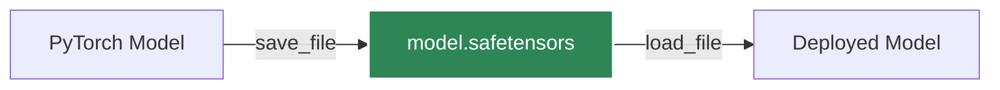

# Serialization

Saving and loading models correctly is essential for pausing training, sharing models, or deploying to production. PyTorch provides standard serialization mechanisms.

## `state_dict`

A `state_dict` is a simple Python dictionary object that maps each layer to its parameter tensor. Only layers with learnable parameters (convolutional layers, linear layers, etc.) and registered buffers have entries in the model's `state_dict`.

### Saving Weights vs. Entire Model

:::caution[Best Practice]
**Always save the `state_dict` instead of the entire model object.** Saving the model object couples the serialized data to the specific class definitions and directory structure used during saving, which breaks easily when code changes.
:::

#### Recommended: Saving `state_dict`

```python
import torch

# Save the model's weights
torch.save(model.state_dict(), 'model_weights.pth')

# Load the weights (requires initializing the model architecture first)
model = TheModelClass(*args, **kwargs)
model.load_state_dict(torch.load('model_weights.pth'))
model.eval() # Remember to call eval() for inference
```

#### Not Recommended: Saving the Entire Model

```python
# Bad practice - ties serialized data to exact code structure
torch.save(model, 'entire_model.pth')
model = torch.load('entire_model.pth')
```

## Resuming Training

To resume training, you must save both the model's `state_dict` and the optimizer's `state_dict`, along with other metadata like the current epoch.

```python
checkpoint = {
    'epoch': epoch,
    'model_state_dict': model.state_dict(),
    'optimizer_state_dict': optimizer.state_dict(),
    'loss': loss,
}
torch.save(checkpoint, 'checkpoint.pth')
```

## `safetensors` Format

The default `torch.save` relies on Python's `pickle` module, which is not secure against malicious payloads. For sharing models publicly or in production, use the `safetensors` format from Hugging Face.



```python
from safetensors.torch import save_file, load_file

# Saving
save_file(model.state_dict(), "model.safetensors")

# Loading
state_dict = load_file("model.safetensors")
model.load_state_dict(state_dict)
```

:::info[Safetensors Benefits]
`safetensors` is significantly faster for loading, limits memory usage (zero-copy), and is secure against arbitrary code execution.
:::
