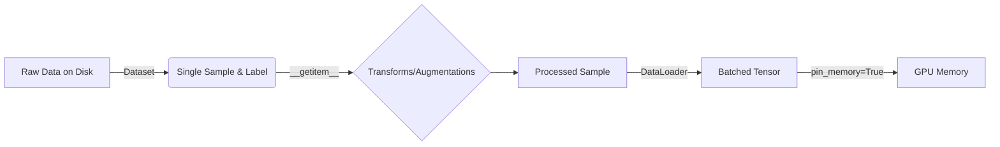

# Dataset & DataLoader Basics

Efficient data loading is a crucial component of any deep learning pipeline. PyTorch provides two core data primitives: `torch.utils.data.Dataset` and `torch.utils.data.DataLoader`. They allow you to decouple your data preprocessing code from your model training code for better readability and modularity.

## `Dataset`

A `Dataset` stores the samples and their corresponding labels. To create a custom dataset, you must create a class that inherits from `torch.utils.data.Dataset` and implements three essential methods:

1.  `__init__`: Initializes the directory containing the data, transforms, and any other necessary configuration.
2.  `__len__`: Returns the total number of samples in the dataset.
3.  `__getitem__`: Retrieves a sample from the dataset at the given index `idx`.

### Example: Custom Image Dataset

```python
import os
from PIL import Image
from torch.utils.data import Dataset
from torchvision import transforms

class CustomImageDataset(Dataset):
    def __init__(self, annotations_file, img_dir, transform=None):
        self.img_labels = self._load_annotations(annotations_file)
        self.img_dir = img_dir
        self.transform = transform

    def _load_annotations(self, file_path):
        # Implementation to load labels
        return [("img1.jpg", 0), ("img2.jpg", 1)]

    def __len__(self):
        return len(self.img_labels)

    def __getitem__(self, idx):
        img_path = os.path.join(self.img_dir, self.img_labels[idx][0])
        image = Image.open(img_path).convert("RGB")
        label = self.img_labels[idx][1]
        
        if self.transform:
            image = self.transform(image)
            
        return image, label
```

## `DataLoader`

The `Dataset` retrieves our dataset's features and labels one sample at a time. During model training, you typically want to pass samples in "minibatches", reshuffle the data at every epoch to reduce model overfitting, and use Python's multiprocessing to speed up data retrieval.

`DataLoader` is an iterable that abstracts this complexity.

```python
from torch.utils.data import DataLoader

# Instantiate the dataset
transform = transforms.ToTensor()
dataset = CustomImageDataset(
    annotations_file="labels.csv", 
    img_dir="img_dir", 
    transform=transform
)

# Create the DataLoader
dataloader = DataLoader(
    dataset, 
    batch_size=64, 
    shuffle=True, 
    num_workers=4,
    pin_memory=True
)
```

### Key Parameters

| Parameter | Purpose | Recommended Setting |
| :--- | :--- | :--- |
| `batch_size` | Number of samples per batch | Dependent on GPU memory (e.g., 32, 64, 128) |
| `shuffle` | Randomize data order | `True` for training, `False` for validation/test |
| `num_workers` | Subprocesses for data loading | Start with `4` or `8` (monitor CPU/GPU utilization) |
| `pin_memory` | Faster data transfer to CUDA-enabled GPUs | `True` if using a GPU |

## Data Flow Diagram



## References

- [PyTorch Official Tutorial: Datasets & DataLoaders](https://pytorch.org/tutorials/beginner/basics/data_tutorial.html)
