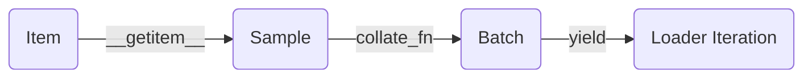

# Data Pipeline

In PyTorch, the data pipeline is more than a simple combination of `Dataset` and `DataLoader`. To build a robust and scalable data flow, start from sample design and understand every stage in the data lifecycle:



## Core definitions and responsibilities

PyTorch draws a clear boundary between data-processing primitives:

- **`Dataset`**: defines what a sample is and how to fetch it by index. Its job is to **describe single-sample reading and transformation logic**.
- **`DataLoader`**: delivers samples to the training loop in batches, with ordering and parallelism. Its job is not to understand business semantics, but to **organize the data flow** (batching, shuffling, multiprocessing).

If the data pipeline is a restaurant, `Dataset` is the kitchen's **single-plate serving rule**, while `DataLoader` is the **serving system** that controls how many plates go out, in what order, and whether multiple workers operate in parallel.

## System definitions of the core classes

Before entering more complex flows, establish the building blocks of the PyTorch data system from the code level:

### `Dataset` base class
The core responsibility of `torch.utils.data.Dataset` is data access. The most common Map-style dataset only needs three magic methods:
- `__init__`: prepares metadata once (for example, reading CSV labels, storing paths, initializing transforms).
- `__len__`: returns the total number of samples so external code knows the dataset size.
- `__getitem__`: the **most important method**; given an index `idx`, it returns the **single sample** at that position.

**Basic template**:
```python
from torch.utils.data import Dataset

class CustomDataset(Dataset):
    def __init__(self, data_list):
        self.data = data_list
        
    def __len__(self):
        return len(self.data)
        
    def __getitem__(self, idx):
        # Extract and parse a single sample
        item = self.data[idx]
        return item
```

### `DataLoader` base class
`torch.utils.data.DataLoader` is not a data container; it is an **iterator engine** wrapped around a dataset. Core parameters include:
- `dataset`: the source object that provides data.
- `batch_size`: how many samples to fetch for each batch.
- `shuffle`: whether to shuffle the data order each epoch.
- `num_workers`: how many subprocesses fetch data concurrently (`0` means single-process main thread).
- `collate_fn`: the function that merges `batch_size` samples into a batch.

**Basic usage**:
```python
from torch.utils.data import DataLoader

dataloader = DataLoader(
    dataset=CustomDataset([1, 2, 3, 4, 5]),
    batch_size=2,
    shuffle=True,
    num_workers=0
)
# Use it as: for batch in dataloader: ...
```

---

## Build the mental model: the four stages of the data path

For a standard Map-style dataset, the core path looks like this:

1. **Item (atomic data)**: the smallest raw data fragment.
2. **Sample**: a single piece of data that has been parsed, decoded, and lightly transformed, with complete business meaning (usually the return value of `dataset[idx]`).
3. **Batch**: a tensor group formed by merging multiple samples, usually through `collate_fn`, and fed directly into the model.
4. **DataLoader iteration**: an iterable object that keeps yielding batches while handling multiprocessing and pinned memory.

The approximate process in code looks like this:

```python
# 1 & 2. Fetch a single sample
sample = dataset[idx] 

# 3. Use the sampler to get a list of indices and fetch a group of samples
samples = [dataset[i] for i in indices]

# 4. Assemble multiple samples into a batch (internal DataLoader behavior)
batch = collate_fn(samples)
```

:::info[Batch Construction]
**Conclusion**: `DataLoader` does not create batches from nothing. It first collects a sequence of items and then assembles them. **A batch is just a combination of multiple items, not the smallest unit in the data flow.**
:::

## Start with the design: define the “sample contract”

The most common mistake is to start by debating `batch_size` or `num_workers`. The correct order is: **define what an `item` is first**.

You need to answer the following questions clearly:
**“If `DataLoader` is removed and only `sample = dataset[0]` runs, what fields does it return? What are the shape and dtype of each field? Are they consistent between training and inference?”**

The sample contract varies significantly by task:

### Image classification
The most typical item is a tuple `(image_tensor, class_id)`.
If all `image_tensor` values are already cropped to the same shape at this stage (for example `[C, 224, 224]`), the default collation logic can stack them directly into `[B, C, 224, 224]`.

### Object detection / keypoints
A single sample is often a dictionary because the number of objects in one image is variable:
```python
sample = {
    "image": [C, H, W],
    "boxes": [N, 4], # N is the number of objects in the image
    "labels": [N]
}
```

### NLP (natural language processing)
In text tasks, a single sample is usually also a dictionary, but the sequence length `L` varies by sentence:
```python
sample = {
    "input_ids": [L], 
    "attention_mask": [L],
    "label": 1
}
```

:::tip[Best practice]
In engineering work, always **validate the single-sample logic first with `print(dataset[0])`**. Configure `DataLoader` for batching only after the sample contract is stable.
:::

## Common misconceptions

- **Misconception 1: treating `Dataset` as a batch generator**.
  - `Dataset` should normally return **single samples only**. Batch assembly belongs to `DataLoader` and `collate_fn`. Only consider emitting batches directly from `Dataset` when the underlying storage makes batch reads cheaper.
- **Misconception 2: blaming the model as soon as the output shape looks wrong**.
  - Many shape errors happen during collation. For example, sending variable-length sequences into the default `DataLoader` will fail. In that case, the issue is not the model but the missing padding logic in a custom `collate_fn`.

## Summary and engineering checklist

Here is the practical division of labor:

1. How to read, decode, and attach labels to a sample → **`Dataset`**.
2. How to merge multiple independent samples into one tensor and pad them → **`collate_fn`**.
3. How many samples to take at once, whether to shuffle, and how to shard data in distributed training → **`Sampler`**.
4. How many workers to use and whether to lock memory → **`DataLoader` parameters**.

Once this division is clear, even complex streaming data or multimodal tasks become manageable.
