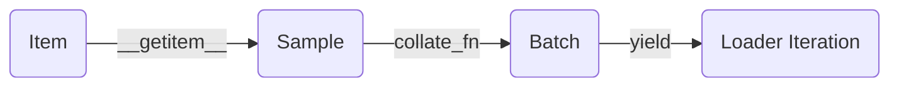

# 核心逻辑：从 Item 到 DataLoader

在 PyTorch 中，数据管线并不只是 `Dataset` 和 `DataLoader` 两个类的简单组合。要构建健壮、可扩展的数据流，我们必须从底层的样本设计出发，理解数据在其生命周期中的各个阶段：



## 核心定义与职责边界

PyTorch 对数据处理原语的职责划分非常明确：

- **`Dataset`**：负责“定义一条样本是什么、怎么按索引取到它”。它的职责是**描述单个样本的读取和变换逻辑**。
- **`DataLoader`**：负责“把这些样本按批次、顺序和并行方式送出来给训练循环使用”。它的职责不是理解业务语义，而是**组织数据流**（批次、打乱、多进程）。

如果将数据管线比作餐厅：`Dataset` 是厨房的**单份出餐规则**，而 `DataLoader` 则是**传菜系统**（一次上几份、按什么顺序、是否多工并行）。

## 核心类的系统定义

在进入复杂的链路之前，我们先从代码层面认识 PyTorch 数据系统的基石：

### `Dataset` 基类
`torch.utils.data.Dataset` 的核心是定义数据读取。最常见的 Map-style Dataset 只需要实现三个魔法方法：
- `__init__`：负责一次性的元数据准备（如读取 CSV 标注、保存路径、初始化 transform）。
- `__len__`：返回数据集的总样本数，让外部知道数据的规模。
- `__getitem__`：**最关键的方法**，给定一个索引 `idx`，返回该位置的**单条样本**。

**基础模板**：
```python
from torch.utils.data import Dataset

class CustomDataset(Dataset):
    def __init__(self, data_list):
        self.data = data_list
        
    def __len__(self):
        return len(self.data)
        
    def __getitem__(self, idx):
        # 提取、解析单一样本
        item = self.data[idx]
        return item
```

### `DataLoader` 基类
`torch.utils.data.DataLoader` 并不是一个数据容器，而是一个**迭代器引擎**。它在 Dataset 外面包了一层，核心参数包括：
- `dataset`：提供数据的来源对象。
- `batch_size`：每次抓取多少个样本组装成一个批次。
- `shuffle`：每个 epoch 是否打乱数据顺序。
- `num_workers`：分配几个子进程并发拉取数据（0 表示单进程主线程）。
- `collate_fn`：定义如何将 `batch_size` 个单样本拼接成批次的方法。

**基础调用**：
```python
from torch.utils.data import DataLoader

dataloader = DataLoader(
    dataset=CustomDataset([1, 2, 3, 4, 5]),
    batch_size=2,
    shuffle=True,
    num_workers=0
)
# 使用时：for batch in dataloader: ...
```

---

## 建立思维模型：数据链路的四个阶段

对于标准的 Map-style 数据集，其核心链路如下：

1. **Item（原子数据）**：最底层的基础数据片段。
2. **Sample（单样本）**：经过解析、解码、初步变换后，具有完整业务语义的单条数据（通常就是 `dataset[idx]` 的返回值）。
3. **Batch（批次数据）**：多个 Sample 经过汇总合并（通常通过 `collate_fn`）后形成的张量组，直接作为模型的输入。
4. **DataLoader Iteration**：持续产出 Batch 的可迭代对象，并在此期间处理多进程加速和内存固定（Pinned Memory）。

用代码表示这一近似过程：

```python
# 1 & 2. 获取单一样本
sample = dataset[idx] 

# 3. 根据采样器 (Sampler) 拿到一组索引，获取一组样本
samples = [dataset[i] for i in indices]

# 4. 将多条样本组装成 Batch (DataLoader 内部行为)
batch = collate_fn(samples)
```

:::info
**结论**：`DataLoader` 并不是凭空“造”出 batch，它是先获取一串 item，再将它们拼装起来。**Batch 只是“多个 item 的组合”，而非数据流的最基础单元。**
:::

## 设计的起点：确定“单样本契约” (Sample Contract)

最常见的误区是：一上来就开始纠结 `batch_size` 设多少，或者 `num_workers` 给多少。正确的顺序是：**首先定义清楚 `item` 是什么**。

你需要能明确回答以下问题：
**“如果现在不用 `DataLoader`，只执行 `sample = dataset[0]`，它返回了什么字段？每个字段的 shape 和 dtype 是什么？它们在训练和推理时一致吗？”**

不同任务下的“单样本契约”差异巨大：

### 图像分类
最典型的 Item 是二元组 `(image_tensor, class_id)`。
如果所有的 `image_tensor` 都在此阶段被裁剪到了相同的 shape（如 `[C, 224, 224]`），默认的合并逻辑就能直接将它们堆叠成 `[B, C, 224, 224]`。

### 目标检测 / 关键点
单样本往往是一个字典结构，因为一张图里的目标数量是不确定的：
```python
sample = {
    "image": [C, H, W],
    "boxes": [N, 4], # N 是该图中的目标数
    "labels": [N]
}
```

### NLP (自然语言处理)
在文本任务中，单样本通常也是字典，但序列长度 `L` 因句子而异：
```python
sample = {
    "input_ids": [L], 
    "attention_mask": [L],
    "label": 1
}
```

:::tip[最佳实践]
在工程中，务必**先通过 `print(dataset[0])` 跑通单一样本的逻辑**。确认单样本的契约完全稳定后，再去配置 `DataLoader` 进行批量化。
:::

## 常见误区澄清

- **误区一：将 Dataset 当成“批数据生成器”**。
  - `Dataset` 默认应当只返回**单条样本**。批处理（组装 Batch）是 `DataLoader` 和 `collate_fn` 的工作。除非你的底层存储（如某些数据库或二进制连续块）“直接读取批数据更便宜”，才考虑在 Dataset 中直接产出 Batch。
- **误区二：看到输出 Shape 不对就怀疑模型**。
  - 大量维度错误出在拼接阶段。例如变长序列直接送入默认的 `DataLoader` 会报错，此时问题不在数据本身，而在缺少自定义的 `collate_fn` 补齐（Padding）逻辑。

## 小结与工程化判断标准

总结一下各组件的落地位：

1. 样本怎么读、怎么解码、怎么附带标签 → **放 `Dataset`**。
2. 多个独立样本怎么合并成一个 Tensor，怎么做补齐 → **放 `collate_fn`**。
3. 一次取多少条、是否打乱、怎么做分布式数据分片 → **放 `Sampler`**。
4. 用几个 Worker 拉取、是否锁定内存 → **放 `DataLoader` 参数**。

掌握了这一套分工，后续无论面对多么复杂的流式数据或多模态任务，你都能游刃有余。
