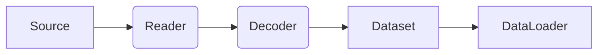

# Dataset Design

In real-world projects, data rarely lives neatly in a local folder. It may come from local image files, cloud Parquet tables, remote database cursors, or Kafka streams. To keep training code stable, build a highly scalable Dataset architecture.

## Two Dataset paradigms

PyTorch natively supports two dataset forms, each mapping to a different low-level access pattern:

### Map-style `Dataset`
- **Core API**: implement `__getitem__()` and usually `__len__()`.
- **Use case**: known-length data with **$O(1)$ random access**. Examples include local image directories, in-memory DataFrames, and fixed-size index files.
- **Advantage**: works naturally with PyTorch samplers and supports shuffle and weighted sampling.

### Iterable-style `IterableDataset`
- **Core API**: implement `__iter__()` and yield an iterator.
- **Use case**: data sources where sequential access is natural or random access is too expensive. Examples include streaming database reads, huge log parsing, and online adversarial sample generation.
- **Note**: because there is no global index, `Sampler`-based workflows such as random sampling and batch sampling do not apply.

## A layered design for scalability

To support multiple data formats and storage backends, the safest approach is to **decouple sample semantics from physical storage access**.

With a layered design, build a flexible preprocessing pipeline:



- **Source / Reader**: handles where the data comes from, such as S3, local disk, or database handles.
- **Decoder / Parser**: handles format decoding, turning raw bytes into NumPy arrays, tensors, or PIL images.
- **Dataset**: carries the abstract sample contract and maps decoded data to unified business fields such as `image` and `label`.

:::tip[Adapter pattern]
Do not write separate training code for every data source. Build classes such as `ImageFolderAdapter`, `ParquetAdapter`, and `StreamAdapter`, and let them handle the conversion from Source to the underlying Dataset. As long as they emit the same sample schema, downstream training logic does not need to change.
:::

## Advanced Dataset composition

In many cases, you do not need to write all logic from scratch. PyTorch provides primitives for dataset composition and splitting:

| Tool | Use case | Description |
| :--- | :--- | :--- |
| `ConcatDataset` | **Joint training on multiple datasets** | Concatenates multiple Map-style datasets end to end, increasing sample count along the row dimension. |
| `ChainDataset` | **Multiple streaming sources** | Chains multiple `IterableDataset` instances together, reading the next stream after the current one ends. |
| `StackDataset` | **Multimodal alignment** | For example, Dataset A produces images and Dataset B produces text. Stack aligns them by index in parallel. |
| `Subset` | **Dataset splitting** | Takes an index list and returns a subset of the original dataset, often for train/validation splits. |

## `IterableDataset` and multiprocessing traps

:::warning[Duplicate data risk]
When `IterableDataset` is used with `DataLoader(num_workers > 0)`, each worker process receives a full copy of the Dataset object. If splitting is not done manually in `__iter__`, **every process will read the same data from the beginning**, causing duplicates.
:::

:::success[Correct approach]
Use `torch.utils.data.get_worker_info()` inside `__iter__()` to shard the data so that each worker consumes only its assigned partition.
:::

```python
import math
from torch.utils.data import IterableDataset, get_worker_info

class MyStreamingDataset(IterableDataset):
    def __init__(self, start, end):
        self.start = start
        self.end = end

    def __iter__(self):
        worker_info = get_worker_info()
        if worker_info is None:  # single-process mode
            iter_start = self.start
            iter_end = self.end
        else:  # multiprocessing mode, shard the data
            per_worker = int(math.ceil((self.end - self.start) / float(worker_info.num_workers)))
            worker_id = worker_info.id
            iter_start = self.start + worker_id * per_worker
            iter_end = min(iter_start + per_worker, self.end)
            
        return iter(range(iter_start, iter_end))
```

:::caution[IterableDataset sharding]
Because `IterableDataset` has no global index, `Sampler` and `BatchSampler` cannot be used with it. All sampling and shuffle logic must be implemented inside the Dataset.
:::


With this layered and composable design, you can build a modern deep learning data foundation that scales to tens of millions of samples and mounts multiple storage systems flexibly.
