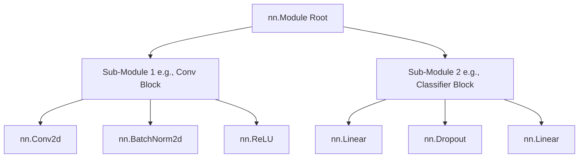

# `nn.Module` Deep Dive

In PyTorch, neural networks are constructed using the `torch.nn` package. `nn.Module` is the base class for all neural network modules. A neural network itself is a module that consists of other modules (layers). This nested structure allows for complex architectures while keeping the code simple and easy to debug.

## Building a Custom Model

Every custom model in PyTorch must inherit from `nn.Module`.

You must define two methods:
1.  `__init__`: Define the layers (e.g., `nn.Linear`, `nn.Conv2d`) and other attributes of the model.
2.  `forward`: Define the forward pass logic, i.e., how the input data passes through the layers to generate the output.

### Basic Feed-Forward Network

```python
import torch
from torch import nn

class NeuralNetwork(nn.Module):
    def __init__(self):
        super(NeuralNetwork, self).__init__()
        self.flatten = nn.Flatten()
        self.linear_relu_stack = nn.Sequential(
            nn.Linear(28*28, 512),
            nn.ReLU(),
            nn.Linear(512, 512),
            nn.ReLU(),
            nn.Linear(512, 10),
        )

    def forward(self, x):
        x = self.flatten(x)
        logits = self.linear_relu_stack(x)
        return logits
```

:::info
You do not need to explicitly define the backward pass (how gradients are computed). PyTorch's `autograd` system automatically calculates gradients for operations defined in the `forward` pass.
:::

## Key `nn.Module` Concepts

### `Parameters` and `Buffers`

-   **Parameters (`nn.Parameter`)**: Tensors that are registered as model attributes and are updated by the optimizer during training (e.g., weights and biases).
-   **Buffers**: Tensors that are registered as model attributes but do *not* require gradients and are *not* updated by the optimizer (e.g., running mean and variance in `BatchNorm`).

```python
for name, param in model.named_parameters():
    print(f"Layer: {name} | Size: {param.size()} | Requires Grad: {param.requires_grad}")
```

### Module State Management (`state_dict`)

A `state_dict` is simply a Python dictionary object that maps each layer to its parameter tensor. Because `state_dict` objects are Python dictionaries, they can be easily saved, updated, altered, and restored.

```python
# Save model weights
torch.save(model.state_dict(), "model_weights.pth")

# Load model weights
model.load_state_dict(torch.load("model_weights.pth"))
```

### Training and Evaluation Modes

A model behaves differently depending on whether it is training or evaluating (e.g., `Dropout` and `BatchNorm` layers).

```python
model.train() # Set the model to training mode
model.eval()  # Set the model to evaluation mode
```

## Internal Architecture Hierarchy



## Best Practices

- Always call `super().__init__()` at the beginning of your custom module's constructor.
- Use `nn.Sequential` for simple, linear stacks of layers to keep the `forward` function clean.
- Ensure all custom operations involving tensors are fully differentiable if they require backpropagation.

## References

- [PyTorch Official Tutorial: Build the Neural Network](https://pytorch.org/tutorials/beginner/basics/buildmodel_tutorial.html)
- [PyTorch Documentation: torch.nn](https://pytorch.org/docs/stable/nn.html)
