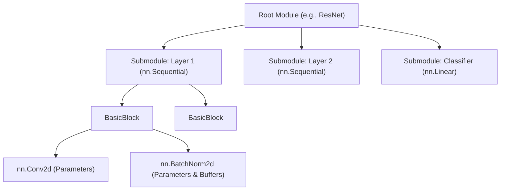

# nn.Module

`nn.Module` is the foundational abstraction in PyTorch for all differentiable computational units. Its core purpose is to encapsulate **state** (parameters and buffers) and **computation** (`forward` pass) into a unified, composable object. 

Rather than just being a "layer of code," a module is a stateful building block that automatically integrates with PyTorch's autograd engine, optimizers, model serialization, and device placement mechanisms.

## Core Design Philosophy

The architecture of `nn.Module` is built around three central principles:

### Stateful Registration
A module internally manages three types of states: learnable parameters, non-learnable persistent buffers, and submodules. By overriding Python's `__setattr__`, PyTorch automatically routes these objects into internal dictionaries (`_parameters`, `_buffers`, `_modules`). This automated registration is what makes recursive operations like `model.parameters()`, `model.to(device)`, and `model.state_dict()` possible.

### Differentiable Forward & Autograd Integration
The `forward` method defines the mathematical mapping $f_\theta: \mathcal{X} \rightarrow \mathcal{Y}$. When you invoke a module instance (`model(x)`), it actually triggers the `__call__` method. This method executes registered hooks, checks the `self.training` state, and finally dispatches the call to your `forward` implementation. The autograd engine dynamically constructs the computational graph during this process, enabling the gradient flow $\frac{\partial \mathcal{L}}{\partial \theta}$ to propagate backward seamlessly.

### Compositional Hierarchy
Modules can contain other modules to arbitrary depths, forming a tree structure. This design perfectly matches the modular paradigm of modern deep learning architectures (e.g., Transformer blocks, ResNet stages), facilitating weight sharing, targeted replacement, and feature extraction.



## Minimum Implementation

A minimum viable custom module requires inheriting from `nn.Module`, calling the superclass constructor, and implementing the `forward` pass.

```python
import torch
import torch.nn as nn

class MinimalModule(nn.Module):
    def __init__(self, in_dim: int, out_dim: int):
        super().__init__() # CRITICAL: Initializes internal tracking dictionaries
        self.linear = nn.Linear(in_dim, out_dim)

    def forward(self, x: torch.Tensor) -> torch.Tensor:
        return self.linear(x)
```

:::danger[Do not forget `super().__init__()`]
Never omit `super().__init__()`. Without it, the internal dictionaries (`_parameters`, `_buffers`, etc.) are not initialized, and assigning any module or parameter will throw an `AttributeError`.
:::

## State Registration Mechanism

Understanding how PyTorch tracks state is crucial for ensuring optimizers update the correct weights and `state_dict` saves the correct tensors.

| State Type | How to Register | Requires Grad | Migrates with `.to()` | Saved in `state_dict` |
| :--- | :--- | :--- | :--- | :--- |
| **Learnable Parameter** | `nn.Parameter(tensor)` | ✅ Yes | ✅ Yes | ✅ Yes |
| **Persistent Buffer** | `self.register_buffer(name, tensor)` | ❌ No | ✅ Yes | ✅ Yes |
| **Transient Buffer** | `self.register_buffer(name, tensor, persistent=False)` | ❌ No | ✅ Yes | ❌ No |
| **Submodule** | `self.layer = nn.Module(...)` | Depends on sub-components | ✅ Yes | ✅ Yes |

:::note[When to use Buffers?]
Use `register_buffer` for state that is necessary for the model's forward pass but should not be updated by backpropagation. Common examples include positional encodings, attention masks, and the running mean/variance in `BatchNorm`.

Remember: Do not simply assign a standard tensor to `self` (e.g., `self.mask = torch.zeros(...)`), as it will bypass the registration system.
:::

## Construction and Modification Best Practices

### State and Container Management

Remember to **explicitly initialize parameters**. If your custom layers have specific parameters, they should be initialized explicitly. You can use `model.apply(init_weights)` to apply initialization functions recursively to the entire module tree.

:::warning[Never use standard Python containers for submodules]
If you use `self.layers = [nn.Linear(...) for _ in range(N)]`, PyTorch will not register them. The optimizer will not see their parameters. You must use `nn.ModuleList`, `nn.ModuleDict`, `nn.ParameterList`, or `nn.ParameterDict`.
:::

### Forward Execution
- **Always call `model(x)` instead of `model.forward(x)`.** Directly calling `forward` bypasses the `__call__` method, meaning registered forward/backward hooks will not execute.
- **Respect the `self.training` flag.** Layers like Dropout and BatchNorm behave differently during training and evaluation. Always rely on `model.train()` and `model.eval()` to toggle this flag globally across the module tree.
- **Avoid In-place Operations.** Operations like `x += self.bias` on leaf tensors requiring gradients will break the autograd graph and raise a `RuntimeError`. Prefer out-of-place operations: `x = x + self.bias`.

### Device and Precision Consistency
- **Dynamic Device Inference.** Do not hardcode device assignments (e.g., `device='cuda'`) inside `__init__`. When creating new tensors inside `forward`, always inherit the device and data type from the input tensor:
  `mask = torch.ones(B, L, device=x.device, dtype=x.dtype)`
- **Optimization and Compilation.** Avoid data-dependent control flow (e.g., `if x.sum() > 0:`) in the `forward` pass if you plan to use `torch.compile()`. Prefer static branching or operators like `torch.where`.

### Modifying the Architecture (Model Surgery)
When modifying an existing architecture (e.g., replacing a specific deep submodule), avoid manually traversing `named_modules()`. Instead, use the built-in `get_submodule()` and `set_submodule()` methods, which operate based on nested dot-path strings (e.g., `layer1.0.conv1`), making targeted replacements much safer.

## Summary

The fundamental responsibility of `nn.Module` is to declare the structural state of a network partition and define how that state participates in the forward computation. It does not dictate the training loop itself. Instead, it ensures that external mechanisms—optimizers, serialization (`state_dict`), device migration (`.to()`), evaluation modes (`train`/`eval`), and the hook system—can recursively observe and manipulate the model's state.

## References

- [PyTorch Official Documentation: torch.nn](https://pytorch.org/docs/stable/nn.html)
- [PyTorch Tutorial: Build the Neural Network](https://pytorch.org/tutorials/beginner/basics/buildmodel_tutorial.html)
