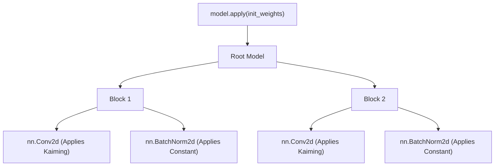

# Custom Layers

While PyTorch provides a rich standard library of layers (`nn.Linear`, `nn.Conv2d`), modern deep learning research frequently requires defining custom mathematical operations. Building a custom layer goes beyond writing a `forward` function—it requires principled management of learnable parameters and rigorous weight initialization.

## The Anatomy of a Custom Layer

Creating a custom layer is structurally identical to building a full model: you subclass `nn.Module`. The core difference lies in how you manually define and register the layer's internal tensors.

### Explicit Parameter Registration

When a standard tensor is assigned as an attribute, PyTorch treats it as a standard Python object. To integrate a tensor into the autograd engine and optimizer, it must be wrapped in `nn.Parameter`.

```python
import torch
import torch.nn as nn
import math

class CustomProjection(nn.Module):
    def __init__(self, in_features: int, out_features: int):
        super().__init__()
        # Wrap tensors in nn.Parameter to make them learnable and trackable
        self.weight = nn.Parameter(torch.empty((out_features, in_features)))
        self.bias = nn.Parameter(torch.empty(out_features))
        
        self.reset_parameters()

    def reset_parameters(self):
        # Initialization logic belongs here
        nn.init.kaiming_uniform_(self.weight, a=math.sqrt(5))
        nn.init.zeros_(self.bias)

    def forward(self, x: torch.Tensor) -> torch.Tensor:
        return torch.nn.functional.linear(x, self.weight, self.bias)
```

:::tip[The `reset_parameters` Convention]
It is a PyTorch convention to encapsulate initialization logic within a `reset_parameters()` method. This allows the weights to be easily re-initialized later without instantiating a new object.
:::

## The Mathematics of Initialization

Initialization is not merely a hyperparameter; it determines whether a deep network can train at all. Poor initialization leads to **vanishing** or **exploding** gradients.

### Why Initialization Matters

Consider a deep linear network where the forward pass at layer $l$ is $h^{(l)} = W^{(l)} h^{(l-1)}$. If the variance of the weights is not carefully scaled, the variance of the activations will exponentially grow or decay with the network depth:

$$
\text{Var}(h^{(l)}) = n \cdot \text{Var}(W^{(l)}) \cdot \text{Var}(h^{(l-1)})
$$

Where $n$ is the fan-in (number of input units). To maintain a stable variance ($\text{Var}(h^{(l)}) \approx \text{Var}(h^{(l-1)})$), we need $n \cdot \text{Var}(W^{(l)}) = 1$, which means $\text{Var}(W) = \frac{1}{n}$.

### Standard Strategies

1. **Xavier (Glorot) Initialization**: Designed for symmetric activation functions like `tanh`. It scales weights based on both input and output dimensions.
2. **Kaiming (He) Initialization**: Designed for non-linearities like ReLU, which zero out half of the variance. It multiplies the variance by 2 to compensate: $\text{Var}(W) = \frac{2}{n_{in}}$.

:::warning[Initialization Mismatch]
Using Xavier initialization with ReLU activations will systematically halve the signal variance at each layer, leading to vanishing gradients in deep networks. Always match the initialization scheme to your activation function.
:::

## Applying Initialization Systematically

Instead of initializing layers one by one, PyTorch provides `model.apply(fn)`, which recursively visits every node in the module tree (including the root itself) and applies the given function `fn`.



### The `apply` Pattern

By defining a dispatch function, you can systematically initialize an entire architecture based on layer types:

```python
import torch.nn.init as init

def init_weights(m: nn.Module):
    if isinstance(m, nn.Conv2d) or isinstance(m, nn.Linear):
        # Kaiming normal for layers followed by ReLU
        init.kaiming_normal_(m.weight, mode='fan_in', nonlinearity='relu')
        if m.bias is not None:
            init.zeros_(m.bias)
    elif isinstance(m, nn.BatchNorm2d) or isinstance(m, nn.LayerNorm):
        # Scale to 1, shift to 0
        init.ones_(m.weight)
        init.zeros_(m.bias)

# Execute the recursive initialization
model.apply(init_weights)
```

## Summary

Custom layers give you absolute control over mathematical operations, but with that power comes the responsibility of correct parameter registration and initialization. Remember to always wrap learnable tensors in `nn.Parameter`, use `reset_parameters` for encapsulation, and leverage `model.apply` for robust, tree-wide initialization strategies.

## References

- [PyTorch Docs: torch.nn.init](https://pytorch.org/docs/stable/nn.init.html)
- [Delving Deep into Rectifiers (He et al.)](https://arxiv.org/abs/1502.01852)
- [Understanding the difficulty of training deep feedforward neural networks (Glorot & Bengio)](https://proceedings.mlr.press/v9/glorot10a.html)
