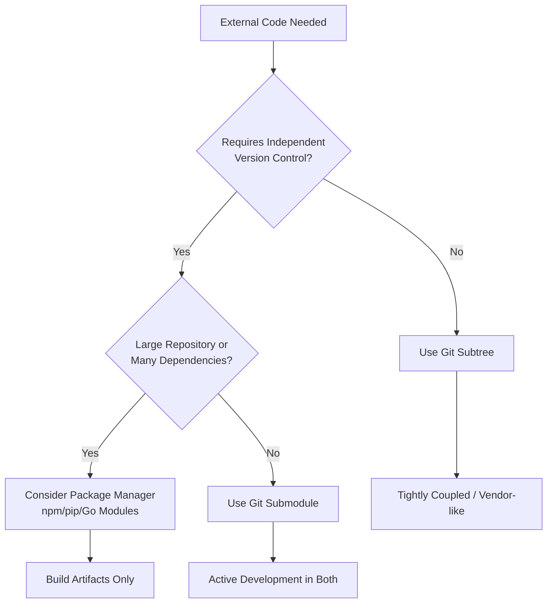

# Git Composition Strategy

**Choosing Between Submodule and Subtree for Dependency Management**

Before implementing a specific technical solution, evaluate the development philosophy that best fits your project. The choice usually hinges on whether you treat external code as an independent dependency (like a reference) or as an integrated part of your project's source (like a managed fork).

---

## Decision Logic

The following table outlines the primary trade-offs between the two approaches:

| Dimension | Submodule (Separation) | Subtree (Inclusion) |
| :--- | :--- | :--- |
| **Mental Model** | **Reference**: A pointer to an external repo | **Managed Fork**: Code is merged into your repo |
| **Philosophy** | "Dependency as a pointer" | "Dependency as source code" |
| **Modification** | Rare — dependency is an independent repo | Frequent — dependency is part of the project |
| **Update Frequency** | Low — deliberate, infrequent upgrades | High — changes happen alongside main development |
| **Sync Cost** | Higher — two-step (sub-repo + pointer) | Lower — single commit covers both |
| **Onboarding** | Higher — requires Submodule workflows | Lower — standard Git workflows suffice |
| **CI/CD** | Needs recursive clone/init | Zero extra setup |

### Short Guidance

- **Prefer Submodule** if the dependency is maintained independently (e.g., a stable library) and you only need to upgrade it occasionally. It works like a **link** to a specific version.
- **Prefer Subtree** if your team frequently patches or evolves the dependency code while working on features. It works like **forking** the code directly into your repository, keeping everything in one place.

---

## Architectural Fit

Use this guide to determine where your requirement falls within the Git ecosystem:

---

## Comparison Matrix

| Dimension | Submodule | Subtree | Package Manager |
| :--- | :--- | :--- | :--- |
| **Storage** | Pointer to commit hash | Full code merged | Build artifacts (usually) |
| **Workflow** | Higher (init/update) | Lower (normal Git) | Managed (npm/pip) |
| **History** | Separated | Merged | None (source hidden) |
| **CI/CD** | Needs recursive clone | Zero extra setup | Needs registry/install |
| **Push Upstream** | Trivial | Possible but slow | Via release process |
