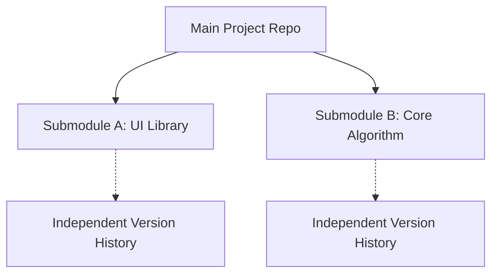

# Git Submodule

**Managing External Dependencies and Multi-Repository Architectures**

Git submodules allow you to keep a Git repository as a subdirectory of another Git repository. This lets you clone another repository into your project and keep your commits separate.

---

## Core Concepts

### Architecture Overview



| Use Case | Description | Example |
| :--- | :--- | :--- |
| **Dependency Management** | Contain specific versions of third-party libraries. | UI framework version pinning. |
| **Component Reuse** | Share common components across multiple projects. | Shared auth/logging module. |
| **Microservices** | Organize multiple related services in a single view. | Dev environment orchestration. |

---

## Basic Operations

### Adding a Submodule

```bash
# Add a submodule at a specific path
git submodule add <repository_url> <path>

# Example: Adding a common utility library
git submodule add https://github.com/example/tools.git libs/tools
```

### Cloning a Project with Submodules

```bash
# Method A: One-step clone (Recommended)
git clone --recurse-submodules <url>

# Method B: Multi-step initialization
git clone <url>
cd project
git submodule update --init --recursive
```

### Updating Submodules

| Task | Command |
| :--- | :--- |
| **Sync to recorded commit** | `git submodule update` |
| **Update to remote HEAD** | `git submodule update --remote` |
| **Recursively update all** | `git submodule update --init --recursive` |

---

## Development Workflow

When you need to make changes inside a submodule:

1. **Enter submodule**: `cd libs/tools`
2. **Switch to branch**: `git checkout main` (avoids Detached HEAD).
3. **Modify and commit**: `git add . && git commit -m "feat: update tools"`
4. **Push submodule**: `git push origin main`
5. **Update main project**:
   ```bash
   cd ../..
   git add libs/tools
   git commit -m "chore: update tools submodule pointer"
   git push origin main
   ```

---

## Best Practices

:::info[Engineering Advice]
1. **Pin Versions**: Pin to specific commits for build reproducibility.
2. **Use HTTPS**: Prefer HTTPS links in `.gitmodules` for CI/CD compatibility.
3. **Proactive Sync**: Run `git submodule update --init --recursive` after `git pull`.
4. **Clean Removal**: Use `git rm` AND clean `.git/modules/` when removing.
:::

---

## Troubleshooting

| Issue | Solution |
| :--- | :--- |
| **Detached HEAD** | `cd <path> && git checkout <branch>`. |
| **URL Changed** | Update `.gitmodules` and run `git submodule sync`. |
| **Merge Conflicts** | Use `git checkout --ours/--theirs <path>` and re-commit pointer. |
