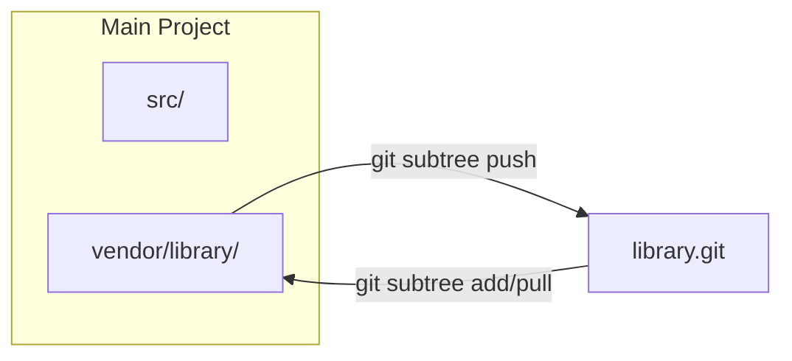

# Git Subtree Engineering Guide

**Embedding External Repositories Without a Separate Pointer File**

Git subtree lets you merge another repository into a subdirectory of your project, while retaining the ability to pull upstream updates and push changes back. Unlike `git submodule`, no `.gitmodules` file is needed — the foreign code lives inside your own history.

---

## Core Concepts


### How Subtree Works



At its core, `git subtree` performs a **squash merge** of the external repository's history into a designated prefix directory. The foreign commits can be replayed on top of your own tree, or squashed into a single commit per import to keep your log clean.

---

## Basic Operations

### Adding a Subtree

```bash
# General syntax
git subtree add --prefix=<path> <repository_url> <branch> [--squash]

# Example: embed a utility library under vendor/tools
git subtree add --prefix=vendor/tools https://github.com/example/tools.git main --squash
```

| Flag | Purpose |
| :--- | :--- |
| `--prefix` | Target directory in the working tree (created if it does not exist) |
| `--squash` | Squash external history into a single merge commit (recommended for a cleaner log) |
| `<branch>` | Branch of the remote to import (`main`, `master`, `develop`, etc.) |

### Pulling Upstream Updates

```bash
# Pull latest changes from the remote into your prefix
git subtree pull --prefix=vendor/tools https://github.com/example/tools.git main --squash
```

:::info
`git subtree pull` internally performs a `git merge` of the remote branch into your prefix directory. Conflicts, if any, follow standard Git conflict resolution rules.
:::

---

## Development Workflow

### Scenario: Importing a Library and Making Local Changes

1. **Add subtree** (one-time setup):
   `git subtree add --prefix=vendor/log https://github.com/user/log.git main --squash`

2. **Modify library locally**:
   Edit files in `vendor/log/`.

3. **Commit local changes**:
   `git add vendor/log && git commit -m "vendor(log): patch memory leak in parser"`

4. **Push upstream** (if you have write access):
   `git subtree push --prefix=vendor/log https://github.com/user/log.git main`

---

## Best Practices

### Common Patterns

- **Keep Prefix Paths Predictable**: Organize subtrees under `vendor/` or `packages/`.
- **Use `--squash` Consistently**: Mixing squash and non-squash causes confusing histories.
- **Avoid Deep Nesting**: Subtrees within subtrees are technically possible but lead to unpredictable merge behavior.
- **Commit Message Convention**: Prefixing with `vendor(<name>):` makes it easy to filter history.

---

## Troubleshooting

| Issue | Solution |
| :--- | :--- |
| **`subtree push` is extremely slow** | Use `git subtree push` on a fresh clone or split first. |
| **Merge conflicts on `subtree pull`** | Resolve conflicts normally (`git add <file> && git commit`). |
| **Wrong prefix directory** | Re-add with the correct prefix and remove the old one. |
| **Need to remove a subtree** | `git rm -r <prefix> && git commit -m "remove subtree <name>"`. |

---

## Migration

### From Submodule to Subtree

```bash
# 1. Remove the submodule
git submodule deinit vendor/library
git rm vendor/library
rm -rf .git/modules/vendor/library
git commit -m "chore: remove submodule vendor/library"

# 2. Add as subtree
git subtree add --prefix=vendor/library https://github.com/user/library.git main --squash
```

---

## References

- [Pro Git -- Git Tools - Subtree Merging](https://git-scm.com/book/en/v2/Git-Tools-Subtree-Merging)
- [git-subtree documentation (built-in)](https://git.wiki.kernel.org/index.php/Git-subtree)
- [Atlassian Tutorial -- Git Subtree](https://www.atlassian.com/git/tutorials/git-subtree)
