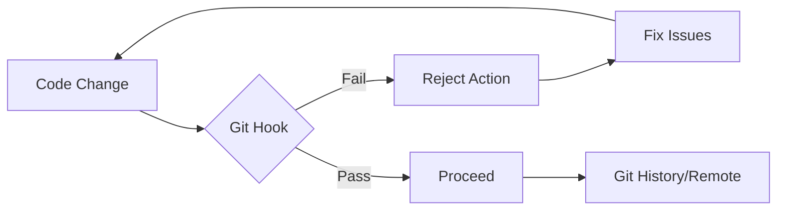

# Git Hooks Engineering Guide

**Automating Workflows and Enforcing Engineering Standards**

Git hooks are scripts that Git automatically executes before or after key events (commit, push, receive). They are essential for maintaining code quality, ensuring security, and automating repetitive developer tasks.

## Core Concepts

### Hook Categories

| Category | Hooks | Scope |
| :--- | :--- | :--- |
| **Client-Side** | `pre-commit`, `commit-msg`, `pre-push` | Local developer workflow |
| **Server-Side** | `pre-receive`, `post-receive`, `update` | Remote repository enforcement |

### Client-Side vs Server-Side Hooks

**Client-side hooks** run on a developer's local machine. They act as personal guardrails — fast checks like linting, formatting, and commit message validation. They can be bypassed with `--no-verify`, so they are advisory rather than mandatory.

**Server-side hooks** run on the remote repository (e.g., GitHub, GitLab, self-hosted Git servers). They enforce policies that cannot be skipped, such as rejecting pushes that fail CI checks, enforcing branch naming conventions, or preventing force-pushes to protected branches.

> **Rule of thumb**: Use client-side hooks for developer experience (fast feedback), and server-side hooks for policy enforcement (non-negotiable rules).

### Why Automate with Hooks?



| Benefit | Engineering Outcome |
| :--- | :--- |
| **Code Quality** | Prevents linting/formatting errors from entering the history. |
| **Security** | Scans for hardcoded secrets/API keys before they leave the machine. |
| **Standardization** | Enforces [Conventional Commits](https://www.conventionalcommits.org/). |
| **Reliability** | Ensures unit tests pass before a push is allowed. |

---

## Hook Managers

Native Git hooks (stored in `.git/hooks/`) are not easily version-controlled. Hook managers solve this by making hooks shareable, configurable, and easy to maintain. Choose based on your project's ecosystem:

| Manager | Language | Best For | Parallel Execution |
| :--- | :--- | :--- | :--- |
| **Husky** + lint-staged | Node.js | npm/Node.js projects | Via lint-staged |
| **[Lefthook](https://github.com/evilmartians/lefthook)** | Go binary | Polyglot / any toolchain | Built-in |
| **[pre-commit](https://pre-commit.com)** | Python | Python or multi-language repos | No |

### Husky + lint-staged (Node.js Ecosystem)

Husky makes Git hooks easy to manage and share across the team.

```bash
# Install Husky
npm install husky --save-dev

# Initialize Husky (creates .husky directory)
npx husky init
```

Running linters on the *entire* codebase for every commit is slow. `lint-staged` ensures you only check files that are currently being committed.

```bash
npm install lint-staged --save-dev
```

**Configuration (`package.json`):**

```json
{
  "lint-staged": {
    "*.{js,ts,tsx}": "eslint --fix",
    "*.py": "ruff check --fix",
    "*.md": "prettier --write"
  }
}
```

**.husky/pre-commit:**

```bash
npx lint-staged
```

### Lefthook (Language-Agnostic)

A fast, zero-dependency alternative written in Go. Unlike Husky (npm-only) or pre-commit (Python), Lefthook works with any toolchain and supports parallel execution out of the box.

**Installation:**

```bash
# Go
go install github.com/evilmartians/lefthook@latest

# npm
npm install @evilmartians/lefthook --save-dev

# Homebrew (macOS/Linux)
brew install lefthook
```

**Configuration (`lefthook.yml`):**

```yaml
pre-commit:
  commands:
    lint-js:
      glob: "*.{js,ts,tsx}"
      run: eslint --fix {staged_files}

    format-py:
      glob: "*.py"
      run: ruff format {staged_files}

commit-msg:
  commands:
    conventional:
      run: commitlint --edit {1}
```

```bash
# Install hooks into .git/
lefthook install
```

### pre-commit (Python Ecosystem)

The industry standard for pure Python or multi-language projects, with a rich ecosystem of shared hook repositories.

```bash
pip install pre-commit
```

**`.pre-commit-config.yaml`:**

```yaml
repos:
  - repo: https://github.com/pre-commit/pre-commit-hooks
    rev: v4.6.0
    hooks:
      - id: trailing-whitespace
      - id: end-of-file-fixer
      - id: check-yaml
      - id: check-added-large-files

  - repo: https://github.com/astral-sh/ruff-pre-commit
    rev: v0.4.0
    hooks:
      - id: ruff
        args: [ --fix ]
      - id: ruff-format
```

```bash
# Install the hooks into .git/
pre-commit install

# Run against all files manually
pre-commit run --all-files
```

---

## Commit Message Tooling

Standardized commit messages enable automated changelog generation and better project history. These tools plug into any hook manager via the `commit-msg` hook.

### Commitlint (Validation)

Enforce the Conventional Commit specification after the message is written:

```bash
npm install @commitlint/cli @commitlint/config-conventional --save-dev

# Create config
echo "export default { extends: ['@commitlint/config-conventional'] };" > commitlint.config.js

# Add hook
echo "npx commitlint --edit \$1" > .husky/commit-msg
```

### Commitizen (Interactive)

**[Commitizen](https://commitizen-tools.github.io/commitizen/)** guides developers through writing compliant messages interactively — eliminating the guesswork before validation is even needed.

```bash
npm install cz-conventional-changelog --save-dev
```

**`package.json`:**

```json
{
  "scripts": {
    "commit": "cz"
  },
  "config": {
    "commitizen": {
      "path": "cz-conventional-changelog"
    }
  }
}
```

Use `npm run commit` (or `npx cz`) instead of `git commit` to be prompted for type, scope, and description.

> Combine both for defense-in-depth: Commitizen helps write good messages, Commitlint catches any that slip through.

---

## Best Practices

:::tip[Proactive Validation]
1. **Version Control Your Hooks**: Never rely on local `.git/hooks/`. Use a hook manager.
2. **Fail Fast**: Order hooks so the fastest checks (linting) run before slow ones (integration tests).
3. **Informative Errors**: Ensure hook scripts provide clear instructions on how to fix a rejection.
4. **Use `--no-verify` Sparingly**: Only bypass hooks for emergencies; never to ignore quality standards.
5. **Virtual Environment Awareness**: Hooks execute in a bare shell — they won't inherit your active virtualenv. Use wrapper commands like `uv run`, `pipx run`, or absolute paths to ensure tools are found.
:::

---

## Troubleshooting

| Issue | Resolution |
| :--- | :--- |
| **Hooks not firing** | Ensure the script is executable: `chmod +x .husky/pre-commit` |
| **Husky init fails** | Ensure you are in the root of a Git repository. |
| **Environment mismatch** | Use absolute paths or standard commands (e.g., `npm run`) in hook scripts. |
| **"command not found" in hook** | The hook runs outside your virtual environment. Prefix with `uv run`, `pipx run`, or use the absolute path to the binary. |
