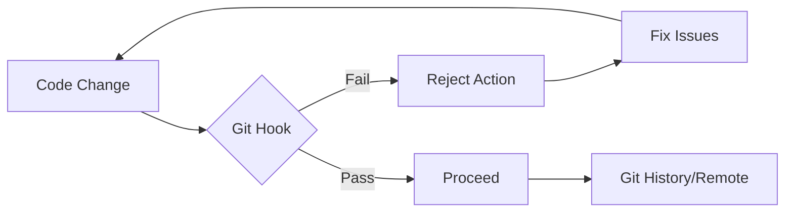

# Git Hooks Engineering Guide

**Automating Workflows and Enforcing Engineering Standards**

Git hooks are scripts that Git automatically executes before or after key events (commit, push, receive). They are essential for maintaining code quality, ensuring security, and automating repetitive developer tasks.

## Core Concepts

### Hook Categories

| Category | Hooks | Scope |
| :--- | :--- | :--- |
| **Client-Side** | `pre-commit`, `commit-msg`, `pre-push` | Local developer workflow |
| **Server-Side** | `pre-receive`, `post-receive`, `update` | Remote repository enforcement |

### Why Automate with Hooks?



| Benefit | Engineering Outcome |
| :--- | :--- |
| **Code Quality** | Prevents linting/formatting errors from entering the history. |
| **Security** | Scans for hardcoded secrets/API keys before they leave the machine. |
| **Standardization** | Enforces [Conventional Commits](https://www.conventionalcommits.org/). |
| **Reliability** | Ensures unit tests pass before a push is allowed. |

---

## Standard Tooling: Husky & lint-staged

While native Git hooks (stored in `.git/hooks/`) are powerful, they are not easily version-controlled. For modern engineering teams, we standardize on **Husky**.

### 1. Setup Husky (Node.js/General)

Husky makes Git hooks easy to manage and share across the team.

```bash
# Install Husky
npm install husky --save-dev

# Initialize Husky (creates .husky directory)
npx husky init
```

### 2. Optimize with lint-staged

Running linters on the *entire* codebase for every commit is slow. `lint-staged` ensures you only check files that are currently being committed.

```bash
npm install lint-staged --save-dev
```

**Configuration (`package.json`):**

```json
{
  "lint-staged": {
    "*.{js,ts,tsx}": "eslint --fix",
    "*.py": "ruff check --fix",
    "*.md": "prettier --write"
  }
}
```

**.husky/pre-commit:**

```bash
npx lint-staged
```

---

## Commit Message Standardization

Standardized commit messages enable automated changelog generation and better project history.

### Commitlint

Enforce the Conventional Commit specification:

```bash
npm install @commitlint/cli @commitlint/config-conventional --save-dev

# Create config
echo "export default { extends: ['@commitlint/config-conventional'] };" > commitlint.config.js

# Add hook
echo "npx commitlint --edit \$1" > .husky/commit-msg
```

---

## Python Engineering: Pre-commit Framework

For pure Python or multi-language projects, the `pre-commit` framework is the industry standard.

### Installation & Config

```bash
pip install pre-commit
```

**`.pre-commit-config.yaml`:**

```yaml
repos:
  - repo: https://github.com/pre-commit/pre-commit-hooks
    rev: v4.6.0
    hooks:
      - id: trailing-whitespace
      - id: end-of-file-fixer
      - id: check-yaml
      - id: check-added-large-files

  - repo: https://github.com/astral-sh/ruff-pre-commit
    rev: v0.4.0
    hooks:
      - id: ruff
        args: [ --fix ]
      - id: ruff-format
```

### Usage

```bash
# Install the hooks into .git/
pre-commit install

# Run against all files manually
pre-commit run --all-files
```

---

## Best Practices

:::tip Proactive Validation
1. **Version Control Your Hooks**: Never rely on local `.git/hooks/`. Use Husky or `pre-commit`.
2. **Fail Fast**: Order hooks so the fastest checks (linting) run before slow ones (integration tests).
3. **Informative Errors**: Ensure hook scripts provide clear instructions on how to fix a rejection.
4. **Use `--no-verify` Sparingly**: Only bypass hooks for emergencies; never to ignore quality standards.
:::

---

## Troubleshooting

| Issue | Resolution |
| :--- | :--- |
| **Hooks not firing** | Ensure the script is executable: `chmod +x .husky/pre-commit` |
| **Husky init fails** | Ensure you are in the root of a Git repository. |
| **Environment mismatch** | Use absolute paths or standard commands (e.g., `npm run`) in hook scripts. |

---

*Last updated: March 2026*
