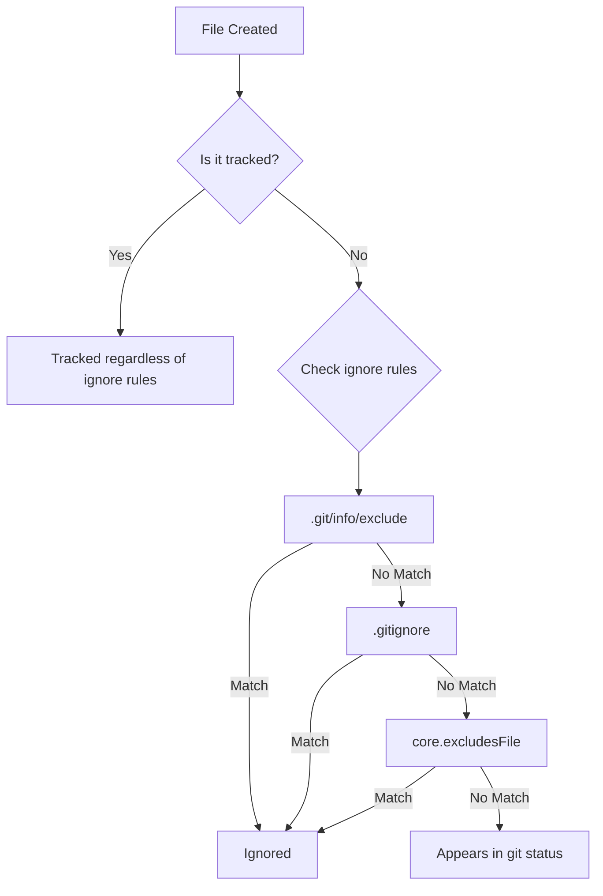
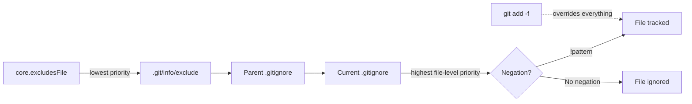

# Git Ignore

**Managing Untracked Files Across Project, Local, and Global Scopes**

Git provides three levels of ignore configuration to control which files are excluded from version control. Understanding when and where to use each level is essential for clean repositories and efficient team workflows.

## Ignore Levels Overview

| Level | File / Config | Scope | Shared? | Use Case |
| :--- | :--- | :--- | :--- | :--- |
| **Project** | `.gitignore` | Repository-wide | Yes (committed) | Build artifacts, dependencies, IDE configs |
| **Local** | `.git/info/exclude` | Single local repo | No | Personal editor files, local scripts |
| **Global** | `core.excludesFile` | All repos for a user | No | OS files (`.DS_Store`), editor backups |



---

## Project-Level: `.gitignore`

The `.gitignore` file is committed to the repository and shared across all collaborators. It defines ignore rules that apply to everyone working on the project.

### Placement and Scope

- A `.gitignore` file applies to its directory and all subdirectories recursively.
- Multiple `.gitignore` files can exist at different levels of the tree.
- Rules in a subdirectory's `.gitignore` take precedence over parent directory rules.

### Pattern Syntax

| Pattern | Meaning | Example |
| :--- | :--- | :--- |
| `*.log` | Match all `.log` files in this directory and subdirectories | `debug.log`, `error.log` |
| `build/` | Match the `build` directory and all contents | `build/output.js` |
| `temp` | Match any file or directory named `temp` anywhere | `temp/`, `src/temp` |
| `/temp` | Match only `temp` at the root (leading slash anchors to `.gitignore` location) | `temp/` but not `src/temp` |
| `**/logs` | Match `logs` at any depth | `logs/`, `a/b/logs/` |
| `**/logs/**` | Match everything inside any `logs` directory | `a/b/logs/x.txt` |
| `!important.log` | Negation: do NOT ignore this file (overrides previous rules) | Re-include a specific file |
| `doc/*.txt` | Match `.txt` files directly in `doc/` (no subdirectories) | `doc/notes.txt` |
| `doc/**/*.txt` | Match `.txt` files in `doc/` and all subdirectories | `doc/a/b/notes.txt` |

### Negation Rules

Use `!` to re-include a file previously ignored by a broader rule:

```gitignore
# Ignore all .log files
*.log

# Except important.log
!important.log
```

:::caution[Negation Limitation]
Negation only works if the parent directory is not itself ignored. If `logs/` is ignored, `!logs/important.log` will not work — Git never looks inside ignored directories.
:::

### Common Project Patterns

```gitignore
# Dependencies
node_modules/
vendor/
.pnp/
.pnp.js

# Build output
dist/
build/
out/
*.o
*.pyc

# Environment and secrets
.env
.env.*
!.env.example
*.pem
*.key

# IDE and editor files
.vscode/
.idea/
*.swp
*.swo
*~

# OS files
.DS_Store
Thumbs.db

# Logs
*.log
npm-debug.log*
yarn-debug.log*
yarn-error.log*

# Python
__pycache__/
*.pyc
.pytest_cache/
.mypy_cache/

# Docusaurus / Node.js
.docusaurus/
.cache/
```

---

## Local-Level: `.git/info/exclude`

The `.git/info/exclude` file lives inside the `.git` directory of a specific repository. It functions identically to `.gitignore` but is **never committed or shared**.

### When to Use

- Personal IDE configuration files that shouldn't be in the project's `.gitignore`
- Local helper scripts or scratch files
- Temporary files specific to your workflow
- Files that are relevant to the project but not to other team members

### Location

```
<repo-root>/.git/info/exclude
```

### Example

```gitignore
# Personal scratch files
scratch.md
notes/

# Local editor config not shared with team
.local-editor-settings.json

# OS-specific files you don't want to pollute git status
.DS_Store
```

:::tip[Local Exclude File]
Use `.git/info/exclude` when a file is project-specific but shouldn't force an ignore rule on the entire team. This keeps `.gitignore` clean and focused on universally relevant patterns.
:::

---

## Global-Level: `core.excludesFile`

Global ignores apply to **all repositories** on your machine. Configure them once and never worry about OS or editor clutter files again.

### Setup

```bash
# 1. Create a global ignore file
touch ~/.gitignore_global

# 2. Tell Git to use it
git config --global core.excludesFile ~/.gitignore_global
```

### Recommended Global Patterns

```gitignore
# macOS
.DS_Store
.AppleDouble
.LSOverride
._*

# Windows
Thumbs.db
ehthumbs.db
Desktop.ini

# Linux
*~
.directory

# Editor files
*.swp
*.swo
*~
.vscode/settings.json
.idea/workspace.xml

# Diff and merge tool backups
*.orig
*.rej
*.merge-file-backup

# Python
__pycache__/
*.pyc

# Node.js (if you work on many JS projects)
node_modules/
```

### Verify Configuration

```bash
# Check the current global excludesFile path
git config --global core.excludesFile

# View all ignore-related config
git config --global --get-regexp ignore
```

---

## Precedence and Evaluation Order

Git evaluates ignore rules in the following order (later rules override earlier ones):

1. **Command-line flags** — `git add -f <file>` forces tracking regardless of any ignore rule.
2. **`.gitignore` rules** — Read from the file in the current directory, then parent directories up to the root. Closer files take precedence.
3. **`.git/info/exclude`** — Local repository exclude file.
4. **`core.excludesFile`** — Global ignore file.

:::info[Rule Precedence]
Within a single `.gitignore` file, **the last matching rule wins**. A negation `!pattern` placed after an ignore pattern will re-include matching files.
:::



---

## Tracked Files Are Never Ignored

A critical rule: **Git does not ignore files that are already tracked.** If a file has been committed, adding it to `.gitignore` will have no effect.

### Removing a Tracked File from the Index

```bash
# Remove from Git index but keep on disk
git rm --cached <file>

# Remove a directory recursively
git rm --cached -r <directory>

# Commit the change
git commit -m "chore: stop tracking <file>"
```

After `git rm --cached`, the file becomes untracked and the `.gitignore` rules will apply to it.

---

## Debugging Ignore Rules

### Check Why a File Is Ignored

```bash
git check-ignore -v <file>
```

Output format:

```
.gitignore:3:*.log    debug.log
```

This shows: the file `.gitignore` at line `3`, the rule `*.log`, matched the file `debug.log`.

### Check Multiple Files

```bash
git check-ignore -v *.log *.tmp
```

### Find All Ignored Files

```bash
# List all ignored files in the working tree
git status --ignored

# List with details
git ls-files --others --ignored --exclude-standard
```

---

## Best Practices

| Practice | Rationale |
| :--- | :--- |
| **Commit `.gitignore` early** | Prevents accidental commits of build artifacts or secrets. |
| **Keep it specific** | Use explicit patterns over broad wildcards to avoid surprises. |
| **Use `.git/info/exclude` for personal files** | Keeps shared `.gitignore` clean. |
| **Set up global ignores once** | Eliminate OS and editor clutter across all repos. |
| **Add comments in `.gitignore`** | Group rules by purpose with blank-line-separated sections. |
| **Never ignore with `.gitignore` what belongs in `.git/info/exclude`** | Personal workflow files should not be enforced on the team. |
| **Use `git check-ignore -v` for debugging** | Quickly identify which rule is ignoring a file. |
