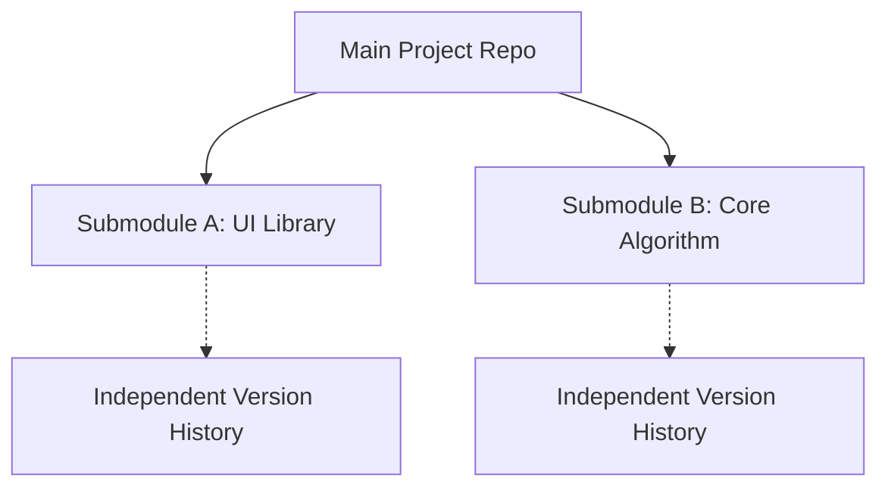

# Git Submodule Engineering Guide

**Managing External Dependencies and Multi-Repository Architectures**

Git submodules allow you to keep a Git repository as a subdirectory of another Git repository. This lets you clone another repository into your project and keep your commits separate.

## Core Concepts

### Why Use Submodules?



| Use Case | Description | Example |
| :--- | :--- | :--- |
| **Dependency Management** | Contain specific versions of third-party libraries. | Referencing a specific version of a UI framework. |
| **Component Reuse** | Share common components across multiple projects. | A shared authentication module. |
| **Microservices** | Organize multiple related services in a single view. | Integrating multiple services within one project. |

---

## Basic Operations

### Adding a Submodule

```bash
# Add a submodule at a specific path
git submodule add <repository_url> <path>

# Example: Adding a common utility library
git submodule add https://github.com/example/tools.git libs/tools
```

### Cloning a Project with Submodules

When new members clone a project, submodule contents are not downloaded by default.

```bash
# Method A: One-step clone
git clone --recurse-submodules <url>

# Method B: Multi-step initialization
git clone <url>
cd project
git submodule update --init --recursive
```

### Updating Submodules

| Task | Command |
| :--- | :--- |
| **Sync to recorded commit** | `git submodule update` |
| **Update to remote HEAD** | `git submodule update --remote` |
| **Recursively update all** | `git submodule update --init --recursive` |

---

## Development Workflow

When you need to make changes inside a submodule, follow this workflow:

1. **Enter submodule directory**: `cd libs/tools`
2. **Switch to branch**: `git checkout main` (Git puts submodules in a "Detached HEAD" state by default).
3. **Modify and commit**: `git add . && git commit -m "feat: update tools"`
4. **Push submodule changes**: `git push origin main`
5. **Record update in main project**:
   ```bash
   cd ../..
   git add libs/tools
   git commit -m "chore: update tools submodule to latest"
   git push origin main
   ```

---

## Best Practices

:::info[Engineering Advice]
1. **Pin Versions**: Unless explicitly required otherwise, pin submodules to specific commits (Commit Hash) to ensure build reproducibility.
2. **Use HTTPS Links**: Prefer HTTPS links in `.gitmodules` for better compatibility in CI/CD environments.
3. **Proactive Sync**: Develop the habit of running `git submodule update --init --recursive` after performing a `git pull`.
4. **Clean Up**: When removing a submodule, remember to clean up the cache under `.git/modules` in addition to running `git rm`.
:::

---

## Troubleshooting

| Issue | Solution |
| :--- | :--- |
| **Detached HEAD state** | Enter the directory and run `git checkout <branch_name>`. |
| **Submodule URL changed** | Update `.gitmodules` and run `git submodule sync`. |
| **Merge conflicts** | If submodule pointers conflict, use `git checkout --ours/--theirs <path>` to pick the correct version and re-commit. |

