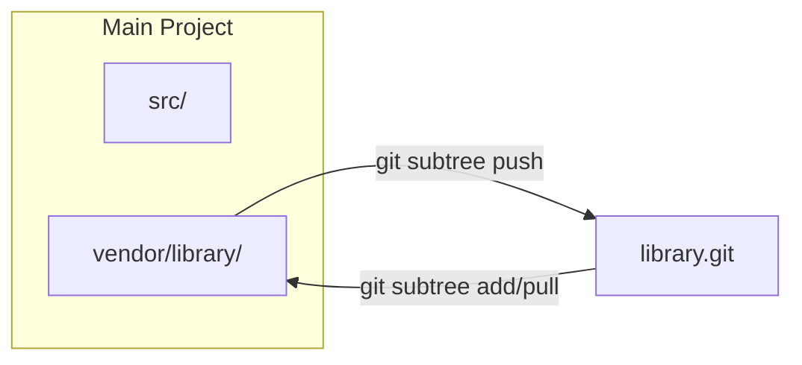

# Git Subtree Engineering Guide

**Embedding External Repositories Without a Separate Pointer File**

Git subtree lets you merge another repository into a subdirectory of your project, while retaining the ability to pull upstream updates and (optionally) push changes back. Unlike `git submodule`, no `.gitmodules` file is needed -- the foreign code simply lives inside your own history.

---

## Core Concepts

### How Subtree Works



At its core, `git subtree` performs a **squash merge** of the external repository's history into a designated prefix directory. The foreign commits can be replayed on top of your own tree, or squashed into a single commit per import to keep your log clean.

### Subtree vs Submodule

| Dimension | Submodule | Subtree |
| :--- | :--- | :--- |
| **Storage** | Only a pointer in the main repo | Full foreign history merged into main repo |
| **Workflow complexity** | Higher (`init`, `update`, detached HEAD) | Lower (normal git operations) |
| **Independent history** | Yes -- separate repo | No -- histories are merged |
| **Ease of CI/CD** | Requires `--recurse-submodules` | Works like any other directory |
| **Push upstream** | Trivial (separate remote) | Possible via `git subtree push` but slower |
| **Binary size on clone** | Smaller | Larger (carries full history) |
| **Learning curve** | Steeper | Gentler |

:::tip When to Prefer Subtree
- The code is **tightly coupled** with your project and unlikely to be forked independently.
- You want **zero extra setup** for contributors (no `submodule init`).
- You are embedding a **small to medium** external library whose history can afford to be inlined.
:::

---

## Basic Operations

### 1. Adding a Subtree

```bash
# General syntax
git subtree add --prefix=<path> <repository_url> <branch> [--squash]

# Example: embed a utility library under vendor/tools
git subtree add --prefix=vendor/tools https://github.com/example/tools.git main --squash
```

| Flag | Purpose |
| :--- | :--- |
| `--prefix` | Target directory in the working tree (created if it does not exist) |
| `--squash` | Squash external history into a single merge commit (recommended for a cleaner log) |
| `<branch>` | Branch of the remote to import (`main`, `master`, `develop`, etc.) |

### 2. Pulling Upstream Updates

```bash
# Pull latest changes from the remote into your prefix
git subtree pull --prefix=vendor/tools https://github.com/example/tools.git main --squash
```

:::info
`git subtree pull` internally performs a `git merge` of the remote branch into your prefix directory. Conflicts, if any, follow standard Git conflict resolution rules.
:::

### 3. Pushing Changes Upstream

```bash
# Push local modifications back to the remote
git subtree push --prefix=vendor/tools https://github.com/example/tools.git main
```

:::caution
`git subtree push` replays the sub-directory's commits and can be **slow** on large histories because it has to split the entire repo. For fast iteration, consider working in the remote directly and using `pull` instead.
:::

### 4. Splitting a Subtree

```bash
# Create a branch that contains only the prefix history
git subtree split --prefix=vendor/tools --branch tools-split
```

This is useful when you need to review or cherry-pick commits that belong to the subtree in isolation.

### 5. Squashing Without Merge

If you previously added a subtree without `--squash` and want to clean up the log:

```bash
git subtree pull --prefix=vendor/tools https://github.com/example/tools.git main --squash
```

The `--squash` flag on `pull` squashes only the **new** commits since the last recorded subtree merge.

---

## Development Workflow

### Scenario: Importing a Library and Making Local Changes

```bash
# 1. Add the subtree (one-time setup)
git subtree add --prefix=vendor/log https://github.com/user/log.git main --squash

# 2. Use and modify the library locally
# ... edit vendor/log/ ...

# 3. Commit local changes in your main repo
git add vendor/log
git commit -m "vendor(log): patch memory leak in parser"

# 4. Push the change back upstream (if you have write access)
git subtree push --prefix=vendor/log https://github.com/user/log.git main

# 5. Later, pull upstream fixes
git subtree pull --prefix=vendor/log https://github.com/user/log.git main --squash
```

### Scenario: Embedding a Read-Only Third-Party Library

```bash
# Add once and forget about pushes
git subtree add --prefix=vendor/json https://github.com/nlohmann/json.git master --squash

# Periodically pull updates
git subtree pull --prefix=vendor/json https://github.com/nlohmann/json.git master --squash
```

---

## Working with Remote Aliases

Typing the full URL every time is tedious. Use a Git remote alias:

```bash
# Add a named remote for the subtree
git remote add tools-remote https://github.com/example/tools.git

# Now use the remote name instead of the URL
git subtree add --prefix=vendor/tools tools-remote main --squash
git subtree pull --prefix=vendor/tools tools-remote main --squash
git subtree push --prefix=vendor/tools tools-remote main
```

---

## Common Patterns & Best Practices

### Keep Prefix Paths Predictable

```
project/
├── src/                  # Your code
├── vendor/               # Third-party subtrees
│   ├── log/              # git subtree --prefix=vendor/log
│   └── http-client/      # git subtree --prefix=vendor/http-client
└── ...
```

### Use `--squash` Consistently

Mixing squash and non-squash subtrees in the same project causes confusing histories. Pick one approach and stick with it.

### Avoid Deep Nesting

Subtrees within subtrees are technically possible but lead to unpredictable merge behavior. Keep the structure flat.

### Commit Message Convention

```bash
git commit -m "vendor(log): pull upstream v2.4.1"
git commit -m "vendor(log): patch formatting bug"
```

Prefixing with `vendor(<name>):` makes it easy to `git log --oneline -- vendor/log/` and understand the subtree's change timeline.

---

## Troubleshooting

| Issue | Solution |
| :--- | :--- |
| **`subtree push` is extremely slow** | Use `git subtree push` on a fresh clone or split first. Alternatively, push directly in the remote repo and use `pull`. |
| **Merge conflicts on `subtree pull`** | Resolve conflicts normally (`git add <file> && git commit`). The prefix files may conflict with your own changes in the same directory. |
| **Wrong prefix directory** | If you accidentally used `--prefix=lib/tools` instead of `vendor/tools`, re-add with the correct prefix and remove the old one (`git rm -r lib/tools`). |
| **Need to remove a subtree** | `git rm -r <prefix> && git commit -m "remove subtree <name>"`. No residual config cleanup is needed (unlike submodule). |
| **History is bloated** | If you forgot `--squash`, `git filter-branch` or `git filter-repo` can rewrite history, but this is destructive and requires coordination. |

---

## Migration

### From Submodule to Subtree

```bash
# 1. Remove the submodule
git submodule deinit vendor/library
git rm vendor/library
rm -rf .git/modules/vendor/library
git commit -m "chore: remove submodule vendor/library"

# 2. Add as subtree
git subtree add --prefix=vendor/library https://github.com/user/library.git main --squash
```

### From Vendor Directory to Subtree

If you already have a vendor directory that was manually copied (not tracked by Git subtree):

```bash
# 1. Remove the old vendor content
git rm -r vendor/library
git commit -m "chore: remove manually vendored library"

# 2. Re-import as a proper subtree
git subtree add --prefix=vendor/library https://github.com/user/library.git main --squash
```

### From Subtree to Submodule

```bash
# 1. Remove the subtree directory
git rm -r vendor/library
git commit -m "chore: remove subtree vendor/library"

# 2. Add as submodule
git submodule add https://github.com/user/library.git vendor/library
git commit -m "chore: add library as submodule"
```

---

## Advanced Tips

### Partial Directory Import

If you only need a subdirectory of a remote repository:

```bash
# Split only the "src/" directory from the remote, then add
git subtree add --prefix=vendor/lib-core https://github.com/large-org/mono.git src --squash
```

:::caution
This relies on `git subtree`'s split logic and may not work reliably for complex repository structures. Test before committing to this approach.
:::

### Scripting Subtree Updates

```bash
#!/bin/bash
# scripts/update-subtrees.sh

declare -A SUBTREES=(
    ["vendor/log"]="https://github.com/user/log.git main"
    ["vendor/http-client"]="https://github.com/user/http-client.git main"
)

for prefix in "${!SUBTREES[@]}"; do
    read url branch <<< "${SUBTREES[$prefix]}"
    echo "Updating $prefix from $url ($branch)..."
    git subtree pull --prefix="$prefix" "$url" "$branch" --squash
done

echo "All subtrees updated."
```

---

## References

- [Pro Git -- Git Tools - Subtree Merging](https://git-scm.com/book/en/v2/Git-Tools-Subtree-Merging)
- [git-subtree documentation (built-in)](https://git.wiki.kernel.org/index.php/Git-subtree)
- [Atlassian Tutorial -- Git Subtree](https://www.atlassian.com/git/tutorials/git-subtree)
