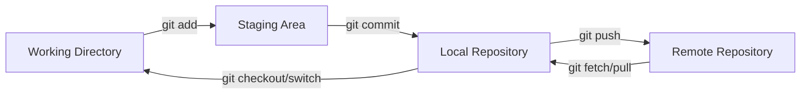
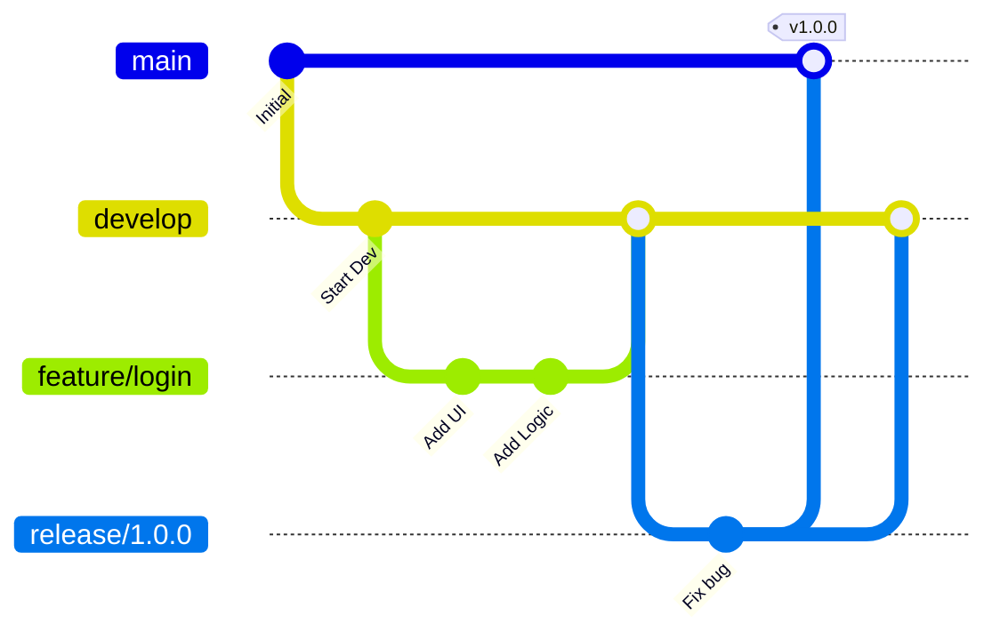
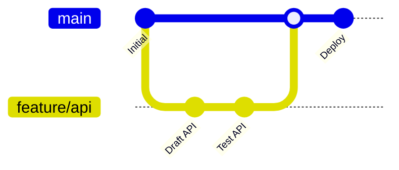

# Git Workflow & Branching Strategy

This guide covers professional Git workflows, branching strategies, conventional commits, and essential commands for daily development.

## Basic Workflow

A standard Git workflow involves moving changes through three main areas: the **Working Directory**, the **Staging Area** (Index), and the **Repository** (HEAD).



---

## Branching Strategies

Choosing the right branching strategy depends on your team size and release frequency.

### 1. Git Flow
**Best for:** Scheduled releases and versioned products.



*   **main**: Production-ready code only.
*   **develop**: Integration branch for features.
*   **feature/**: Temporary branches for new features.
*   **release/**: Preparation for a new production release.
*   **hotfix/**: Quick fixes for production bugs.

### 2. GitHub Flow
**Best for:** Continuous Deployment (CD) and web applications.



*   The `main` branch is always deployable.
*   Create short-lived feature branches from `main`.
*   Merge back to `main` via Pull Request after CI/CD passes.

---

## Conventional Commits

Standardizing commit messages makes history readable and enables automated changelog generation.

**Format:** `<type>(<scope>): <subject>`

| Type | Purpose | Example |
| :--- | :--- | :--- |
| `feat` | New feature | `feat(auth): add JWT support` |
| `fix` | Bug fix | `fix(api): handle null response` |
| `docs` | Documentation only | `docs: update readme` |
| `refactor` | Code change that neither fixes a bug nor adds a feature | `refactor: simplify loop` |
| `chore` | Maintenance (build, deps, tools) | `chore: update docusaurus` |

:::tip Atomicity
Keep commits **atomic**. One commit should represent one logical change. This makes `git revert` and `git cherry-pick` much safer.
:::

---

## Essential Commands

### History & Inspection

| Command | Purpose |
| :--- | :--- |
| `git status -s` | Short status summary |
| `git diff --staged` | View changes already added to staging |
| `git log --oneline --graph --all` | Visual representation of all branches |
| `git blame <file>` | Identify who changed each line |

### Undo & Recovery

| Command | Effect | Scenario |
| :--- | :--- | :--- |
| `git commit --amend` | Modify the very last commit | Forgot a file or typo in message |
| `git reset --soft HEAD~1` | Undo commit, keep changes staged | Redo a commit properly |
| `git reset --hard HEAD~1` | **Destructive**: Revert to previous state | Discard unwanted work |
| `git revert <hash>` | Create a new commit that undoes a previous one | Safe undo for pushed commits |

:::warning Force Push
Never use `git push --force` on shared branches like `main` or `develop`. Use `git push --force-with-lease` if you must update a remote branch after a rebase.
:::

---

## Advanced Tools

### Git Stash
Temporarily save uncommitted changes to switch branches.
*   `git stash`: Save work
*   `git stash pop`: Restore work

### Git Worktree

Manage **multiple working trees** attached to the same repository, so you can check out different branches side-by-side without stashing or switching.

#### Why Use Worktree?

| Problem without Worktree | Solution with Worktree |
| :--- | :--- |
| Need to `git stash` before switching branches | Each branch has its own directory — no stashing needed |
| Long-running builds block switching | Keep build running in one tree, edit code in another |
| Comparing branches requires `git diff` | Open two editors in two directories and compare directly |

#### Core Commands

| Command | Purpose |
| :--- | :--- |
| `git worktree add <path> <branch>` | Create a new working tree at `<path>` and check out `<branch>` |
| `git worktree add -b <new-branch> <path> <start-point>` | Create a new branch and working tree simultaneously |
| `git worktree list` | List all working trees attached to this repository |
| `git worktree remove <path>` | Remove a working tree (does not delete the branch) |
| `git worktree prune` | Clean up stale worktree entries (e.g., after manually deleting a directory) |

#### Example Workflow

```bash
# You are on `main`, working on a new feature.
# A hotfix is needed for production branch `v2.0`.

# 1. Create a worktree for the hotfix (no need to stash anything)
git worktree add ../hotfix-dir v2.0

# 2. Fix the bug in the separate directory
cd ../hotfix-dir
# ... edit, commit, push ...
git push origin v2.0

# 3. Return to your original work
cd ../project
# Your feature branch is exactly where you left it.

# 4. Clean up the hotfix worktree
git worktree remove ../hotfix-dir
```

:::tip Naming Convention
Use a consistent prefix for worktree directories, e.g., `../project-hotfix`, `../project-review`, `../project-release`. This keeps your workspace organized.
:::

:::caution
Each branch can only be checked out in **one** worktree at a time. Attempting to check out the same branch in two trees will fail.
:::

### Git Bisect
Binary search to find the commit that introduced a bug.
*   `git bisect start`
*   `git bisect bad`
*   `git bisect good <stable-hash>`

---

## Related Guides

*   [📄 Merge, Rebase & Cherry-Pick](./git-merge-rebase-cherry-pick.mdx) — Integrating changes and rewriting history.
*   [📄 Git Hooks Guide](./git-hooks-guide.mdx) — Automate linting and testing.
*   [📄 Submodules Guide](./git-submodule-guide.mdx) — Manage external dependencies.
*   [📄 SSH Setup](../infra/06-ssh.mdx) — Secure remote access.
