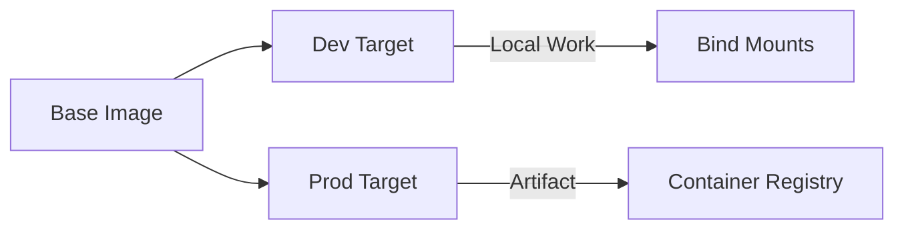

# Infrastructure Setup

This guide defines the engineering standard for local infrastructure orchestration using **Docker Compose**. We prioritize a **layered, profile-driven configuration** that scales from standalone services to complex, multi-service platform architectures.

## Docker Compose Architecture

We utilize a **layered Compose file** strategy: a base configuration defines core infrastructure services, while overlay files inject environment-specific or profile-specific overrides.

### Project Structure Standard

```text title="Infrastructure Directory Layout"
infra/ (or platform-dev/)
├── compose.yaml              # Base: Core infrastructure (Postgres, Redis, etc.)
├── compose.dev.yaml          # Overlay: Local development (bind mounts, debug)
├── compose.staging.yaml      # Overlay: Pre-production (CI validation targets)
├── compose.prod.yaml         # Overlay: Production (immutable images, limits)
└── env/
    ├── compose.dev.env       # Interpolation variables (Dev)
    ├── shared.base.env       # Shared runtime constants (All Envs)
    ├── shared.dev.env        # Runtime overrides (Dev)
    ├── service-a.dev.env     # Service-specific overrides (Dev)
    └── service-a.prod.env    # Service-specific overrides (Prod)
```

:::tip[Implementation Best Practice]
Standardize on the `.yaml` extension and the `compose.yaml` filename (modern specification) to ensure cross-platform compatibility.
:::

### Execution Workflow

```bash
# Execute with layered overrides and specific profiles
docker compose \
  --env-file ./env/compose.dev.env \
  -f compose.yaml \
  -f compose.dev.yaml \
  --profile dev \
  up -d
```

---

## Monorepo vs Polyrepo: Compose Layout

The repository strategy directly affects how Compose files are organized and how `build.context` is configured.

### Polyrepo Layout

Each service has its own repository. The `infra/` directory is a sibling to service code:

```text
api-gateway/              # Service repo
├── Dockerfile
└── src/
infra/                    # Infrastructure repo (shared)
├── compose.yaml
└── compose.dev.yaml
```

`build.context` points to the service directory:

```yaml
services:
  api:
    build:
      context: ../api-gateway    # Relative to infra/
      dockerfile: Dockerfile
```

### Monorepo Layout

All services and shared libraries live in one repository. Compose files sit at the repo root or in a dedicated `infra/` directory:

```text
monorepo/
├── infra/
│   ├── compose.yaml
│   └── compose.dev.yaml
├── services/
│   ├── api-gateway/
│   │   └── Dockerfile
│   └── auth-service/
│       └── Dockerfile
└── libs/
    └── shared-utils/
```

`build.context` points to the repo root so the Dockerfile can `COPY` shared libraries:

```yaml
services:
  api:
    build:
      context: ../..                         # Repo root
      dockerfile: services/api-gateway/Dockerfile
```

### Comparison

| Dimension | Polyrepo | Monorepo |
| :--- | :--- | :--- |
| **Compose Location** | Per-repo or shared infra repo | Repo root or `infra/` dir |
| **build.context** | Service directory | Repo root (access to shared libs) |
| **Shared Services** | Separate infra compose file | Single base compose file |
| **Service Isolation** | Natural (separate repos) | Requires profiles or filters |

---

## Core Infrastructure Services

The base `compose.yaml` defines the shared persistence and messaging layers.

```yaml title="compose.yaml (Excerpts)"
services:
  database:
    image: postgres:16-alpine
    environment:
      POSTGRES_USER: devuser
      POSTGRES_DB: platform_db
    ports:
      - "5432:5432"
    volumes:
      - db_data:/var/lib/postgresql/data
    healthcheck:
      test: ["CMD-SHELL", "pg_isready -U devuser -d platform_db"]
      interval: 5s
      timeout: 3s
      retries: 10
```

:::info[Technical Design Patterns]
- **Standardized Health Checks**: Enable dependent services to utilize `condition: service_healthy` to mitigate startup race conditions.
- **Persistent Data Layers**: Use named Docker volumes to maintain state across container lifecycle transitions.
- **Resource Optimization**: Prioritize `alpine` based images for smaller storage footprints and accelerated CI/CD pull operations.
:::

---

## Local Development Overrides

The development overlay (`compose.dev.yaml`) facilitates iterative coding via bind mounts and debugging features.

```yaml title="compose.dev.yaml (Excerpts)"
services:
  api:
    build:
      context: ../api-gateway
      dockerfile: Dockerfile
      target: dev                         # Utilize multi-stage 'dev' target
    command: npm run dev
    ports:
      - "3000:3000"
    volumes:
      - ../api-gateway:/workspace/api-gateway
    depends_on:
      database: { condition: service_healthy }
    profiles:
      - dev
```

---

## Multi-Stage Dockerfile Pattern

Every service **must** implement multi-stage builds to optimize for both development speed and production security.



### Strategic Comparison

| Feature | Development Target | Production Target |
| :--- | :--- | :--- |
| **Tooling** | Includes Debuggers/Hot Reload | Minimal Runtime Only |
| **Dependencies** | Full (Dev + Runtime) | Runtime Dependencies Only |
| **Artifacts** | Dynamic Bind Mounts | Static Code Copy & Compilation |
| **Security** | Non-root with mapped UID | Minimalist non-root runner |

