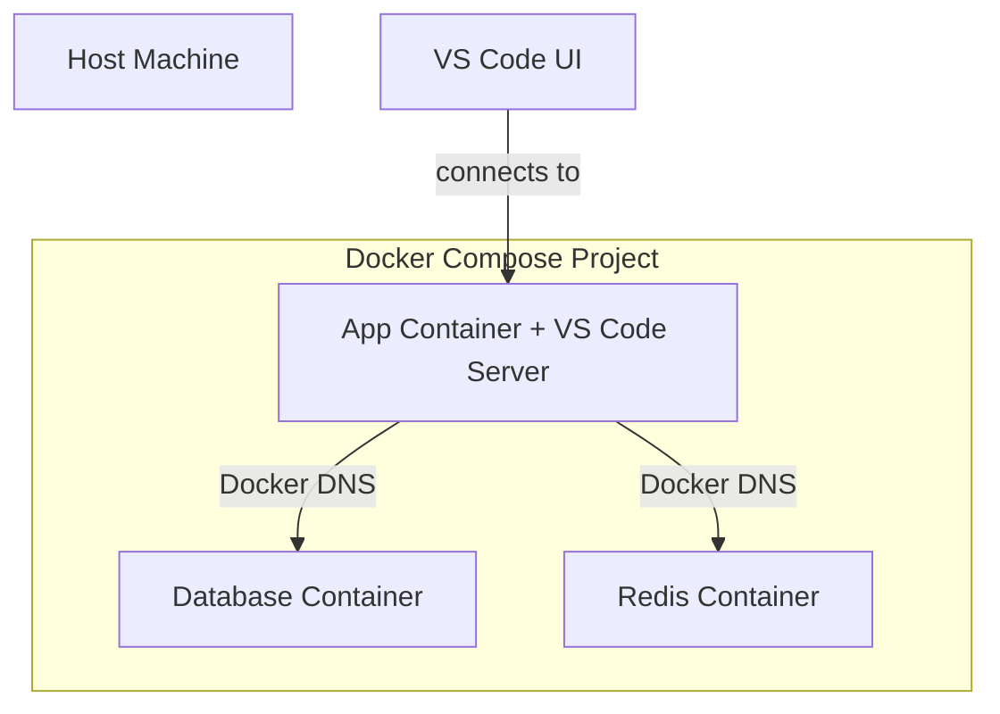

# Development Environment (Dev Containers)

We standardize on **VS Code Dev Containers** to ensure a consistent, isolated, and high-fidelity development environment for every engineer. This approach eliminates "works on my machine" inconsistencies and reduces project onboarding time to minutes.

## 1. Dev Container Fundamentals

A **Dev Container** is a standardized environment defined by a `devcontainer.json` configuration. It enables you to utilize a Docker container as a full-featured integrated development environment.

### Engineering Workflow

1. **Clone** the service repository.
2. **Open** the directory in VS Code.
3. **Reopen in Container** when prompted by the IDE.
4. **Environment Boot**: VS Code builds the environment and installs pre-defined tools.
5. **Ready**: Runtimes, compilers, and extensions are pre-configured and active.

:::info Architecture Detail
The VS Code UI executes on your host machine, while the **VS Code Server**, terminal, debugger, and all runtimes (Node, Python, Go) execute **within** the container.
:::

---

## 2. Strategic Comparison: Local vs. Container

| Feature | Host Machine Development | Dev Container Strategy |
| :--- | :--- | :--- |
| **Consistency** | Drift between developer OS/versions. | **Identical for all engineers.** |
| **Onboarding** | Manual execution of 20+ steps. | **Automated one-click setup.** |
| **Isolation** | Dependency pollution on host. | **Cleanly isolated per project.** |
| **Conflict Management** | Version conflicts (e.g., Node 18 vs 20). | **Project-specific runtimes.** |

---

## 3. Orchestration with Docker Compose

For microservices, we integrate **Dev Containers** with **Docker Compose** to manage the application and its sidecar dependencies (e.g., Database, Cache) in unison.



---

## 4. Configuration Standard (`devcontainer.json`)

A standard service configuration integrates infrastructure layers and developer experience tools:

```json title="devcontainer.json (Excerpts)"
{
  "name": "Platform Service",
  "dockerComposeFile": [
    "../../infra/compose.yaml",
    "../../infra/compose.dev.yaml"
  ],
  "service": "api",
  "workspaceFolder": "/workspace/api",
  "remoteUser": "vscode",
  "customizations": {
    "vscode": {
      "extensions": [
        "ms-python.python",
        "dbaeumer.vscode-eslint"
      ],
      "settings": { "editor.formatOnSave": true }
    }
  },
  "postCreateCommand": "npm install && npm run db:migrate"
}
```

:::tip Implementation Detail
Utilize **Dev Container Features** to modularly inject tools (e.g., AWS CLI, Terraform) without bloating the service's primary `Dockerfile`.
:::

---

## 5. Security: SSH Agent Forwarding

To maintain security, private keys remain on your host machine. We utilize **SSH Agent Forwarding** to allow the container to request authentication signatures from the host.

### Host Preparation
Ensure your private key is registered with the host's SSH agent:
```bash
ssh-add ~/.ssh/id_ed25519
```

### Container Verification
```bash
# Execute within the container terminal
echo $SSH_AUTH_SOCK # Expected: /run/host-services/ssh-auth.sock
ssh-add -l          # Lists keys available from host agent
```

---

## 6. Operational Troubleshooting

| Symptom | Primary Cause | Remediation |
| :--- | :--- | :--- |
| **"fatal: detected dubious ownership"** | Host/Container UID mismatch | Set `updateRemoteUserUID: true` in `devcontainer.json`. |
| **SSH Auth Failure** | Key not registered on host | Execute `ssh-add -l` on host to verify key availability. |
| **Startup Latency** | Heavy `postCreateCommand` | Move stable tool installation to the base `Dockerfile`. |

---

*Previous: [Infrastructure Setup](./infrastructure-setup)*
*Next: [Production Deployment](./production-deployment)*

