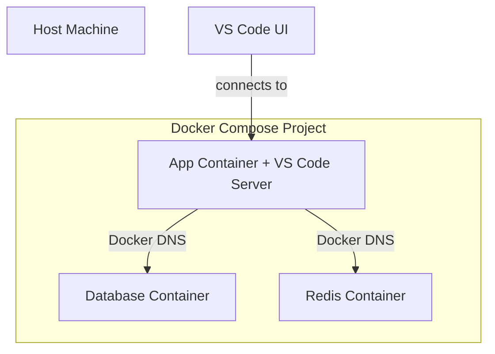

# Dev Containers

We standardize on **VS Code Dev Containers** to ensure a consistent, isolated, and high-fidelity development environment for every engineer. This approach eliminates "works on my machine" inconsistencies and reduces project onboarding time to minutes.

## Dev Container Fundamentals

A **Dev Container** is a standardized environment defined by a `devcontainer.json` configuration. It enables you to utilize a Docker container as a full-featured integrated development environment.

### Engineering Workflow

1. **Clone** the service repository.
2. **Open** the directory in VS Code.
3. **Reopen in Container** when prompted by the IDE.
4. **Environment Boot**: VS Code builds the environment and installs pre-defined tools.
5. **Ready**: Runtimes, compilers, and extensions are pre-configured and active.

:::info[Architecture Detail]
The VS Code UI executes on your host machine, while the **VS Code Server**, terminal, debugger, and all runtimes (Node, Python, Go) execute **within** the container.
:::

---

## Strategic Comparison: Local vs. Container

| Feature | Host Machine Development | Dev Container Strategy |
| :--- | :--- | :--- |
| **Consistency** | Drift between developer OS/versions. | **Identical for all engineers.** |
| **Onboarding** | Manual execution of 20+ steps. | **Automated one-click setup.** |
| **Isolation** | Dependency pollution on host. | **Cleanly isolated per project.** |
| **Conflict Management** | Version conflicts (e.g., Node 18 vs 20). | **Project-specific runtimes.** |

---

## Orchestration with Docker Compose

For microservices, we integrate **Dev Containers** with **Docker Compose** to manage the application and its sidecar dependencies (e.g., Database, Cache) in unison.



---

## Configuration Standard (`devcontainer.json`)

A standard service configuration integrates infrastructure layers and developer experience tools:

```json title="devcontainer.json (Excerpts)"
{
  "name": "Platform Service",
  "dockerComposeFile": [
    "../../infra/compose.yaml",
    "../../infra/compose.dev.yaml"
  ],
  "service": "api",
  "workspaceFolder": "/workspace/api",
  "remoteUser": "vscode",
  "customizations": {
    "vscode": {
      "extensions": [
        "ms-python.python",
        "dbaeumer.vscode-eslint"
      ],
      "settings": { "editor.formatOnSave": true }
    }
  },
  "postCreateCommand": "pnpm install && pnpm run db:migrate"
}
```

### Monorepo vs Polyrepo: Compose File Paths

The `dockerComposeFile` paths in `devcontainer.json` differ based on your repository strategy:

| Strategy | `dockerComposeFile` Example | Explanation |
| :--- | :--- | :--- |
| **Polyrepo** | `"../../infra/compose.yaml"` | `infra/` is in a sibling repo or shared directory. |
| **Monorepo** | `"../../compose.yaml"` | Compose files are at the monorepo root; `devcontainer.json` is per-service under `services/`. |

```json title="Monorepo devcontainer.json"
{
  "name": "API Gateway",
  "dockerComposeFile": [
    "../../compose.yaml",
    "../../compose.dev.yaml"
  ],
  "service": "api-gateway",
  "workspaceFolder": "/workspace/services/api-gateway"
}
```

:::info[Key Difference]
In a **monorepo**, the `workspaceFolder` and `service` name must match the service's subdirectory path. In a **polyrepo**, `workspaceFolder` typically maps to the repo root.
:::

---

## Dev Container Features

**Features** are pre-packaged installable units that add tools, runtimes, or CLI utilities to a Dev Container without modifying the `Dockerfile`. They are the modular, declarative way to extend your development environment.

### Usage

Add Features in `devcontainer.json` under the `"features"` key:

```json
{
  "features": {
    "ghcr.io/devcontainers/features/node:1": { "version": "20" },
    "ghcr.io/devcontainers/features/aws-cli:1": {},
    "ghcr.io/devcontainers/features/terraform:1": { "version": "1.7" }
  }
}
```

### Features vs. Dockerfile vs. Compose

| Approach | When to Use | Trade-offs |
| :--- | :--- | :--- |
| **Dev Container Features** | Standard tools shared across projects (AWS CLI, Git, Terraform). | Declarative, auto-updated, no Dockerfile changes. Limited to available catalog. |
| **Dockerfile `RUN`** | Custom or project-specific tool installation. | Full control, but increases image build time and Dockerfile complexity. |
| **Compose `command`** | Runtime configuration, env setup, service orchestration. | Affects container lifecycle, not tool availability. |

:::tip[Recommendation]
Use **Features** for anything available in the [Dev Container Feature catalog](https://containers.dev/features). Only fall back to `Dockerfile` installation for tools not in the catalog or requiring custom build steps.
:::

---

## Dev Container CLI

The **Dev Container CLI** (`@devcontainers/cli`) is the reference implementation of the [Development Containers Specification](https://containers.dev/). It allows you to build and manage dev containers from the command line, without requiring VS Code.

### Installation

```bash
# Install globally
pnpm add -g @devcontainers/cli # or npm/yarn global add

# Or use directly via dlx
pnpm dlx @devcontainers/cli --help # or npx/yarn dlx
```

### Common Commands

| Command | Description |
| :--- | :--- |
| `devcontainer up` | Create and start a dev container from `devcontainer.json` |
| `devcontainer exec <cmd>` | Execute a command inside a running dev container |
| `devcontainer build` | Build a dev container image (for publishing) |
| `devcontainer read-configuration` | Read and resolve the full `devcontainer.json` config |

### Typical Use Cases

**Run commands in a dev container without VS Code:**

```bash
devcontainer up --workspace-folder .
devcontainer exec --workspace-folder . pnpm test # or npm/yarn
```

**Pre-build and publish a dev container image in CI/CD:**

```bash
devcontainer build --workspace-folder . --push true --image-name ghcr.io/my-org/devcontainer:latest
```

This is useful for speeding up container startup by pre-building the image in a CI pipeline and pushing it to a container registry.

:::tip[When to Use the CLI]
Use the CLI when you need to interact with dev containers **outside of VS Code** — such as in CI/CD pipelines, headless servers, or non-VS Code editors. For daily development, the VS Code Dev Containers extension provides the most seamless experience.
:::

---

## Multi-Root Workspaces (`.code-workspace`)

A **`.code-workspace`** file defines a multi-root workspace, allowing you to manage multiple projects in a single VS Code window. This is essential for both monorepo and polyrepo workflows.

### File Structure

```json title="*.code-workspace"
{
  "folders": [
    { "path": "services/api" },
    { "path": "services/web" },
    { "path": "packages/shared" }
  ],
  "settings": {
    "editor.formatOnSave": true
  },
  "extensions": {
    "recommendations": ["ms-python.python", "dbaeumer.vscode-eslint"]
  }
}
```

| Field | Purpose |
| :--- | :--- |
| `folders` | List of folders to include in the workspace |
| `settings` | Workspace-scoped VS Code settings (override user settings) |
| `extensions.recommendations` | Suggested extensions when opening this workspace |

### Monorepo Example

Single repository with multiple service directories:

```json title="platform.code-workspace"
{
  "folders": [
    { "path": "services/api-gateway" },
    { "path": "services/user-service" },
    { "path": "services/notification-service" },
    { "path": "infrastructure/terraform" }
  ],
  "settings": {
    "editor.formatOnSave": true,
    "files.exclude": { "**/node_modules": true }
  }
}
```

### Polyrepo Example

Multiple repositories under a shared parent directory:

```
projects/
├── project-core/          # Main application repo
├── project-shared/        # Shared library repo
├── project-infra/         # Infrastructure repo
└── platform.code-workspace
```

```json title="platform.code-workspace"
{
  "folders": [
    { "path": "../project-core" },
    { "path": "../project-shared" },
    { "path": "../project-infra" }
  ],
  "settings": {
    "editor.formatOnSave": true
  }
}
```

:::tip[Path Resolution]
In polyrepo setups, paths in `.code-workspace` are relative to the workspace file location. Use `../` to reference sibling repositories.
:::

### Integration with Dev Containers

`.code-workspace` files work seamlessly with Dev Containers. Each folder in the workspace can have its own `devcontainer.json`:

```
projects/
├── project-core/
│   └── .devcontainer/
│       └── devcontainer.json
├── project-shared/
│   └── .devcontainer/
│       └── devcontainer.json
└── platform.code-workspace
```

Open the workspace in VS Code, then reopen individual folders in containers as needed via the **Dev Containers** extension.

---

## Security: SSH Agent Forwarding

To maintain security, private keys remain on your host machine. We utilize **SSH Agent Forwarding** to allow the container to request authentication signatures from the host.

### Host Preparation
Ensure your private key is registered with the host's SSH agent:
```bash
ssh-add ~/.ssh/id_ed25519
```

### Container Verification
```bash
# Execute within the container terminal
echo $SSH_AUTH_SOCK # Expected: /run/host-services/ssh-auth.sock
ssh-add -l          # Lists keys available from host agent
```

---

## Operational Troubleshooting

| Symptom | Primary Cause | Remediation |
| :--- | :--- | :--- |
| **"fatal: detected dubious ownership"** | Host/Container UID mismatch | Set `updateRemoteUserUID: true` in `devcontainer.json`. |
| **SSH Auth Failure** | Key not registered on host | Execute `ssh-add -l` on host to verify key availability. |
| **Startup Latency** | Heavy `postCreateCommand` | Move stable tool installation to the base `Dockerfile`. |
