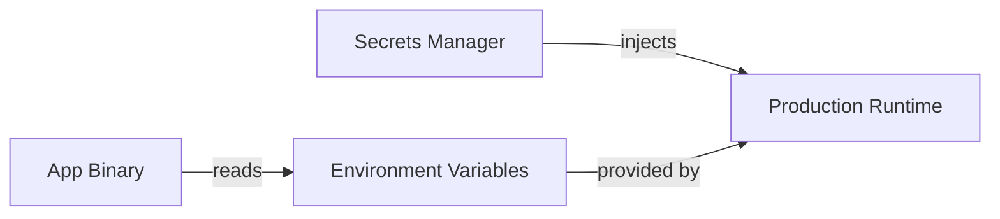
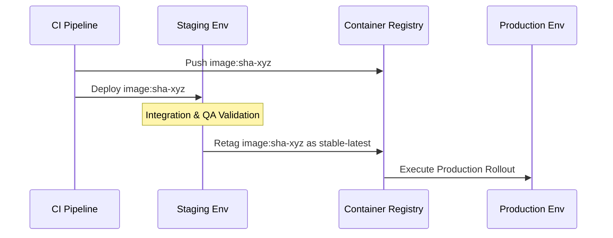

# Production Deployment (CI/CD)

Our deployment strategy focuses on **Environment Parity**, **Immutable Artifacts**, and **Automated Pipelines**. We prioritize high-confidence releases by validating exact binary images in pre-production before final deployment.

## Environment Infrastructure Tiers

We maintain three primary environment tiers to isolate development, validation, and production traffic.

| Infrastructure Tier | Operational Purpose | Build Artifact | Configuration Source |
| :--- | :--- | :--- | :--- |
| **Development** | Local iterative coding | `dev` target | Local `.env` (Interpolated) |
| **Staging** | Pre-production validation | **`prod` target** | CI/CD Variables + Staging Secrets |
| **Production** | External traffic handling | **`prod` target** | **Vault / Managed Secrets Service** |

:::info Principle of Parity
**Build Once, Deploy Multi-Environment**: We build the production Docker image once and promote it through staging and production. Environment-specific variations are injected exclusively via runtime configuration.
:::

---

## Image Build & Tagging Strategy

We utilize **Git SHAs** for deterministic tagging, ensuring every production image is traceable to a specific repository commit.

### Automated Tagging Procedure
```bash
# Extract the unique Git SHA
GIT_SHA=$(git rev-parse --short HEAD)

# Tag: registry.example.com/api-gateway:sha-a1b2c3d
```

### Build Orchestration with Docker Buildx
For complex platforms, we use `docker-bake.hcl` to parallelize service builds and manage build-time dependencies efficiently.

```hcl title="docker-bake.hcl"
target "api" {
  context = "../api"
  dockerfile = "Dockerfile"
  target = "prod"
  tags = ["${REGISTRY}/api:sha-${GIT_SHA}", "${REGISTRY}/api:latest"]
}
```

---

## Production Secrets Management

**Strict Security Protocol**: Production credentials, API keys, and certificates **must** be stored in an external manager, never in version control or `.env` templates.

### Secure Injection Workflow



---

## Database Migration Protocol

To prevent race conditions and ensure zero-downtime releases, database migrations are decoupled from the primary application startup.

1. **Migration Execution**: A short-lived task container executes the migration scripts.
2. **Success Verification**: The deployment pipeline waits for task completion.
3. **Application Rollout**: New application containers are deployed only after the schema is confirmed.

:::caution Backward Compatibility
All migrations **must** be backward compatible to ensure the current (old) application version continues to function during the rollout phase.
:::

---

## Automated Promotion Workflow

We promote images from Staging to Production after automated verification passes.




