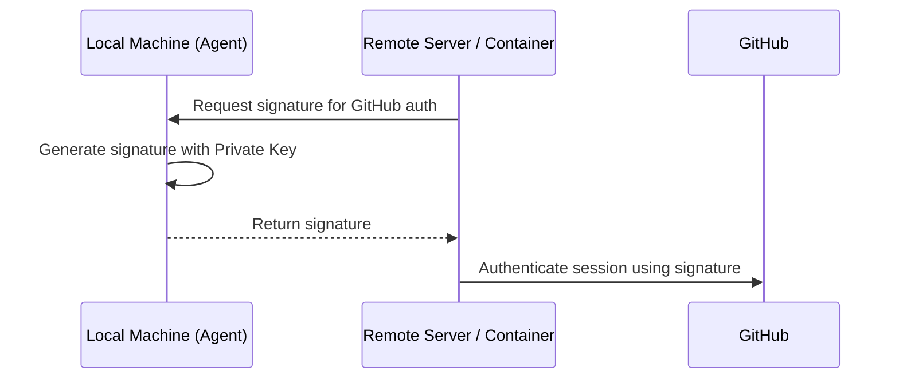

# SSH & Access Security

Secure access to remote servers and Git repositories is fundamentally built on the **SSH (Secure Shell)** protocol. We utilize asymmetric cryptography to ensure that authentication credentials are never transmitted over the network and remain stored exclusively on your local machine.

## 1. SSH Cryptography Fundamentals

SSH authentication relies on a **public-key pair** consisting of two mathematically linked files.

| Component | Default Path | Purpose |
| :--- | :--- | :--- |
| **Private Key** | `~/.ssh/id_ed25519` | **Restricted Access.** Stored on your local machine only. |
| **Public Key** | `~/.ssh/id_ed25519.pub` | **Public Distribution.** Distributed to servers and GitHub. |

:::tip Algorithm Recommendation
We standardize on the **Ed25519** algorithm for all new key pairs. It provides superior performance and higher security compared to older RSA standards.
:::

---

## 2. Infrastructure Setup Guide

### 2.1 Generating a Key Pair
Execute the following command to generate a new key pair:
```bash
ssh-keygen -t ed25519 -C "your_email@example.com"
```
:::note
Accept the default storage path and provide a strong passphrase for local encryption.
:::

### 2.2 Managing with SSH Agent
Use the SSH agent to manage decrypted keys in memory, eliminating the need to re-enter passphrases for every connection.
```bash
# Initialize the SSH agent
eval "$(ssh-agent -s)"

# Register the private key with the agent
ssh-add ~/.ssh/id_ed25519
```

### 2.3 Integration with GitHub
Retrieve your public key and add it to your profile under **GitHub Settings → SSH and GPG keys**.
```bash
# Copy to clipboard or display public key
cat ~/.ssh/id_ed25519.pub
```

### 2.4 Connectivity Verification
```bash
ssh -T git@github.com
# Expected output: "Hi <username>! You've successfully authenticated..."
```

---

## 3. Advanced Workflow: Agent Forwarding

**Agent Forwarding** enables the use of local SSH keys within remote sessions (e.g., inside a server or a Docker container) without copying private keys to those environments.

### Authentication Workflow



### Docker Implementation
Mount the host's SSH agent socket to enable forwarding inside a container:
```bash
docker run -it \
  -v $SSH_AUTH_SOCK:/run/host-services/ssh-auth.sock \
  -e SSH_AUTH_SOCK=/run/host-services/ssh-auth.sock \
  my-engineering-image bash
```

:::caution Security Protocol
Only utilize agent forwarding when connecting to **trusted** infrastructure. A compromised remote root user could potentially use your forwarded agent socket to authenticate as you.
:::

---

## 4. SSH Configuration Strategy

Optimize connection workflows by defining host aliases in `~/.ssh/config`:

```text title="~/.ssh/config"
Host production-server
    HostName 10.0.0.50
    User deploy-user
    ForwardAgent yes
    IdentityFile ~/.ssh/id_ed25519
```
*Workflow efficiency:* Execute `ssh production-server` to connect without manually specifying parameters.

---

:::tip Best Practice
Regularly audit your `~/.ssh/authorized_keys` file on remote servers to ensure only current, authorized keys are active.
:::

