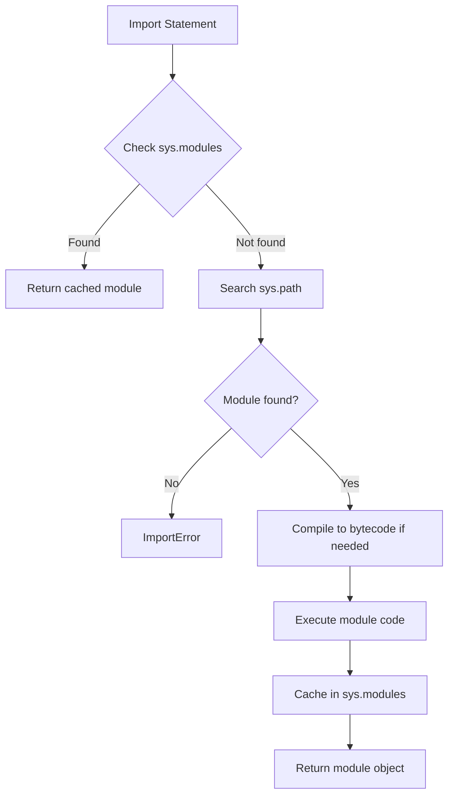

# Python Import System

Python's import system is a core mechanism that affects code organization, performance, and maintainability. Understanding how imports work is essential for building scalable applications, especially in large codebases like Deep Learning projects.

## Import Basics

### Absolute vs Relative Imports

Python supports two import styles, each with specific use cases.

| Import Type | Syntax | Use Case | Scope |
| :--- | :--- | :--- | :--- |
| **Absolute** | `from package import module` | Production code, libraries | Project-wide |
| **Explicit Relative** | `from . import sibling` | Package-internal modules | Within package |
| **Implicit Relative** | `import sibling` | **Deprecated in Python 3** | - |

**Absolute imports** are recommended for most scenarios:

```python
# ✅ Recommended: Absolute import
from my_package.utils.helpers import load_config
from my_package.core.engine import InferenceEngine

# ✅ Acceptable: Explicit relative import (within the same package)
from .utils.helpers import load_config
from ..core.engine import InferenceEngine

# ❌ Avoid: Implicit relative import (Python 3 error)
import helpers  # Raises ImportError in Python 3
```

:::tip When to Use Relative Imports
Relative imports are appropriate when:
- Refactoring package-internal code and the package name might change
- The import path is excessively long within the same package
- You want to explicitly indicate that the imported module is part of the same package
:::

### The Role of `__init__.py`

The `__init__.py` file marks a directory as a Python package and can control the package's public API.

```python
# my_package/__init__.py
from .core import Engine
from .utils import load_config

# Define the public API
__all__ = ["Engine", "load_config"]
```

:::info Best Practice
Use `__init__.py` to:
- Provide a simplified package-level API
- Hide internal modules from imports
- Execute package initialization code (logging, version checks)
:::

### Import Search Path (`sys.path`)

Python searches for modules in the following order:

1. **Current directory** (for scripts) or **script's directory**
2. **Directories in `PYTHONPATH`** environment variable
3. **Standard library locations** (installation-dependent)
4. **Site-packages** (third-party packages)

```python
import sys
print("\n".join(sys.path))

# Add custom path programmatically (use sparingly)
sys.path.append("/custom/module/path")
```

:::danger Critical
Avoid modifying `sys.path` programmatically in production code. It makes code fragile and deployment-dependent. Use proper package installation or `PYTHONPATH` instead.
:::

---

## Import Mechanism (Under the Hood)

### `sys.modules` Cache

Python maintains a cache of imported modules in `sys.modules`. Once a module is imported, subsequent imports return the cached module object.

```python
import sys
import math

# Module is cached after first import
print(math is sys.modules["math"])  # True

# Reloading (rarely needed)
import importlib
importlib.reload(math)
```

:::note
The `sys.modules` cache means that import statements are essentially singleton constructors. Module-level code executes only once per interpreter session.
:::

### Import Statement Execution Flow



### Dynamic Imports with `importlib`

For runtime dynamic imports, use the `importlib` module instead of `__import__` or `eval`.

```python
import importlib

# Dynamic import by string name
module_name = "yaml"
yaml = importlib.import_module(module_name)

# Conditional import (useful for optional dependencies)
try:
    import plotly
except ImportError:
    plotly = None

def plot(data):
    if plotly is None:
        raise ImportError("plotly is required for visualization")
    plotly.plot(data)
```

:::tip Use Case
Dynamic imports are useful for:
- Plugin systems
- Delayed loading of heavy dependencies
- Feature flags and optional dependencies
:::

---

## Engineering Practices

### Avoid Circular Imports

Circular imports occur when module A imports module B, and module B imports module A (directly or indirectly). This causes runtime errors or undefined behavior.

**Problem:**

```python title="models.py"
from trainers import Trainer

class Model:
    def train(self):
        return Trainer().train(self)
```

```python title="trainers.py"
from models import Model

class Trainer:
    def train(self, model: Model):
        pass
```

**Solutions:**

**✅ Solution 1: Use type hints with string literals**

```python title="models.py"
from typing import TYPE_CHECKING

if TYPE_CHECKING:
    from trainers import Trainer

class Model:
    def train(self):
        from trainers import Trainer  # Local import
        return Trainer().train(self)
```

---

**✅ Solution 2: Refactor to a third module**

```python title="interfaces.py"
from abc import ABC, abstractmethod

class Trainable(ABC):
    @abstractmethod
    def train(self): pass
```

```python title="models.py"
from trainers import Trainer
from interfaces import Trainable

class Model(Trainable):
    def train(self):
        return Trainer().train(self)
```

:::info Runtime vs Type-Checking
The `TYPE_CHECKING` constant is `False` at runtime but `True` during static type checking. This allows imports for type hints without causing circular dependencies.
:::

### Import Performance Optimization

For large applications, consider lazy imports for heavyweight dependencies.

**❌ Eager: All imports loaded at startup**

```python
import torch
import transformers
import numpy as np

def main():
    # Heavy modules loaded even if not used
    pass
```

**✅ Lazy: Defer imports until needed**

```python
def main():
    import torch
    import transformers
    import numpy as np

    # Modules loaded only when main() is called
    pass
```

**✅ Explicit lazy loading with `importlib`**

```python
import importlib

_torch = None

def get_torch():
    global _torch
    if _torch is None:
        import torch
        _torch = torch
    return _torch
```

:::tip Trade-off
Lazy imports improve startup time but can shift errors from startup to runtime. Use them for truly optional or rarely used dependencies.
:::

### Import Statement Style (PEP 8)

Organize imports in three groups, separated by blank lines:

```python
# 1. Standard library imports
import os
import sys
from pathlib import Path

# 2. Third-party imports
import numpy as np
import torch
from fastapi import FastAPI

# 3. Local application imports
from my_package.core import Engine
from my_package.utils.helpers import load_config
```

Configure **Ruff** to enforce this automatically:

```toml
[tool.ruff.lint.isort]
known-first-party = ["my_package"]
force-sort-within-sections = true
```

---

## Common Pitfalls

### Shadowing Standard Library Modules

Avoid naming files or modules the same as standard library modules.

```text
# ❌ Problematic structure
project/
├── random.py         # Shadows stdlib random
└── main.py

# main.py
import random  # Imports your file, not stdlib!
```

:::danger Critical
Shadowed modules cause mysterious bugs and make debugging extremely difficult. Always check for name conflicts.
:::

### Relative Import Boundaries

Relative imports cannot go beyond the top-level package.

```python
# ✅ Valid: Within package
# my_package/subpkg1/module.py
from ..subpkg2 import helper

# ❌ Invalid: Outside package
# my_package/subpkg1/module.py
from ...external_lib import something  # ImportError
```

### Executable Modules vs Importable Packages

A module can be both executable and importable:

```python
# my_package/cli.py
import argparse

def main():
    """Entry point for CLI."""
    parser = argparse.ArgumentParser()
    args = parser.parse_args()
    # CLI logic here

if __name__ == "__main__":
    main()  # Only runs when executed directly
```

Configure in `pyproject.toml`:

```toml
[project.scripts]
mycli = "my_package.cli:main"
```

---

## Checklist

- [ ] Use absolute imports by default
- [ ] Avoid circular dependencies with `TYPE_CHECKING` or refactoring
- [ ] Configure Ruff to enforce import sorting
- [ ] Never modify `sys.path` in production code
- [ ] Use `__init__.py` to define clean package APIs
- [ ] Check for module name shadowing
- [ ] Consider lazy imports for heavy dependencies

---

## Further Reading

- [PEP 8 -- Style Guide for Python Code](https://peps.python.org/pep-0008/#imports)
- [PEP 328 -- Imports: Multi-Line and Absolute/Relative](https://peps.python.org/pep-0328/)
- [Python Import System Documentation](https://docs.python.org/3/reference/import.html)
- [The `importlib` Package](https://docs.python.org/3/library/importlib.html)
