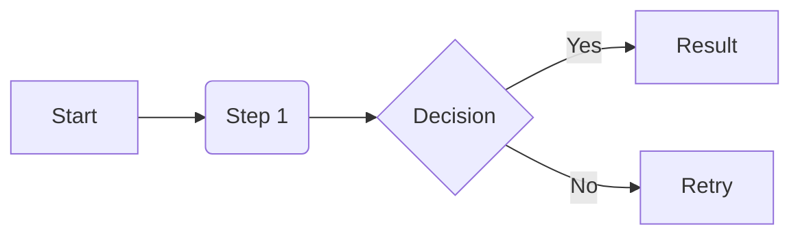

# Documentation Template

This document serves as a standard for all other documentation in this repository. Follow this structure to ensure consistency across the knowledge base.

## 1. Frontmatter
Every `.mdx` file must start with a Frontmatter block:
```markdown
---
sidebar_position: 1
title: Page Title
description: A brief summary of the page (good for SEO and search).
---
```

## 2. Using Admonitions
Use admonitions to highlight important information. Don't just use **bold** or *italic*.

:::info
Use `info` for general informative notes.
:::

:::tip Pro Tip
Use `tip` for helpful advice or "best practice" shortcuts.
:::

:::note
Use `note` for secondary details or context.
:::

:::caution
Use `caution` for things that require the user's attention.
:::

:::danger Critical
Use `danger` for risks, destructive actions, or high-risk warnings.
:::

## 3. Comparison Tables
When comparing tools or strategies, use a clear table:

| Dimension | Option A | Option B |
| :--- | :--- | :--- |
| **Speed** | Fast | Slow |
| **Complexity** | Low | High |

## 4. Code Blocks and Tabs
Use code blocks with language identifiers. For multi-platform instructions, use Tabs (if enabled in Docusaurus).

```bash
# Example command
npm install docusaurus
```

## 5. Diagrams (Mermaid)
Prefer Mermaid diagrams over complex text descriptions for workflows.



## 6. Tone and Voice
- **Objective**: Avoid "I think" or "In my opinion". Use "It is recommended" or "Best practice dictates".
- **Action-Oriented**: Use imperative verbs for steps (e.g., "Install the package" instead of "You should install the package").
- **Professional**: Keep the language technical and precise. Avoid slang or overly casual expressions.
