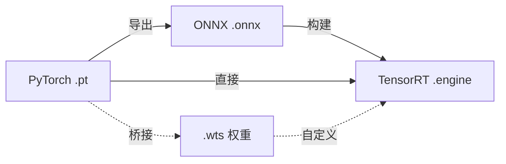

# 深度学习模型文件

在深度学习生命周期中，不同的模型格式服务于不同的目的，涵盖从训练到部署的各个阶段。

## 格式关系

下图展示了现代深度学习模型的标准转换链。

## 支持的格式

| 格式 | 角色 | 主要用途 |
| :--- | :--- | :--- |
| **[.pt / .pth](./pytorch-pt-guide)** | 训练 | PyTorch 原生存储，包含权重和架构。 |
| **[.onnx](./onnx-overview)** | 转换 | 框架间的通用桥梁 (Open Neural Network Exchange)。 |
| **[.engine / .plan](./tensorrt-engine)** | 部署 | 在 NVIDIA GPU 上进行高性能优化推理。 |
| **[.wts](./wts-bridge)** | 桥接 | 用于自定义 TensorRT 构建器的纯文本权重存储。 |

:::tip[建议]
90% 的生产模型标准路径是：**`.pt` → `.onnx` → `.engine`**。
:::

## 核心概念

- **框架无关性**：ONNX 允许你在不同工具之间移动模型，而不会被特定框架锁定。
- **硬件优化**：TensorRT 引擎绑定到特定的 GPU 架构和驱动版本，以实现巅峰性能。
- **单向转换**：虽然可以从 `.pt` 转换为 `.engine`，但通常无法逆转此过程。
