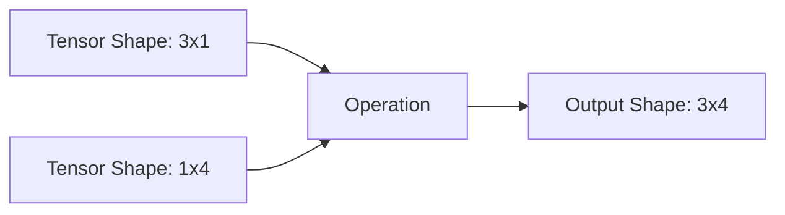

# 张量操作

张量是 PyTorch 中的核心数据结构，功能类似于 NumPy 数组，但支持硬件加速。

## 创建

使用工厂函数创建张量。始终指定 `dtype` 和 `device` 以获得最佳性能。

```python
import torch

# 从列表或 NumPy 数组创建
tensor_a = torch.tensor([[1.0, 2.0], [3.0, 4.0]], dtype=torch.float32)

# 创建全零、全一或随机值的张量
zeros = torch.zeros((3, 3), device='cuda')
ones = torch.ones((2, 2))
random_tensor = torch.randn((10, 10))
```

## 索引

使用标准的 Python 索引语法访问张量的特定元素或切片。

```python
x = torch.arange(9).reshape(3, 3)

# 提取第二行
row = x[1, :]

# 提取一个块
block = x[:2, :2]
```

## 广播机制

在算术运算期间，PyTorch 会自动扩展较小的张量以匹配较大张量的形状。



```python
a = torch.ones(3, 1)
b = torch.ones(1, 4)
# b 被广播为 3x4，a 被广播为 3x4
c = a + b 
```

:::tip[形状兼容性]
如果两个维度相等或其中一个维度为 1，则它们在广播时是兼容的。
:::

## 维度变换：Reshape、View 和 Permute

在不改变底层数据的情况下操作张量维度。

- `view()`: 返回共享相同数据的新张量。要求张量在内存中是连续的 (contiguous)。
- `reshape()`: 返回新张量。如果可能则使用 `view()`，否则会复制数据。
- `permute()`: 交换维度。

```python
x = torch.randn(2, 3, 4)

# 展平
flat_x = x.view(-1) # Shape: 24

# 交换维度 (例如，从 NCHW 到 NHWC)
permuted_x = x.permute(0, 2, 3, 1)
```

:::caution[内存布局]
诸如 `permute()` 或 `transpose()` 等操作会使张量在内存中变得不连续。在对此类张量使用 `.view()` 之前，请先调用 `.contiguous()`。
:::

```python
y = x.transpose(0, 1)
# y.view(-1)  # 这将引发错误！
z = y.contiguous().view(-1) # 正确
```