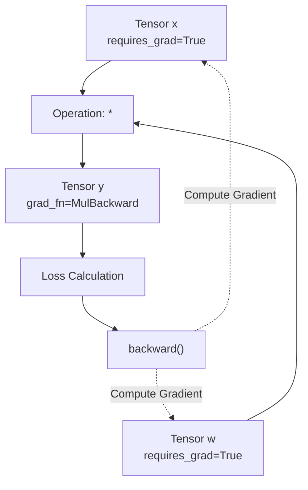

# 自动求导机制

PyTorch 的 `autograd` 引擎可自动为神经网络训练计算梯度。随着操作的执行，它会动态构建一个有向无环计算图。

## 计算图

当对设置了 `requires_grad=True` 的张量执行操作时，PyTorch 会跟踪这些操作并创建一个计算图。



## `requires_grad` 和 `grad_fn`

通过设置 `requires_grad=True` 启用梯度跟踪。

```python
import torch

x = torch.tensor([1.0, 2.0], requires_grad=True)
w = torch.tensor([3.0, 4.0], requires_grad=True)

y = x * w
print(y.grad_fn) # <MulBackward0 object>
```

`grad_fn` 属性引用了创建该张量的数学函数，从而允许 `autograd` 引擎回溯微分步骤。

## 反向传播

通过在输出张量（通常是损失值）上调用 `.backward()` 来计算梯度。

```python
loss = y.sum()
loss.backward()

# 梯度存储在 .grad 属性中
print(x.grad) # [3.0, 4.0]
print(w.grad) # [1.0, 2.0]
```

## 禁用梯度跟踪

在评估模型或执行推理时，防止 PyTorch 跟踪计算历史记录，以节省内存和计算资源。

### `torch.no_grad()`

使用此上下文管理器包装不需要计算梯度的代码块。

```python
with torch.no_grad():
    y_pred = x * w
    # y_pred.requires_grad 为 False
```

### `.detach()`

创建一个新的张量，该张量共享相同的数据，但从计算图中分离出来。

```python
y_detached = y.detach()
# y_detached.requires_grad 为 False
```

## 梯度累加与清零

默认情况下，PyTorch 会在 `.grad` 属性中累加梯度。在进行下一次反向传播之前，必须手动将梯度清零，以防止它们在多个批次中累加。

```python
# 假设存在一个优化器
optimizer.zero_grad() # 梯度清零
loss.backward()       # 计算新梯度
optimizer.step()      # 更新权重
```

:::info[梯度累加]
梯度累加是在模拟更大批量大小（Batch Size）时非常有用的功能。您可以在调用 `optimizer.step()` 和 `optimizer.zero_grad()` 之前多次调用 `.backward()`。
:::
