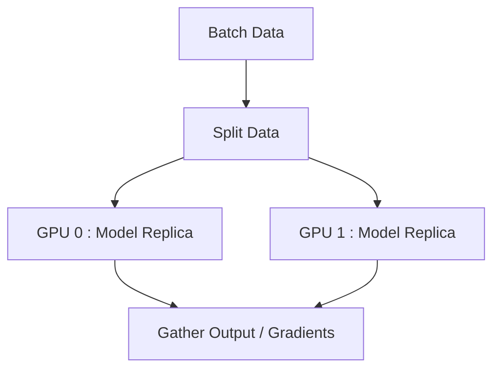

# 设备管理

PyTorch 允许显式控制张量和模型的分配位置。利用诸如 GPU 之类的硬件加速器对于深度学习性能至关重要。

## CPU 和 CUDA 切换

检查 GPU 的可用性并动态分配设备。始终使用动态设备分配，而不是硬编码 `cuda`。

```python
import torch

# 动态设置设备
device = torch.device("cuda" if torch.cuda.is_available() else "cpu")
print(f"正在使用设备: {device}")
```

## 使用 `.to()` 移动数据

使用 `.to()` 方法将张量和模型移动到目标设备。

```python
# 在 CPU 上创建张量
x_cpu = torch.ones(5, 5)

# 将张量移动到 GPU（如果可用）
x_gpu = x_cpu.to(device)

# 移动模型
import torch.nn as nn
model = nn.Linear(10, 2)
model.to(device)
```

:::caution[操作兼容性]
张量之间的操作必须在同一设备上进行。将 CPU 张量与 CUDA 张量相加将导致运行时错误。
:::

## 设备上下文管理器

在现代 PyTorch 中，您可以使用上下文管理器直接在目标设备上实例化张量，这比在 CPU 上创建它们然后再移动它们的内存效率更高。

```python
# 在上下文中创建的张量将分配在指定的设备上
with torch.device(device):
    x = torch.randn(100, 100) # 如果 device=='cuda'，直接在 GPU 上创建
    y = torch.ones(100, 100)
```

## 多 GPU 概述

在处理多 GPU 时，PyTorch 提供了 `DataParallel` (DP) 和 `DistributedDataParallel` (DDP)。



### `DataParallel` (DP)

一个简单的单行包装器，用于在单台机器上利用多个 GPU。然而，它受到全局解释器锁 (GIL) 和 GPU 利用率不均的困扰。

```python
if torch.cuda.device_count() > 1:
    print(f"让我们使用 {torch.cuda.device_count()} 个 GPU！")
    model = nn.DataParallel(model)

model.to(device)
```

:::tip[生产环境推荐使用 DDP]
对于生产代码和多节点设置，请始终使用 `DistributedDataParallel` (DDP) 而不是 `DataParallel`。DDP 会产生多个进程，绕过 GIL，并提供显著更好的性能。
:::
