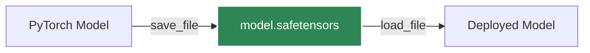

# 序列化

正确保存和加载模型对于暂停训练、共享模型或部署到生产环境至关重要。PyTorch 提供了标准的序列化机制。

## `state_dict`

`state_dict` 是一个简单的 Python 字典对象，它将每一层映射到其参数张量。只有具有可学习参数（卷积层、线性层等）和注册缓冲区的层才在模型的 `state_dict` 中有对应条目。

### 保存权重与保存整个模型

:::caution[最佳实践]
**始终保存 `state_dict` 而不是整个模型对象。** 保存整个模型对象会将序列化数据与保存期间使用的特定类定义和目录结构耦合，当代码发生变化时很容易崩溃。
:::

#### 推荐方式：保存 `state_dict`

```python
import torch

# 保存模型的权重
torch.save(model.state_dict(), 'model_weights.pth')

# 加载权重（需要先初始化模型架构）
model = TheModelClass(*args, **kwargs)
model.load_state_dict(torch.load('model_weights.pth'))
model.eval() # 记住调用 eval() 进行推理
```

#### 不推荐方式：保存整个模型

```python
# 不良实践 - 将序列化数据绑定到确切的代码结构上
torch.save(model, 'entire_model.pth')
model = torch.load('entire_model.pth')
```

## 恢复训练

要恢复训练，您必须保存模型的 `state_dict` 和优化器的 `state_dict`，以及其他元数据（如当前 epoch）。

```python
checkpoint = {
    'epoch': epoch,
    'model_state_dict': model.state_dict(),
    'optimizer_state_dict': optimizer.state_dict(),
    'loss': loss,
}
torch.save(checkpoint, 'checkpoint.pth')
```

## `safetensors` 格式

默认的 `torch.save` 依赖于 Python 的 `pickle` 模块，它无法防御恶意载荷。如果是在公开分享模型或将其部署到生产环境中，请使用 Hugging Face 提供的 `safetensors` 格式。



```python
from safetensors.torch import save_file, load_file

# 保存
save_file(model.state_dict(), "model.safetensors")

# 加载
state_dict = load_file("model.safetensors")
model.load_state_dict(state_dict)
```

:::info[Safetensors 优势]
`safetensors` 加载速度显著提升，限制了内存使用（零拷贝），并且安全可靠，不会执行任意代码。
:::
