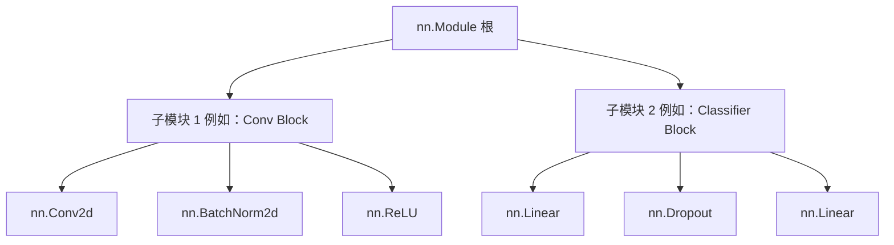

# `nn.Module` 深入探讨

在 PyTorch 中，神经网络是使用 `torch.nn` 包构建的。`nn.Module` 是所有神经网络模块的基类。神经网络本身也是一个包含其他模块（层）的模块。这种嵌套结构允许复杂的架构，同时保持代码简洁且易于调试。

## 构建自定义模型

PyTorch 中的每个自定义模型都必须继承自 `nn.Module`。

您必须定义两个方法：
1. `__init__`：定义层（例如 `nn.Linear`，`nn.Conv2d`）和模型的其他属性。
2. `forward`：定义前向传播逻辑，即输入数据如何通过各层以生成输出。

### 基本前馈网络

```python
import torch
from torch import nn

class NeuralNetwork(nn.Module):
    def __init__(self):
        super(NeuralNetwork, self).__init__()
        self.flatten = nn.Flatten()
        self.linear_relu_stack = nn.Sequential(
            nn.Linear(28*28, 512),
            nn.ReLU(),
            nn.Linear(512, 512),
            nn.ReLU(),
            nn.Linear(512, 10),
        )

    def forward(self, x):
        x = self.flatten(x)
        logits = self.linear_relu_stack(x)
        return logits
```

:::info
您不需要明确定义反向传播（如何计算梯度）。PyTorch 的 `autograd` 系统会自动计算 `forward` 传播中定义的操作的梯度。
:::

## 核心 `nn.Module` 概念

### 参数 (`Parameters`) 和缓冲区 (`Buffers`)

- **参数 (`nn.Parameter`)**：被注册为模型属性并在训练期间由优化器更新的张量（例如权重和偏置）。
- **缓冲区**：被注册为模型属性但 *不* 需要梯度且 *不* 由优化器更新的张量（例如 `BatchNorm` 中的运行均值和方差）。

```python
for name, param in model.named_parameters():
    print(f"Layer: {name} | Size: {param.size()} | Requires Grad: {param.requires_grad}")
```

### 模块状态管理 (`state_dict`)

`state_dict` 只是一个将每个层映射到其参数张量的 Python 字典对象。因为 `state_dict` 对象是 Python 字典，所以它们可以很容易地被保存、更新、修改和恢复。

```python
# 保存模型权重
torch.save(model.state_dict(), "model_weights.pth")

# 加载模型权重
model.load_state_dict(torch.load("model_weights.pth"))
```

### 训练和评估模式

模型的行为取决于它是在训练还是在评估（例如 `Dropout` 和 `BatchNorm` 层）。

```python
model.train() # 将模型设置为训练模式
model.eval()  # 将模型设置为评估模式
```

## 内部架构层次



## 最佳实践

- 始终在自定义模块构造函数的开头调用 `super().__init__()`。
- 对于简单的线性层堆叠使用 `nn.Sequential`，以保持 `forward` 函数整洁。
- 确保所有涉及张量的自定义操作，如果需要反向传播，则都是完全可微的。

## 参考资料

- [PyTorch 官方教程：Build the Neural Network](https://pytorch.org/tutorials/beginner/basics/buildmodel_tutorial.html)
- [PyTorch 文档：torch.nn](https://pytorch.org/docs/stable/nn.html)
