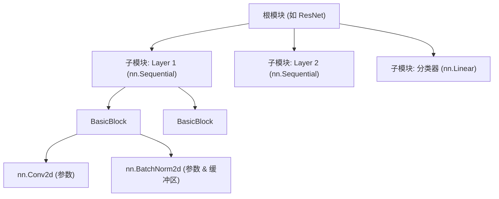

# nn.Module

`nn.Module` 是 PyTorch 中所有可微计算单元的基础抽象。它的核心目的是将**状态**（参数与缓冲区）和**计算**（前向传播）封装成一个统一的、可组合的对象。

一个 module 并不只是“某一层代码”，而是一个带状态的构建块，它与 PyTorch 的自动求导（autograd）引擎、优化器、模型序列化和设备迁移机制紧密集成。

## 核心设计哲学

`nn.Module` 的架构设计围绕着三个核心原则展开：

### 状态封装与自动注册（Stateful Registration）
模块内部负责管理三类状态：可学习参数（parameters）、非学习的持久状态（buffers）以及子模块（submodules）。通过重写 Python 的 `__setattr__`，PyTorch 会在赋值时自动将这些对象路由至内部的字典（`_parameters`、`_buffers`、`_modules`）中。正是这种自动注册机制，支撑了 `model.parameters()`、`model.to(device)` 和 `model.state_dict()` 等接口的递归遍历。

### 计算图构建与 Autograd 集成（Differentiable Forward）
`forward` 方法定义了前向计算的数学映射 $f_\theta: \mathcal{X} \rightarrow \mathcal{Y}$。当你在代码中直接调用模块实例（即 `model(x)`）时，实际触发的是底层的 `__call__` 方法。它会先执行已注册的 hook（钩子函数），检查 `self.training` 状态，最后再将调用派发至你实现的 `forward`。在这个过程中，Autograd 引擎会动态构建计算图，确保梯度流 $\frac{\partial \mathcal{L}}{\partial \theta}$ 能够沿着模块层级无缝反向传播。

### 组合式架构（Compositional Hierarchy）
模块可以嵌套任意深度的子模块，从而形成一棵树状结构。这种设计完美契合了现代深度神经网络的模块化范式（如 Transformer 的 block，或是 ResNet 的 stage），极大地便利了权重共享、局部替换以及特征提取。



## 最小化实现

一个合法的最小化自定义模块只需要做三件事：继承 `nn.Module`、在初始化方法中调用父类的 `__init__()`，以及实现 `forward` 前向计算。

```python
import torch
import torch.nn as nn

class MinimalModule(nn.Module):
    def __init__(self, in_dim: int, out_dim: int):
        super().__init__() # 关键：初始化内部用于注册和追踪的字典
        self.linear = nn.Linear(in_dim, out_dim)

    def forward(self, x: torch.Tensor) -> torch.Tensor:
        return self.linear(x)
```

:::danger[不要忘记`super().__init__()`]
绝对不要省略 `super().__init__()`。如果没有这行代码，内部字典（如 `_parameters`、`_buffers` 等）将不会被初始化。后续任何对模块或参数的赋值都会抛出 `AttributeError`。
:::

## 状态注册机制详解

理解 PyTorch 如何追踪状态非常重要。它决定了优化器能否更新正确的权重，以及 `state_dict` 能否保存正确的张量。

| 状态类型 | 注册方式 | 是否参与梯度计算 | 是否随 `.to()` 迁移 | 是否存入 `state_dict` |
| :--- | :--- | :--- | :--- | :--- |
| **可学习参数** | `nn.Parameter(tensor)` | ✅ 是 | ✅ 是 | ✅ 是 |
| **持久缓冲区** | `self.register_buffer(name, tensor)` | ❌ 否 | ✅ 是 | ✅ 是 |
| **非持久缓冲区** | `self.register_buffer(name, tensor, persistent=False)` | ❌ 否 | ✅ 是 | ❌ 否 |
| **子模块** | `self.layer = nn.Module(...)` | 继承子模块自身定义 | ✅ 是 | ✅ 是 |

:::note[何时应该使用缓冲区（Buffers）?]
对于那些前向计算必须依赖，但不希望被反向传播更新的状态，应当使用 `register_buffer`。典型的例子包括位置编码（positional encoding）、注意力掩码（attention mask）以及 BatchNorm 中的滑动均值/方差。

切记：不要直接把一个普通的 Tensor 作为属性随意挂载到 `self` 上（例如 `self.mask = torch.zeros(...)`），这样会直接绕过 PyTorch 的注册系统。
:::

## 构建与修改的最佳实践

### 状态与容器管理

记得要**显式处理参数初始化**。 自定义层如果有特定参数，应该显式初始化。你可以利用 `model.apply(init_weights)` 将初始化函数递归地应用到整棵模块树上。

:::warning[禁止使用原生 Python 容器存储子模块]
如果你写了 `self.layers = [nn.Linear(...) for _ in range(N)]`，PyTorch 不会注册它们，优化器也就根本“看不见”这些参数。你必须使用官方提供的 `nn.ModuleList`、`nn.ModuleDict`、`nn.ParameterList` 或 `nn.ParameterDict`。
:::

### 前向传播的设计
- **永远调用 `model(x)` 而不是 `model.forward(x)`。** 实例调用会自动处理 hook 的派发机制，而直接调 `forward()` 会绕过这些逻辑。
- **尊重 `self.training` 标志。** 像 Dropout、BatchNorm 这样的层，其行为会根据训练模式和评估模式发生改变。务必只通过调用全局的 `model.train()` 和 `model.eval()` 来切换模式。
- **避免破坏 Autograd 的 in-place 操作。** 对需要梯度的叶子张量（leaf tensor）执行 `x += self.bias` 会引发 `RuntimeError`，因为这破坏了计算图。优先使用 out-of-place 操作：`x = x + self.bias`。

### 设备、精度与模式一致性
- **动态的设备和类型推断。** 禁止在 `__init__` 中硬编码 `device='cuda'`。在前向计算中创建临时张量时，应该始终跟随输入张量的设备和数据类型：
  `mask = torch.ones(B, L, device=x.device, dtype=x.dtype)`
- **`torch.compile` 的编译友好性。** 如果你打算使用 `torch.compile()` 加速，应尽量避免在前向传播中写入强数据依赖的控制流（例如 `if x.sum() > 0:`）。改用静态分支或 `torch.where`。

### 模型修改（模型手术）
做“模型手术”时（例如替换某个深层子模块），尽量避免遍历 `named_modules()`。官方推荐使用 `get_submodule()` 和 `set_submodule()`。它们支持通过按嵌套深度解析点分路径（例如 `layer1.0.conv1`）来工作，非常适合做定点的检查和替换。

## 总结

`nn.Module` 的最小职责边界，是声明当前这个局部网络拥有哪些状态，并定义这些状态如何参与前向计算。它并不负责训练循环本身（取数据、算 loss、step），但它负责让优化器、保存加载机制、设备迁移、训练/评估模式以及 hook 系统都能统一、递归地“看见”并管理这个模块的状态。

## 参考资料

- [PyTorch 官方文档: torch.nn](https://pytorch.org/docs/stable/nn.html)
- [PyTorch 教程: Build the Neural Network](https://pytorch.org/tutorials/beginner/basics/buildmodel_tutorial.html)
