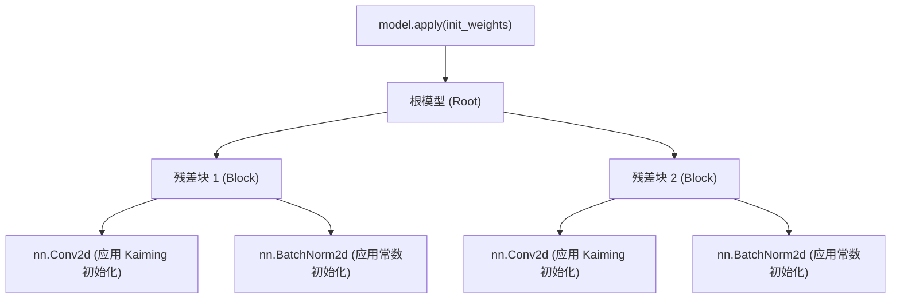

# 自定义层

虽然 PyTorch 提供了极其丰富的标准层库（如 `nn.Linear`、`nn.Conv2d`），但前沿的深度学习研究往往需要定义各种新颖的数学运算。构建一个自定义层并不仅仅是写一个 `forward` 函数那么简单——它要求你严谨地管理可学习参数，并采取科学的权重初始化策略。

## 自定义层的解剖学

构建自定义层在结构上与构建完整的模型完全一致：都需要继承 `nn.Module`。核心的区别在于，你需要手动定义并注册该层内部的张量（Tensors）。

### 显式的参数注册

当你将一个普通的张量赋值给模块的属性时，PyTorch 只会将其视为一个标准的 Python 对象。为了让这个张量融入 Autograd 引擎并被优化器追踪，你必须显式地将其包装为 `nn.Parameter`。

```python
import torch
import torch.nn as nn
import math

class CustomProjection(nn.Module):
    def __init__(self, in_features: int, out_features: int):
        super().__init__()
        # 将张量包装为 nn.Parameter，使其成为可学习、可追踪的参数
        self.weight = nn.Parameter(torch.empty((out_features, in_features)))
        self.bias = nn.Parameter(torch.empty(out_features))
        
        self.reset_parameters()

    def reset_parameters(self):
        # 初始化逻辑应当被封装在这里
        nn.init.kaiming_uniform_(self.weight, a=math.sqrt(5))
        nn.init.zeros_(self.bias)

    def forward(self, x: torch.Tensor) -> torch.Tensor:
        return torch.nn.functional.linear(x, self.weight, self.bias)
```

:::tip[重置参数的惯例]
将所有的参数初始化逻辑封装在 `reset_parameters()` 方法中，是 PyTorch 代码库的一个非正式但被广泛采纳的惯例。这使得你可以在不重新实例化对象的情况下，随时重置层的权重。
:::

## 初始化的数学原理

初始化绝不仅仅是一个普通的超参数；它决定了一个深度网络到底能不能被训练。糟糕的初始化会直接导致梯度的**消失**或**爆炸**。

### 为什么初始化如此重要？

考虑一个深层线性网络，其中第 $l$ 层的前向传播为 $h^{(l)} = W^{(l)} h^{(l-1)}$。如果权重的方差没有经过精心缩放，激活值的方差将随着网络的深度呈指数级放大或缩小：

$$
\text{Var}(h^{(l)}) = n \cdot \text{Var}(W^{(l)}) \cdot \text{Var}(h^{(l-1)})
$$

这里的 $n$ 是 fan-in（输入单元的数量）。为了保持方差稳定（$\text{Var}(h^{(l)}) \approx \text{Var}(h^{(l-1)})$），我们需要 $n \cdot \text{Var}(W^{(l)}) = 1$，即权重的方差应当为 $\text{Var}(W) = \frac{1}{n}$。

### 经典初始化策略

1. **Xavier (Glorot) 初始化**：专为 `tanh` 等对称激活函数设计。它综合考虑了输入和输出的维度来缩放权重。
2. **Kaiming (He) 初始化**：专为 ReLU 等非对称非线性激活函数设计。因为 ReLU 会将一半的激活值归零（削减了一半的方差），Kaiming 初始化将方差乘以 2 来进行补偿：$\text{Var}(W) = \frac{2}{n_{in}}$。

:::warning[警惕初始化不匹配]
如果在 ReLU 激活函数前使用 Xavier 初始化，信号的方差会在每一层被系统性地减半，这在深层网络中会迅速引发梯度消失。请务必让你的初始化方案与激活函数严格匹配。
:::

## 系统性的初始化应用

在实际工程中，我们很少去逐个层调用初始化函数。PyTorch 提供了 `model.apply(fn)` 方法，它会以深度优先的方式递归遍历模块树中的每一个节点（包括根节点本身），并对其应用传入的 `fn` 函数。



### Apply 派发模式

通过定义一个根据层类型进行派发（Dispatch）的函数，你可以极其优雅地完成整个架构的参数初始化：

```python
import torch.nn.init as init

def init_weights(m: nn.Module):
    if isinstance(m, nn.Conv2d) or isinstance(m, nn.Linear):
        # 对后接 ReLU 的层使用 Kaiming 正态分布初始化
        init.kaiming_normal_(m.weight, mode='fan_in', nonlinearity='relu')
        if m.bias is not None:
            init.zeros_(m.bias)
    elif isinstance(m, nn.BatchNorm2d) or isinstance(m, nn.LayerNorm):
        # 归一化层：缩放设为 1，偏移设为 0
        init.ones_(m.weight)
        init.zeros_(m.bias)

# 执行递归初始化
model.apply(init_weights)
```

## 总结

自定义层赋予了你对数学运算的绝对控制权，但随之而来的是正确注册和初始化参数的责任。请永远记住将可学习的张量包装在 `nn.Parameter` 中，利用 `reset_parameters` 封装初始化逻辑，并使用 `model.apply` 来执行稳健的、全局的初始化策略。

## 参考资料

- [PyTorch 官方文档: torch.nn.init](https://pytorch.org/docs/stable/nn.init.html)
- [He 等 (2015): Delving Deep into Rectifiers](https://arxiv.org/abs/1502.01852)
- [Glorot & Bengio (2010): Understanding the difficulty of training deep feedforward neural networks](https://proceedings.mlr.press/v9/glorot10a.html)
