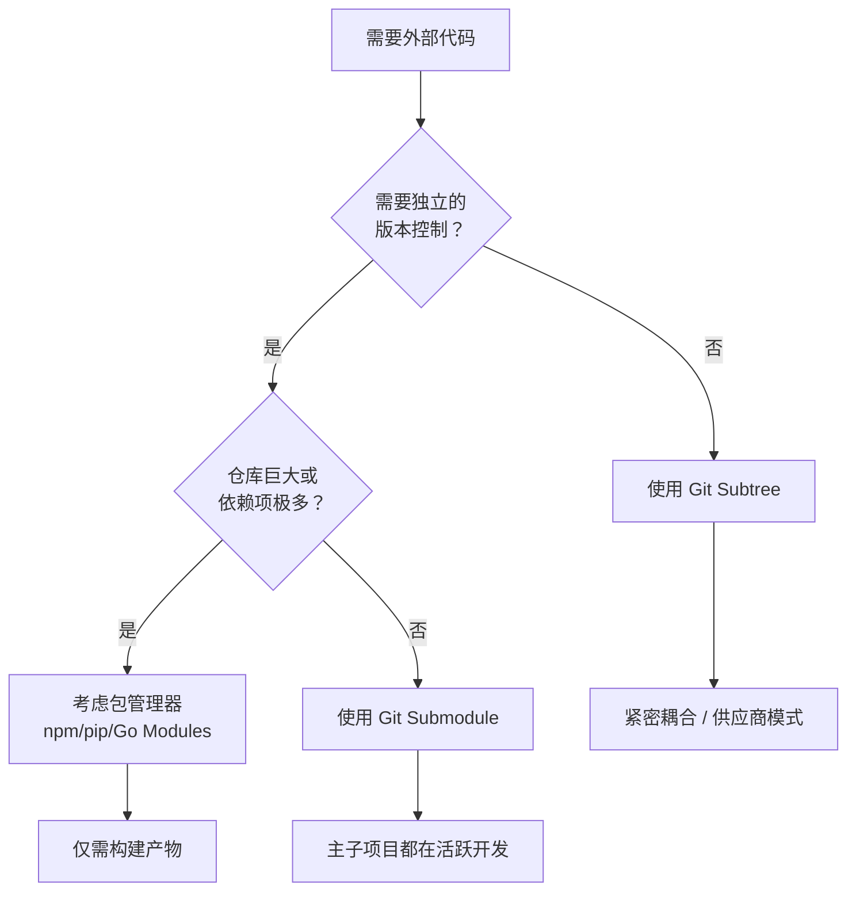

# Git 组合策略

**在 Submodule 与 Subtree 之间做出明智选择**

在实施具体的技术方案之前，请先评估最适合你项目的开发哲学。这通常取决于你将外部代码视为一个独立的依赖项（如外部引用），还是项目源码的集成部分（如受管理的 Fork）。

---

## 决策逻辑

下表概述了两种方案之间的主要权衡点：

| 维度 | Submodule（分离） | Subtree（合入） |
| :--- | :--- | :--- |
| **心智模型** | **外部引用**：指向外部仓库的指针 | **受控 Fork**：代码被合并入你的仓库 |
| **哲学** | "依赖即指针" | "依赖即源码" |
| **修改频率** | 很少 — 依赖独立维护 | 经常 — 依赖被视为项目一部分 |
| **更新频率** | 低 — 有计划地升级 | 高 — 在功能开发中同时变更 |
| **同步成本** | 高 — 两步流程（子仓库 + 指标更新） | 低 — 单次提交即可覆盖主仓库与依赖 |
| **入门成本** | 高 — 需学习 Submodule 工作流 | 低 — 标准 Git 工作流即可 |
| **CI/CD** | 需要递归克隆/初始化 | 无需额外配置 |

### 简短建议

- **优先选择 Submodule**：如果依赖项是独立维护的（例如稳定的公共库），且你仅需偶尔升级。它就像是一个指向特定版本的 **链接**。
- **优先选择 Subtree**：如果团队在开发特性时经常需要修补或演进依赖代码。它就像是将代码直接 **Fork** 到你的仓库中，使一切集中管理。

---

## 架构适配性

使用以下指南确定你的需求在 Git 生态中的位置：

---

## 方案对比矩阵

| 维度 | Submodule | Git Subtree | 包管理器 (npm/pip) |
| :--- | :--- | :--- | :--- |
| **存储方式** | 指向提交哈希的指针 | 完整代码合并入主仓库 | 通常仅限构建产物 |
| **工作流** | 较高 (init/update) | 较低 (普通 Git 操作) | 托管式 (npm/pip) |
| **历史记录** | 分离 | 合并 | 无（源码被隐藏） |
| **CI/CD** | 需要递归克隆 | 无需额外配置 | 需要私有仓库/安装步骤 |
| **回推上游** | 非常简单 | 较慢（需 split/push） | 通过发布流程 |
