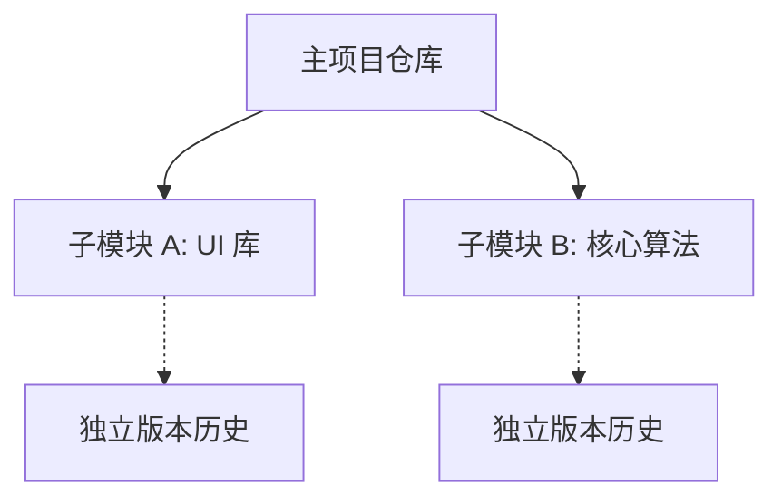

# Git Submodule 完整指南

**管理外部依赖与多仓库架构**

Git Submodule 允许你将一个 Git 仓库作为另一个 Git 仓库的子目录。这让你可以克隆另一个仓库到你的项目中，并保持提交历史的分离。

---

## 核心概念

### 架构概览



| 用例 | 描述 | 示例 |
| :--- | :--- | :--- |
| **依赖管理** | 包含第三方库的特定版本。 | 锁定 UI 框架版本。 |
| **组件复用** | 在多个项目间共享公共组件。 | 共享的认证/日志模块。 |
| **微服务** | 在单一视图中组织相关服务。 | 开发环境的统一编排。 |

---

## 基础操作

### 添加 Submodule

```bash
# 在指定路径添加 Submodule
git submodule add <repository_url> <path>

# 示例：添加通用工具库
git submodule add https://github.com/example/tools.git libs/tools
```

### 克隆包含 Submodule 的项目

```bash
# 方法 A：一步克隆（推荐）
git clone --recurse-submodules <url>

# 方法 B：手动初始化
git clone <url>
cd project
git submodule update --init --recursive
```

### 更新 Submodule

| 任务 | 命令 |
| :--- | :--- |
| **同步到记录的提交** | `git submodule update` |
| **更新到远端最新** | `git submodule update --remote` |
| **递归更新所有** | `git submodule update --init --recursive` |

---

## 开发工作流

当你需要在 Submodule 内部进行修改时：

1. **进入 Submodule**: `cd libs/tools`
2. **切换分支**: `git checkout main` (避免处于游离 HEAD 状态)。
3. **修改并提交**: `git add . && git commit -m "feat: update tools"`
4. **推送 Submodule**: `git push origin main`
5. **在主项目中记录更新**:
   ```bash
   cd ../..
   git add libs/tools
   git commit -m "chore: update tools submodule pointer"
   git push origin main
   ```

---

## 最佳实践

:::info[工程建议]
1. **锁定版本**: 除非有特殊需求，否则应锁定到具体提交，确保构建可重复。
2. **使用 HTTPS**: 在 `.gitmodules` 中优先使用 HTTPS 链接，提高 CI/CD 兼容性。
3. **主动同步**: 养成 `git pull` 后运行 `git submodule update --init --recursive` 的习惯。
4. **清理残留**: 删除 Submodule 时，除 `git rm` 外，还需清理 `.git/modules/` 下的缓存。
:::

---

## 故障排查

| 问题 | 解决方案 |
| :--- | :--- |
| **游离 HEAD 状态** | `cd <path> && git checkout <branch>`。 |
| **URL 发生变更** | 修改 `.gitmodules` 后运行 `git submodule sync`。 |
| **合并冲突** | 使用 `git checkout --ours/--theirs <path>` 选取指针版本并重新提交。 |
