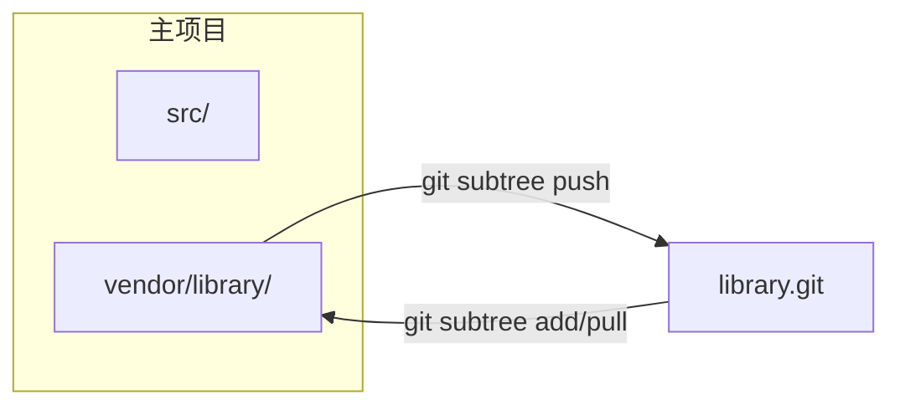

# Git Subtree 完整指南

**在项目中嵌入外部仓库，无需独立指针文件**

Git subtree 允许你将另一个仓库合并到项目的子目录中，同时保留从上游拉取更新以及推送变更的能力。与 `git submodule` 不同，它不需要 `.gitmodules` 文件——外部代码直接存在于你自己的提交历史中。

---

## 核心概念

### Subtree 的工作原理



从本质上讲，`git subtree` 会将外部仓库的提交历史通过 **squash merge** 合并到指定的前缀目录中。外部提交可以逐条重放到你的树上，也可以压缩为单个提交以保持日志整洁。

---

## 基础操作

### 添加 Subtree

```bash
# 通用语法
git subtree add --prefix=<路径> <仓库URL> <分支> [--squash]

# 示例：将工具库嵌入到 vendor/tools
git subtree add --prefix=vendor/tools https://github.com/example/tools.git main --squash
```

| 参数 | 作用 |
| :--- | :--- |
| `--prefix` | 工作树中的目标目录（不存在时会自动创建） |
| `--squash` | 将外部历史压缩为单个合并提交（推荐，保持日志整洁） |
| `<分支>` | 要导入的远程分支（`main`、`master`、`develop` 等） |

### 拉取上游更新

```bash
# 将远程最新变更拉取到指定前缀目录
git subtree pull --prefix=vendor/tools https://github.com/example/tools.git main --squash
```

:::info
`git subtree pull` 内部执行的是 `git merge`。如有冲突，按照标准 Git 冲突解决流程处理即可。
:::

---

## 开发工作流

### 场景：导入库并做本地修改

1. **添加 Subtree**（一次性设置）:
   `git subtree add --prefix=vendor/log https://github.com/user/log.git main --squash`

2. **在本地修改库**:
   直接编辑 `vendor/log/` 下的文件。

3. **在主仓库中提交修改**:
   `git add vendor/log && git commit -m "vendor(log): 修复解析器内存泄漏"`

4. **将变更推送回上游**（需有写入权限）:
   `git subtree push --prefix=vendor/log https://github.com/user/log.git main`

---

## 最佳实践

### 常用模式

- **保持前缀路径清晰可预测**: 将 Subtree 组织在 `vendor/` 或 `packages/` 下。
- **一致使用 `--squash`**: 混用 squash 会导致历史混乱。
- **避免深层嵌套**: Subtree 内再套 Subtree 会导致不可预测的合并行为。
- **提交信息规范**: 使用 `vendor(<名称>):` 前缀方便过滤历史。

---

## 故障排查

| 问题 | 解决方案 |
| :--- | :--- |
| **`subtree push` 极慢** | 在新克隆中执行，或先 split 再推送。 |
| **`subtree pull` 合并冲突** | 正常解决冲突（`git add <file> && git commit`）。 |
| **前缀目录用错了** | 用正确前缀重新 add，然后删除旧目录。 |
| **需要移除 Subtree** | `git rm -r <prefix> && git commit -m "remove subtree <name>"`。 |

---

## 迁移指南

### 从 Submodule 迁移到 Subtree

```bash
# 1. 移除 Submodule
git submodule deinit vendor/library
git rm vendor/library
rm -rf .git/modules/vendor/library
git commit -m "chore: 移除 Submodule vendor/library"

# 2. 添加为 Subtree
git subtree add --prefix=vendor/library https://github.com/user/library.git main --squash
```

---

## 参考资料

- [Pro Git -- Git Tools - Subtree Merging](https://git-scm.com/book/en/v2/Git-Tools-Subtree-Merging)
- [git-subtree 文档（内建）](https://git.wiki.kernel.org/index.php/Git-subtree)
- [Atlassian 教程 -- Git Subtree](https://www.atlassian.com/git/tutorials/git-subtree)
