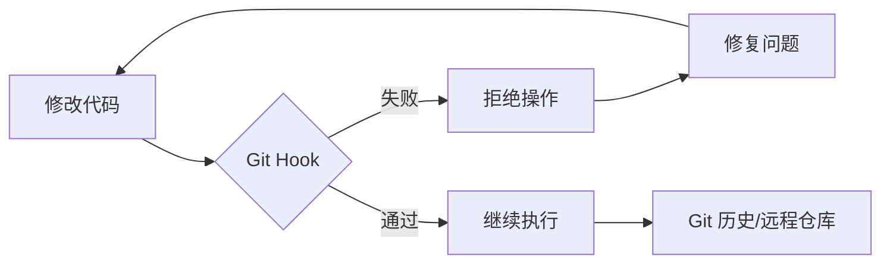

# Git Hooks 工程指南

**自动化工作流并强制执行工程标准**

Git hooks 是 Git 在关键事件（如 commit、push、receive）前后自动执行的脚本。它们对于维护代码质量、确保安全性以及自动化重复性的开发任务至关重要。

## 核心概念

### Hook 分类

| 类别 | Hooks | 作用范围 |
| :--- | :--- | :--- |
| **客户端 (Client-Side)** | `pre-commit`, `commit-msg`, `pre-push` | 本地开发工作流 |
| **服务端 (Server-Side)** | `pre-receive`, `post-receive`, `update` | 远程仓库强制执行 |

### 客户端与服务端 Hooks 的区别

**客户端 Hooks** 在开发者的本地机器上运行。它们充当个人防护栏 — 执行快速的 linting、格式化和提交信息验证等检查。客户端 Hooks 可以通过 `--no-verify` 跳过，因此属于建议性而非强制性。

**服务端 Hooks** 在远程仓库（如 GitHub、GitLab、自建 Git 服务器）上运行。它们强制执行不可跳过的策略，例如拒绝未通过 CI 检查的推送、强制执行分支命名规范，或禁止对受保护分支执行 force-push。

> **经验法则**：客户端 Hooks 用于提升开发体验（快速反馈），服务端 Hooks 用于策略执行（不可绕过的规则）。

### 为什么要使用 Hooks 自动化？



| 收益 | 工程成果 |
| :--- | :--- |
| **代码质量** | 防止 linting/formatting 错误进入版本库。 |
| **安全性** | 在代码离开本地机器前扫描硬编码的密钥（Secrets/API keys）。 |
| **标准化** | 强制执行 [Conventional Commits](https://www.conventionalcommits.org/) 规范。 |
| **可靠性** | 确保单元测试通过后才允许执行 push 操作。 |

---

## Hook 管理工具

原生 Git hooks（存储在 `.git/hooks/` 中）不易进行版本控制。Hook 管理工具通过使 hooks 可共享、可配置且易于维护来解决这一问题。根据项目的生态系统选择合适的工具：

| 管理工具 | 语言 | 适用场景 | 并行执行 |
| :--- | :--- | :--- | :--- |
| **Husky** + lint-staged | Node.js | npm/Node.js 项目 | 通过 lint-staged |
| **[Lefthook](https://github.com/evilmartians/lefthook)** | Go 二进制 | 多语言 / 任意工具链 | 内置支持 |
| **[pre-commit](https://pre-commit.com)** | Python | Python 或多语言仓库 | 不支持 |

### Husky + lint-staged (Node.js 生态)

Husky 简化了 Git hooks 的管理和在团队内的共享。

```bash
# 安装 Husky
npm install husky --save-dev

# 初始化 Husky (创建 .husky 目录)
npx husky init
```

在每次 commit 时对 *整个* 代码库运行 linter 会非常缓慢。`lint-staged` 确保你只检查当前正在提交的文件。

```bash
npm install lint-staged --save-dev
```

**配置 (`package.json`):**

```json
{
  "lint-staged": {
    "*.{js,ts,tsx}": "eslint --fix",
    "*.py": "ruff check --fix",
    "*.md": "prettier --write"
  }
}
```

**.husky/pre-commit:**

```bash
npx lint-staged
```

### Lefthook (语言无关)

一个用 Go 编写的快速、零依赖的管理工具。与 Husky（仅限 npm）或 pre-commit（Python）不同，Lefthook 适用于任何工具链，并内置支持并行执行。

**安装：**

```bash
# Go
go install github.com/evilmartians/lefthook@latest

# npm
npm install @evilmartians/lefthook --save-dev

# Homebrew (macOS/Linux)
brew install lefthook
```

**配置 (`lefthook.yml`):**

```yaml
pre-commit:
  commands:
    lint-js:
      glob: "*.{js,ts,tsx}"
      run: eslint --fix {staged_files}

    format-py:
      glob: "*.py"
      run: ruff format {staged_files}

commit-msg:
  commands:
    conventional:
      run: commitlint --edit {1}
```

```bash
# 将 hooks 安装到 .git/ 目录
lefthook install
```

### pre-commit (Python 生态)

纯 Python 或多语言项目的行业标准，拥有丰富的共享 hook 仓库生态。

```bash
pip install pre-commit
```

**`.pre-commit-config.yaml`:**

```yaml
repos:
  - repo: https://github.com/pre-commit/pre-commit-hooks
    rev: v4.6.0
    hooks:
      - id: trailing-whitespace
      - id: end-of-file-fixer
      - id: check-yaml
      - id: check-added-large-files

  - repo: https://github.com/astral-sh/ruff-pre-commit
    rev: v0.4.0
    hooks:
      - id: ruff
        args: [ --fix ]
      - id: ruff-format
```

```bash
# 将 hooks 安装到 .git/ 目录
pre-commit install

# 手动对所有文件运行
pre-commit run --all-files
```

---

## 提交信息工具

标准化的提交信息有助于自动生成变更日志（Changelog）并提供更好的项目历史视图。这些工具通过 `commit-msg` hook 接入任何 Hook 管理工具。

### Commitlint (验证)

在提交信息写入后强制执行 Conventional Commit 规范：

```bash
npm install @commitlint/cli @commitlint/config-conventional --save-dev

# 创建配置
echo "export default { extends: ['@commitlint/config-conventional'] };" > commitlint.config.js

# 添加 hook
echo "npx commitlint --edit \$1" > .husky/commit-msg
```

### Commitizen (交互式)

**[Commitizen](https://commitizen-tools.github.io/commitizen/)** 通过交互式引导帮助开发者编写合规的提交信息 — 在验证之前就消除猜测。

```bash
npm install cz-conventional-changelog --save-dev
```

**`package.json`:**

```json
{
  "scripts": {
    "commit": "cz"
  },
  "config": {
    "commitizen": {
      "path": "cz-conventional-changelog"
    }
  }
}
```

使用 `npm run commit`（或 `npx cz`）替代 `git commit`，系统将交互式地引导你填写 type、scope 和 description。

> 两者配合实现纵深防御：Commitizen 帮助编写规范的提交信息，Commitlint 捕获任何遗漏。

---

## 最佳实践

:::tip 主动验证 (Proactive Validation)
1. **对 Hooks 进行版本控制**：永远不要依赖本地的 `.git/hooks/`。请使用 Hook 管理工具。
2. **快速失败 (Fail Fast)**：合理安排 hooks 顺序，使运行速度最快的检查（如 linting）先于耗时较长的检查（如集成测试）运行。
3. **信息化错误提示**：确保 hook 脚本在拒绝提交时提供清晰的修复指南。
4. **谨慎使用 `--no-verify`**：仅在紧急情况下跳过 hooks；绝不要为了规避质量标准而使用。
5. **虚拟环境感知**：Hooks 在裸 shell 环境中执行 — 不会继承你激活的虚拟环境。请使用 `uv run`、`pipx run` 等包装命令或绝对路径来确保工具能被找到。
:::

---

## 常见问题排除

| 问题 | 解决方案 |
| :--- | :--- |
| **Hooks 未触发** | 确保脚本具有执行权限：`chmod +x .husky/pre-commit` |
| **Husky 初始化失败** | 确保你位于 Git 仓库的根目录下。 |
| **环境不匹配** | 在 hook 脚本中使用绝对路径或标准命令（如 `npm run`）。 |
| **"command not found" 错误** | Hook 在虚拟环境之外运行。请使用 `uv run`、`pipx run` 前缀或工具的绝对路径。 |
