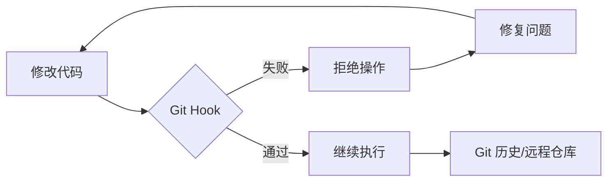

# Git Hooks 工程指南

**自动化工作流并强制执行工程标准**

Git hooks 是 Git 在关键事件（如 commit、push、receive）前后自动执行的脚本。它们对于维护代码质量、确保安全性以及自动化重复性的开发任务至关重要。

## 核心概念

### Hook 分类

| 类别 | Hooks | 作用范围 |
| :--- | :--- | :--- |
| **客户端 (Client-Side)** | `pre-commit`, `commit-msg`, `pre-push` | 本地开发工作流 |
| **服务端 (Server-Side)** | `pre-receive`, `post-receive`, `update` | 远程仓库强制执行 |

### 为什么要使用 Hooks 自动化？



| 收益 | 工程成果 |
| :--- | :--- |
| **代码质量** | 防止 linting/formatting 错误进入版本库。 |
| **安全性** | 在代码离开本地机器前扫描硬编码的密钥（Secrets/API keys）。 |
| **标准化** | 强制执行 [Conventional Commits](https://www.conventionalcommits.org/) 规范。 |
| **可靠性** | 确保单元测试通过后才允许执行 push 操作。 |

---

## 标准工具链：Husky & lint-staged

虽然原生 Git hooks（存储在 `.git/hooks/` 中）非常强大，但它们不易进行版本控制。对于现代工程团队，我们标准化使用 **Husky**。

### 1. 设置 Husky (Node.js/通用)

Husky 简化了 Git hooks 的管理和在团队内的共享。

```bash
# 安装 Husky
npm install husky --save-dev

# 初始化 Husky (创建 .husky 目录)
npx husky init
```

### 2. 使用 lint-staged 进行优化

在每次 commit 时对 *整个* 代码库运行 linter 会非常缓慢。`lint-staged` 确保你只检查当前正在提交的文件。

```bash
npm install lint-staged --save-dev
```

**配置 (`package.json`):**

```json
{
  "lint-staged": {
    "*.{js,ts,tsx}": "eslint --fix",
    "*.py": "ruff check --fix",
    "*.md": "prettier --write"
  }
}
```

**.husky/pre-commit:**

```bash
npx lint-staged
```

---

## 提交信息标准化 (Commit Message Standardization)

标准化的提交信息有助于自动生成变更日志（Changelog）并提供更好的项目历史视图。

### Commitlint

强制执行 Conventional Commit 规范：

```bash
npm install @commitlint/cli @commitlint/config-conventional --save-dev

# 创建配置
echo "export default { extends: ['@commitlint/config-conventional'] };" > commitlint.config.js

# 添加 hook
echo "npx commitlint --edit \$1" > .husky/commit-msg
```

---

## Python 工程：Pre-commit 框架

对于纯 Python 或多语言项目，`pre-commit` 框架是行业标准。

### 安装与配置

```bash
pip install pre-commit
```

**`.pre-commit-config.yaml`:**

```yaml
repos:
  - repo: https://github.com/pre-commit/pre-commit-hooks
    rev: v4.6.0
    hooks:
      - id: trailing-whitespace
      - id: end-of-file-fixer
      - id: check-yaml
      - id: check-added-large-files

  - repo: https://github.com/astral-sh/ruff-pre-commit
    rev: v0.4.0
    hooks:
      - id: ruff
        args: [ --fix ]
      - id: ruff-format
```

### 使用方法

```bash
# 将 hooks 安装到 .git/ 目录
pre-commit install

# 手动对所有文件运行
pre-commit run --all-files
```

---

## 最佳实践

:::tip 主动验证 (Proactive Validation)
1. **对 Hooks 进行版本控制**：永远不要依赖本地的 `.git/hooks/`。请使用 Husky 或 `pre-commit`。
2. **快速失败 (Fail Fast)**：合理安排 hooks 顺序，使运行速度最快的检查（如 linting）先于耗时较长的检查（如集成测试）运行。
3. **信息化错误提示**：确保 hook 脚本在拒绝提交时提供清晰的修复指南。
4. **谨慎使用 `--no-verify`**：仅在紧急情况下跳过 hooks；绝不要为了规避质量标准而使用。
:::

---

## 常见问题排除

| 问题 | 解决方案 |
| :--- | :--- |
| **Hooks 未触发** | 确保脚本具有执行权限：`chmod +x .husky/pre-commit` |
| **Husky 初始化失败** | 确保你位于 Git 仓库的根目录下。 |
| **环境不匹配** | 在 hook 脚本中使用绝对路径或标准命令（如 `npm run`）。 |

---

*最后更新：2026年3月*
