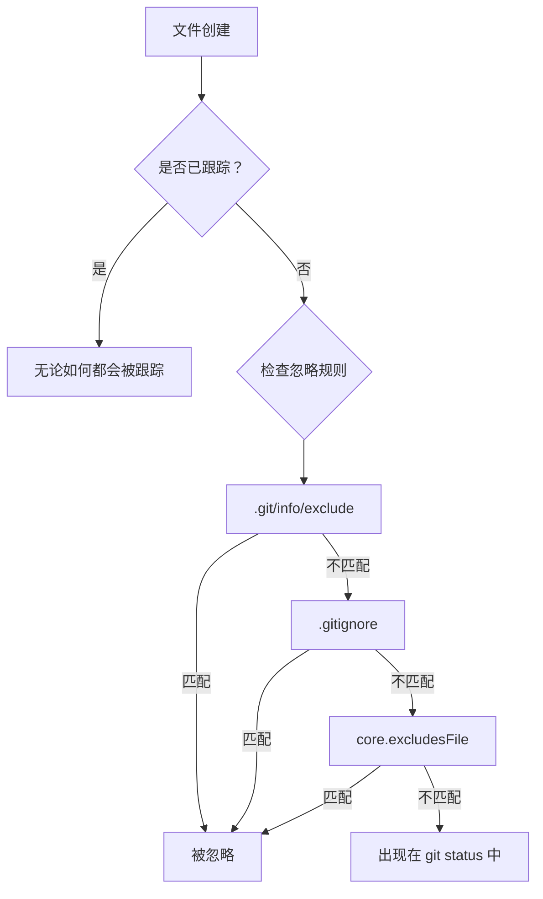
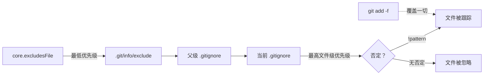

# Git Ignore 工程指南

**在项目、本地和全局范围内管理未跟踪文件**

Git 提供三个层级的忽略配置，用于控制哪些文件被排除在版本控制之外。理解何时何地使用每个层级，对于保持仓库整洁和高效的团队协作至关重要。

## 忽略层级概览

| 层级 | 文件 / 配置 | 作用范围 | 是否共享？ | 使用场景 |
| :--- | :--- | :--- | :--- | :--- |
| **项目级** | `.gitignore` | 整个仓库 | 是（已提交） | 构建产物、依赖、IDE 配置 |
| **本地级** | `.git/info/exclude` | 单个本地仓库 | 否 | 个人编辑器文件、本地脚本 |
| **全局级** | `core.excludesFile` | 用户所有仓库 | 否 | 系统文件（`.DS_Store`）、编辑器备份 |



---

## 项目级：`.gitignore`

`.gitignore` 文件会被提交到仓库，在所有协作者之间共享。它定义了适用于项目所有成员的忽略规则。

### 位置与作用范围

- `.gitignore` 文件对其所在目录及所有子目录递归生效。
- 可以在目录树的不同层级放置多个 `.gitignore` 文件。
- 子目录中 `.gitignore` 的规则优先级高于父目录。

### 模式语法

| 模式 | 含义 | 示例 |
| :--- | :--- | :--- |
| `*.log` | 匹配当前目录及子目录下所有 `.log` 文件 | `debug.log`、`error.log` |
| `build/` | 匹配 `build` 目录及其所有内容 | `build/output.js` |
| `temp` | 匹配任意位置名为 `temp` 的文件或目录 | `temp/`、`src/temp` |
| `/temp` | 仅匹配根目录下的 `temp`（前导斜杠锚定到 `.gitignore` 所在位置） | `temp/` 但不匹配 `src/temp` |
| `**/logs` | 匹配任意深度的 `logs` | `logs/`、`a/b/logs/` |
| `**/logs/**` | 匹配任意 `logs` 目录下的所有内容 | `a/b/logs/x.txt` |
| `!important.log` | 否定：不忽略此文件（覆盖之前的规则） | 重新包含特定文件 |
| `doc/*.txt` | 仅匹配 `doc/` 下的 `.txt` 文件（不含子目录） | `doc/notes.txt` |
| `doc/**/*.txt` | 匹配 `doc/` 及其所有子目录下的 `.txt` 文件 | `doc/a/b/notes.txt` |

### 否定规则

使用 `!` 重新包含被更宽泛规则忽略的文件：

```gitignore
# 忽略所有 .log 文件
*.log

# 但不包括 important.log
!important.log
```

:::caution
否定规则仅在父目录本身未被忽略时才有效。如果 `logs/` 已被忽略，`!logs/important.log` 不会生效 — Git 不会检查已被忽略的目录内部。
:::

### 常见项目模式

```gitignore
# 依赖
node_modules/
vendor/
.pnp/
.pnp.js

# 构建产物
dist/
build/
out/
*.o
*.pyc

# 环境变量和密钥
.env
.env.*
!.env.example
*.pem
*.key

# IDE 和编辑器文件
.vscode/
.idea/
*.swp
*.swo
*~

# 系统文件
.DS_Store
Thumbs.db

# 日志
*.log
npm-debug.log*
yarn-debug.log*
yarn-error.log*

# Python
__pycache__/
*.pyc
.pytest_cache/
.mypy_cache/

# Docusaurus / Node.js
.docusaurus/
.cache/
```

---

## 本地级：`.git/info/exclude`

`.git/info/exclude` 文件位于特定仓库的 `.git` 目录内。其功能与 `.gitignore` 完全相同，但**永远不会被提交或共享**。

### 何时使用

- 不应放入项目 `.gitignore` 的个人 IDE 配置文件
- 本地辅助脚本或草稿文件
- 特定于个人工作流的临时文件
- 与项目相关但对其他团队成员无意义的文件

### 位置

```
<仓库根目录>/.git/info/exclude
```

### 示例

```gitignore
# 个人草稿文件
scratch.md
notes/

# 不与团队共享的本地编辑器配置
.local-editor-settings.json

# 不想污染 git status 的系统文件
.DS_Store
```

:::tip
当文件属于项目特定但不应强制对整个团队生效忽略规则时，使用 `.git/info/exclude`。这样可以保持 `.gitignore` 简洁，专注于通用模式。
:::

---

## 全局级：`core.excludesFile`

全局忽略适用于你机器上的**所有仓库**。配置一次，再也不用担心系统或编辑器产生的干扰文件。

### 设置

```bash
# 1. 创建全局忽略文件
touch ~/.gitignore_global

# 2. 告诉 Git 使用它
git config --global core.excludesFile ~/.gitignore_global
```

### 推荐的全局模式

```gitignore
# macOS
.DS_Store
.AppleDouble
.LSOverride
._*

# Windows
Thumbs.db
ehthumbs.db
Desktop.ini

# Linux
*~
.directory

# 编辑器文件
*.swp
*.swo
*~
.vscode/settings.json
.idea/workspace.xml

# 差异和合并工具备份
*.orig
*.rej
*.merge-file-backup

# Python
__pycache__/
*.pyc

# Node.js（如果参与多个 JS 项目）
node_modules/
```

### 验证配置

```bash
# 查看当前全局 excludesFile 路径
git config --global core.excludesFile

# 查看所有与忽略相关的配置
git config --global --get-regexp ignore
```

---

## 优先级与求值顺序

Git 按以下顺序求值忽略规则（后面的规则覆盖前面的规则）：

1. **命令行标志** — `git add -f <file>` 强制跟踪，无视任何忽略规则。
2. **`.gitignore` 规则** — 从当前目录的文件读取，然后向上逐级读取父目录中的文件。越近的文件优先级越高。
3. **`.git/info/exclude`** — 本地仓库排除文件。
4. **`core.excludesFile`** — 全局忽略文件。

:::info
在单个 `.gitignore` 文件内，**最后匹配的规则生效**。位于忽略模式之后的否定 `!pattern` 会重新包含匹配的文件。
:::



---

## 已跟踪的文件永远不会被忽略

一条关键规则：**Git 不会忽略已被跟踪的文件。** 如果文件已被提交，将其加入 `.gitignore` 不会产生任何效果。

### 从索引中移除已跟踪的文件

```bash
# 从 Git 索引中移除但保留在磁盘上
git rm --cached <file>

# 递归移除目录
git rm --cached -r <directory>

# 提交变更
git commit -m "chore: 停止跟踪 <file>"
```

执行 `git rm --cached` 后，文件变为未跟踪状态，`.gitignore` 规则将对其生效。

---

## 调试忽略规则

### 检查文件为何被忽略

```bash
git check-ignore -v <file>
```

输出格式：

```
.gitignore:3:*.log    debug.log
```

这表示：`.gitignore` 文件第 `3` 行，规则 `*.log`，匹配了文件 `debug.log`。

### 检查多个文件

```bash
git check-ignore -v *.log *.tmp
```

### 查找所有被忽略的文件

```bash
# 列出工作树中所有被忽略的文件
git status --ignored

# 列出详细信息
git ls-files --others --ignored --exclude-standard
```

---

## 最佳实践

| 实践 | 理由 |
| :--- | :--- |
| **尽早提交 `.gitignore`** | 防止意外提交构建产物或密钥。 |
| **保持规则具体** | 使用明确模式而非宽泛通配符，避免意外。 |
| **个人文件使用 `.git/info/exclude`** | 保持共享的 `.gitignore` 简洁。 |
| **一次性设置全局忽略** | 消除所有仓库中的系统和编辑器干扰文件。 |
| **在 `.gitignore` 中添加注释** | 按用途分组规则，用空行分隔各部分。 |
| **不要用 `.gitignore` 忽略应放入 `.git/info/exclude` 的内容** | 个人工作流文件不应强加给团队。 |
| **使用 `git check-ignore -v` 调试** | 快速定位忽略某个文件的规则来源。 |
