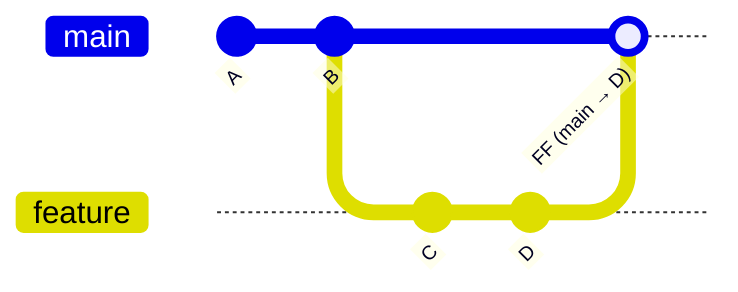
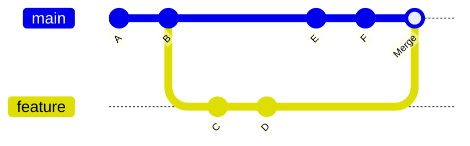
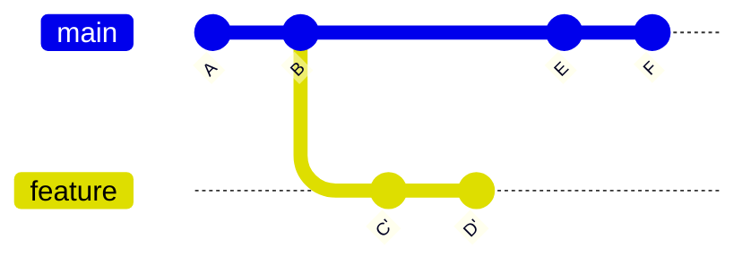
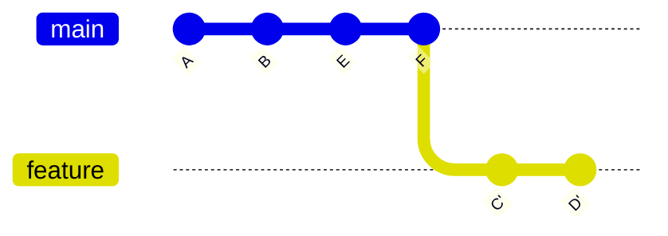
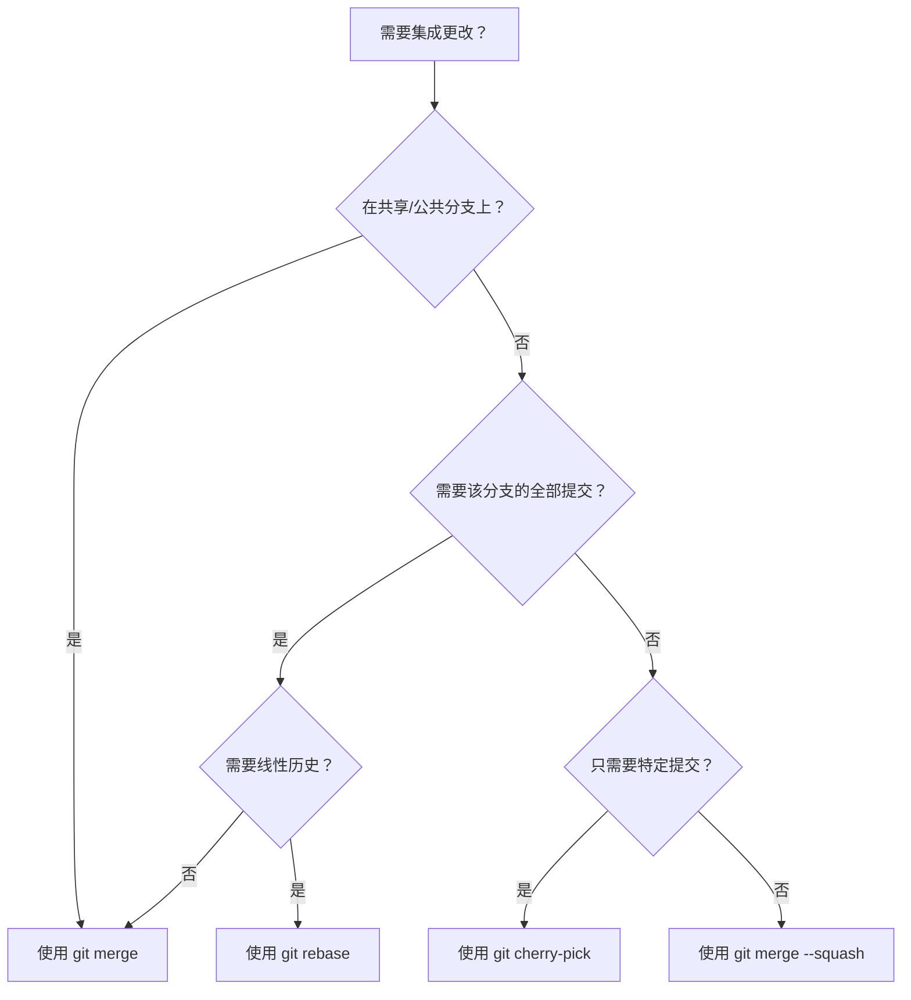

# Merge、Rebase 与 Cherry-Pick

**正确地整合变更与重写历史**

`merge`、`rebase` 和 `cherry-pick` 是 Git 中在分支之间移动提交的三种主要机制。了解何时以及如何使用它们，对于在协作项目中维护清晰、可读的提交历史至关重要。

---

## 快速对比

| 方面 | `merge` | `rebase` | `cherry-pick` |
| :--- | :--- | :--- | :--- |
| **功能** | 通过合并提交组合分支 | 将提交重播到新的基准上 | 将特定提交应用到另一个分支 |
| **历史** | 保留分支拓扑结构 | 创建线性历史 | 复制单个提交 |
| **是否重写历史** | 否 | 是 | 否（创建新提交） |
| **在共享分支上安全** | 是 | **否** | 是 |
| **适用于** | 集成功能分支 | 清理本地提交 | 热修复移植、选择性回退 |

---

## Git Merge

Merge 将两个开发历史合并在一起。它是将一个分支的更改集成到另一个分支的最常见方式。

### 快进合并（Fast-Forward Merge）

当目标分支在源分支分离后没有新的提交时，Git 会执行**快进合并**——它只是将分支指针向前移动。



```bash
git checkout main
git merge feature
# 结果：main 现在指向 D，不会创建合并提交
```

### 三向合并（无快进）

当两个分支已经分离时，Git 会创建一个将两个历史联系在一起的**合并提交**。合并提交有两个父提交。



```bash
git checkout main
git merge feature
# 创建一个以 B（main）和 D（feature）为父提交的合并提交
```

### 使用 `--no-ff` 强制创建合并提交

即使可以进行快进合并，你也可以强制创建合并提交以保留分支拓扑结构。

```bash
git merge --no-ff feature
```

:::tip[为什么要用 `--no-ff`？]
合并提交充当一个**书签**，将功能分支的所有提交分组在一起。这使得 `git revert` 更加容易——你可以通过还原一个合并提交来还原整个功能：

```bash
git revert -m 1 <merge-commit-hash>
```
:::

### 解决合并冲突

当两个分支修改了相同的行时，Git 无法自动合并，会暂停等待手动解决。

```bash
git merge feature
# 冲突 (content): Merge conflict in src/app.py
# 自动合并失败；请修复冲突然后提交。
```

**解决步骤：**

1. 打开有冲突的文件，查找冲突标记：

```python
<<<<<<< HEAD (main)
def greet(name):
    return f"Hello, {name}!"
=======
def greet(name, title):
    return f"Hello, {title} {name}!"
>>>>>>> feature
```

2. 编辑文件到所需的最终状态，删除标记。
3. 暂存并完成合并：

```bash
git add src/app.py
git merge --continue
# 或者：git commit（较旧的 Git 版本）
```

如果出现问题，**中止合并**：

```bash
git merge --abort
```

---

## Git Rebase

Rebase 将你的提交重新应用到另一个分支的顶部，产生**线性历史**。它不是创建合并提交，而是将整个分支移动到新的基准上开始。

### 基础 Rebase



```bash
# 变基前：feature 从 B 分离
git checkout feature
git rebase main

# 变基后：feature 的提交 C'、D' 被重播到 F 之上
# 该分支现在与 main 是线性关系
```



:::danger[Rebase 的黄金法则]
**永远不要对已推送到共享分支的提交进行变基。**

变基会重写提交哈希。如果其他人已经基于原始提交进行了工作，他们的历史将会分离，导致混乱和重复提交。只对你**本地的、未发布的**分支进行变基。
:::

### 交互式变基（`-i`）

交互式变基是一个强大的工具，可以在合并前清理提交。它允许你重新排序、压缩（squash）、编辑或删除提交。

```bash
git rebase -i HEAD~4
```

这会打开一个编辑器，显示最后 4 个提交：

```
pick a1b2c3d feat: add login form
pick e4f5g6h fix: typo in login form
pick i7j8k9l feat: add form validation
pick m0n1o2p fix: validation edge case
```

#### 可用操作

| 命令 | 效果 |
| :--- | :--- |
| `pick` | 保持提交原样 |
| `reword` | 保留提交但编辑消息 |
| `edit` | 在此提交处暂停以便修改 |
| `squash` | 合并到前一个提交（组合消息） |
| `fixup` | 合并到前一个提交（丢弃此消息） |
| `drop` | 完全移除提交 |
| `exec` | 在应用提交后运行 shell 命令 |

#### 常见模式

**压缩相关的修复提交：**

```
pick a1b2c3d feat: add login form
fixup e4f5g6h fix: typo in login form
pick i7j8k9l feat: add form validation
fixup m0n1o2p fix: validation edge case
```

结果：两个干净的提交——`feat: add login form` 和 `feat: add form validation`。

**重新排序提交：**

```
pick i7j8k9l feat: add form validation
pick a1b2c3d feat: add login form
```

只需在编辑器中重新排列行即可。

:::caution[变基期间的冲突]
交互式变基在重新排序或压缩提交时可能会产生冲突。解决每个冲突后：

```bash
git add <file>
git rebase --continue
```

随时中止：

```bash
git rebase --abort
```
:::

### Rebase 与 Merge：何时使用哪个

| 场景 | 建议 |
| :--- | :--- |
| 功能分支 → `main`（团队使用 merge） | `merge --no-ff` |
| 功能分支 → `main`（团队使用 rebase/squash） | `rebase -i` 然后 merge |
| 用最新的 `main` 更新功能分支 | `rebase main`（仅限本地） |
| 共享/公共分支集成 | `merge`（绝不 rebase） |
| 保留精确历史以供审计 | `merge` |
| 需要干净、线性的历史 | `rebase` |

---

## Git Cherry-Pick

Cherry-pick 将特定提交的更改应用到当前分支。它会创建一个**新的提交**和新的哈希，即使更改完全相同。

### 基础用法

```bash
# 将单个提交应用到当前分支
git cherry-pick <commit-hash>

# 应用多个提交
git cherry-pick <hash1> <hash2> <hash3>

# 应用一系列提交
git cherry-pick <start-hash>..<end-hash>
```

### 使用场景

**1. 热修复回退**

一个 bug 修复提交到了 `main`，但也需要在 `release/v1.0` 分支中：

```bash
git checkout release/v1.0
git cherry-pick <hotfix-commit-hash>
```

```mermaid
gitGraph
    commit id: "A"
    commit id: "B (hotfix)"
    branch release/v1.0
    checkout main
    commit id: "C"
    checkout release/v1.0
    cherry-pick id: "B'" 
    commit id: "B' (cherry-picked)"
```

**2. 将单个功能拉到另一个分支**

一个功能分支中的提交需要在另一个分支中使用，但不需要合并整个分支：

```bash
git checkout feature/payment
git cherry-pick <useful-commit-from-feature-auth>
```

**3. 恢复丢失的提交**

如果你在变基期间意外删除了分支或丢弃了提交：

```bash
git reflog
# 找到丢失的提交哈希
git cherry-pick <lost-hash>
```

### Cherry-Pick 选项

| 标志 | 用途 |
| :--- | :--- |
| `-n` / `--no-commit` | 将更改应用到工作区而不创建提交 |
| `-x` | 在提交消息中添加`(cherry picked from commit ...)` |
| `--edit` / `-e` | 打开编辑器在提交前修改提交消息 |
| `-m <parent>` | 在 cherry-pick 合并提交时指定父提交编号 |

:::tip[使用 `-x` 以便追溯]
在共享分支之间进行 cherry-pick 时，始终使用 `-x` 来记录提交的原点。这有助于未来的调试：

```bash
git cherry-pick -x <hash>
# 提交消息将包含：
# (cherry picked from commit abc1234)
```
:::

### 解决 Cherry-Pick 冲突

Cherry-pick 就像 merge 一样可能会产生冲突：

```bash
git cherry-pick <hash>
# error: could not apply abc1234...
```

**解决步骤：**

1. 解决受影响文件中的冲突。
2. 暂存并继续：

```bash
git add <file>
git cherry-pick --continue
```

或完全中止：

```bash
git cherry-pick --abort
```

---

## 决策流程图

不确定该使用哪个命令？按此指南操作：



---

## 实用配方

### 用最新的 `main` 更新功能分支

```bash
# 选项 A：Rebase（干净的历史，仅限本地分支）
git checkout feature/my-feature
git fetch origin
git rebase origin/main

# 选项 B：Merge（保留历史，对共享分支安全）
git checkout feature/my-feature
git fetch origin
git merge origin/main
```

### 在合并前压缩功能分支

```bash
git checkout main
git merge --squash feature/my-feature
git commit -m "feat: add user authentication system"
```

这会将 `feature/my-feature` 的所有提交作为单个变更集暂存。

### Cherry-Pick 合并提交

合并提交有两个父提交。你必须使用 `-m` 指定使用哪个父提交：

```bash
# -m 1 表示"相对于第一个父提交（main）的更改"
git cherry-pick -m 1 <merge-commit-hash>
```

---

## 总结

| 命令 | 核心目的 | 关键规则 |
| :--- | :--- | :--- |
| `merge` | 集成分支，保留拓扑结构 | 共享分支的默认选择 |
| `rebase` | 重播提交以获得线性历史 | 只对本地/未发布的提交进行变基 |
| `cherry-pick` | 将特定提交应用到另一个分支 | 使用 `-x` 以便追溯 |

根据你的工作流程选择：**merge** 用于安全性和可追溯性，**rebase** 用于清洁性和可读性，**cherry-pick** 用于精确操作。
