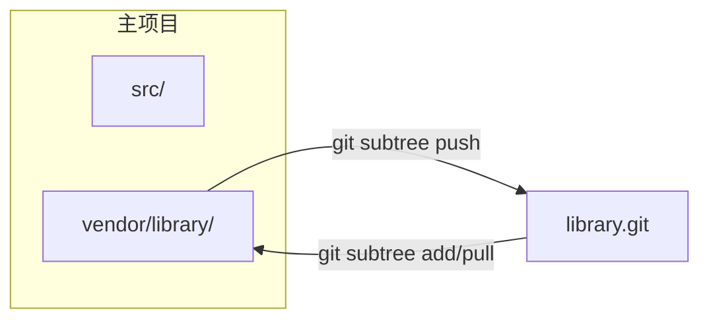

# Git Subtree 完整指南

**在项目中嵌入外部仓库，无需独立指针文件**

Git subtree 允许你将另一个仓库合并到项目的子目录中，同时保留从上游拉取更新以及（可选地）推送变更的能力。与 `git submodule` 不同，它不需要 `.gitmodules` 文件——外部代码直接存在于你自己的提交历史中。

---

## 核心概念

### Subtree 的工作原理



从本质上讲，`git subtree` 会将外部仓库的提交历史通过 **squash merge** 合并到指定的前缀目录中。外部提交可以逐条重放到你的树上，也可以压缩为单个提交以保持日志整洁。

### Subtree 与 Submodule 对比

| 维度 | Submodule | Subtree |
| :--- | :--- | :--- |
| **存储方式** | 主仓库中仅保存指针 | 外部历史完全合并到主仓库 |
| **工作流复杂度** | 较高（`init`、`update`、detached HEAD） | 较低（普通 git 操作即可） |
| **独立历史** | 是——独立仓库 | 否——历史被合并 |
| **CI/CD 友好度** | 需要 `--recurse-submodules` | 与普通目录无异 |
| **推送到上游** | 简单（独立远程仓库） | 可通过 `git subtree push`，但较慢 |
| **克隆体积** | 较小 | 较大（携带完整历史） |
| **学习曲线** | 较陡 | 较平缓 |

:::tip[何时优先使用 Subtree]
- 代码与项目 **紧耦合**，不太可能独立分叉。
- 希望贡献者 **零额外配置**（无需 `submodule init`）。
- 嵌入的是 **中小型** 外部库，历史体量可以接受。
:::

---

## 基础操作

### 添加 Subtree

```bash
# 通用语法
git subtree add --prefix=<路径> <仓库URL> <分支> [--squash]

# 示例：将工具库嵌入到 vendor/tools
git subtree add --prefix=vendor/tools https://github.com/example/tools.git main --squash
```

| 参数 | 作用 |
| :--- | :--- |
| `--prefix` | 工作树中的目标目录（不存在时会自动创建） |
| `--squash` | 将外部历史压缩为单个合并提交（推荐，保持日志整洁） |
| `<分支>` | 要导入的远程分支（`main`、`master`、`develop` 等） |

### 拉取上游更新

```bash
# 将远程最新变更拉取到指定前缀目录
git subtree pull --prefix=vendor/tools https://github.com/example/tools.git main --squash
```

:::info
`git subtree pull` 内部执行的是 `git merge`。如有冲突，按照标准 Git 冲突解决流程处理即可。
:::

### 推送变更到上游

```bash
# 将本地修改推送到远程仓库
git subtree push --prefix=vendor/tools https://github.com/example/tools.git main
```

:::caution
`git subtree push` 需要拆分整个仓库的历史，在大型仓库上会 **很慢**。如果需要频繁推送，建议直接在远程仓库中开发，再通过 `pull` 拉取。
:::

### 拆分 Subtree 历史

```bash
# 创建一个只包含前缀目录历史的分支
git subtree split --prefix=vendor/tools --branch tools-split
```

适用于需要单独审查或 cherry-pick 属于 subtree 的提交时。

### 无 merge 的 squash 拉取

如果之前添加时没有使用 `--squash`，后续 pull 时加上 `--squash` 可以只 squash **本次新增** 的提交：

```bash
git subtree pull --prefix=vendor/tools https://github.com/example/tools.git main --squash
```

---

## 开发工作流

### 场景：导入库并做本地修改

```bash
# 1. 添加 subtree（一次性设置）
git subtree add --prefix=vendor/log https://github.com/user/log.git main --squash

# 2. 在本地使用并修改库
# ... 编辑 vendor/log/ ...

# 3. 在主仓库中提交本地修改
git add vendor/log
git commit -m "vendor(log): 修复解析器内存泄漏"

# 4. 将变更推送回上游（需有写入权限）
git subtree push --prefix=vendor/log https://github.com/user/log.git main

# 5. 后续拉取上游修复
git subtree pull --prefix=vendor/log https://github.com/user/log.git main --squash
```

### 场景：嵌入只读第三方库

```bash
# 一次性添加，之后不再推送
git subtree add --prefix=vendor/json https://github.com/nlohmann/json.git master --squash

# 定期拉取更新
git subtree pull --prefix=vendor/json https://github.com/nlohmann/json.git master --squash
```

---

## 使用远程别名

每次输入完整 URL 很繁琐，可以给 subtree 的远程仓库起个别名：

```bash
# 添加命名远程
git remote add tools-remote https://github.com/example/tools.git

# 之后用远程名代替 URL
git subtree add --prefix=vendor/tools tools-remote main --squash
git subtree pull --prefix=vendor/tools tools-remote main --squash
git subtree push --prefix=vendor/tools tools-remote main
```

---

## 常用模式与最佳实践

### 保持前缀路径清晰可预测

```
project/
├── src/                  # 项目代码
├── vendor/               # 第三方 subtree
│   ├── log/              # git subtree --prefix=vendor/log
│   └── http-client/      # git subtree --prefix=vendor/http-client
└── ...
```

### 一致使用 `--squash`

在同一项目中混用 squash 和非 squash 的 subtree 会导致历史混乱。选择一种方式并始终使用。

### 避免深层嵌套

subtree 内再套 subtree 在技术上可行，但会导致不可预测的合并行为。尽量保持扁平结构。

### 提交信息规范

```bash
git commit -m "vendor(log): 拉取上游 v2.4.1"
git commit -m "vendor(log): 修复格式化 bug"
```

使用 `vendor(<名称>):` 前缀，方便通过 `git log --oneline -- vendor/log/` 查看 subtree 的变更时间线。

---

## 故障排查

| 问题 | 解决方案 |
| :--- | :--- |
| **`subtree push` 极慢** | 在新克隆中执行 `git subtree push`，或先 split 再推送。也可直接在远程仓库修改后用 `pull` 拉取。 |
| **`subtree pull` 合并冲突** | 正常解决冲突（`git add <file> && git commit`）。前缀目录中的文件可能与你自己的修改冲突。 |
| **前缀目录用错了** | 如果误用了 `--prefix=lib/tools` 而非 `vendor/tools`，用正确前缀重新 add，然后删除旧目录（`git rm -r lib/tools`）。 |
| **需要移除 subtree** | `git rm -r <prefix> && git commit -m "remove subtree <name>"`。无需清理配置（与 submodule 不同）。 |
| **历史膨胀** | 如果忘了 `--squash`，可用 `git filter-branch` 或 `git filter-repo` 重写历史，但这是破坏性操作，需要团队协调。 |

---

## 迁移指南

### 从 Submodule 迁移到 Subtree

```bash
# 1. 移除子模块
git submodule deinit vendor/library
git rm vendor/library
rm -rf .git/modules/vendor/library
git commit -m "chore: 移除子模块 vendor/library"

# 2. 添加为 subtree
git subtree add --prefix=vendor/library https://github.com/user/library.git main --squash
```

### 从手动 vendor 目录迁移到 Subtree

如果你之前手动复制了一个 vendor 目录（未通过 Git subtree 管理）：

```bash
# 1. 移除旧的 vendor 内容
git rm -r vendor/library
git commit -m "chore: 移除手动 vendor 的 library"

# 2. 重新以 subtree 方式导入
git subtree add --prefix=vendor/library https://github.com/user/library.git main --squash
```

### 从 Subtree 迁移到 Submodule

```bash
# 1. 移除 subtree 目录
git rm -r vendor/library
git commit -m "chore: 移除 subtree vendor/library"

# 2. 添加为子模块
git submodule add https://github.com/user/library.git vendor/library
git commit -m "chore: 将 library 添加为子模块"
```

---

## 进阶技巧

### 部分目录导入

如果你只需要远程仓库中的一个子目录：

```bash
# 只拆分远程仓库中 src/ 目录的历史，然后添加
git subtree add --prefix=vendor/lib-core https://github.com/large-org/mono.git src --squash
```

:::caution
这依赖 `git subtree` 的拆分逻辑，对于复杂仓库结构可能不可靠。正式使用前请充分测试。
:::

### 批量更新脚本

```bash
#!/bin/bash
# scripts/update-subtrees.sh

declare -A SUBTREES=(
    ["vendor/log"]="https://github.com/user/log.git main"
    ["vendor/http-client"]="https://github.com/user/http-client.git main"
)

for prefix in "${!SUBTREES[@]}"; do
    read url branch <<< "${SUBTREES[$prefix]}"
    echo "更新 $prefix（来源 $url $branch）..."
    git subtree pull --prefix="$prefix" "$url" "$branch" --squash
done

echo "所有 subtree 已更新。"
```

---

## 参考资料

- [Pro Git -- Git Tools - Subtree Merging](https://git-scm.com/book/en/v2/Git-Tools-Subtree-Merging)
- [git-subtree 文档（内建）](https://git.wiki.kernel.org/index.php/Git-subtree)
- [Atlassian 教程 -- Git Subtree](https://www.atlassian.com/git/tutorials/git-subtree)
